## 목차

1. 도메인 분석과 설계
2. 애플리케이션 구현 준비
3. 도메인 개발 (회원, 상품, 주문)
4. 웹 계층 개발
5. 변경 감지와 병합

----------

### 추가 

* spring-boot-devtools 라이브러리를 추가하면, html 파일을 컴파일만 해주면 서버 재시작 없이 View 파일 변경이 가능하다.
* show_sql : 시스템 아웃에 출력 ( 운영환경에서는 쓰지 않음)
* org.hibernate.SQL: debug : 로그를 통해 출력
* 단축키 : 
  * ctrl+alt + v = 변수뽑기
  * shift+ctrl+F = 찾기


# CH 1. 도메인 분석과 설계

도메인 모델

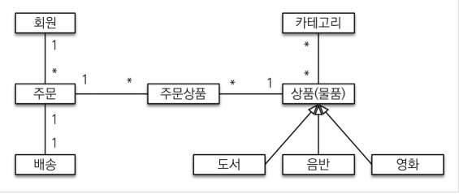

엔티티 분석

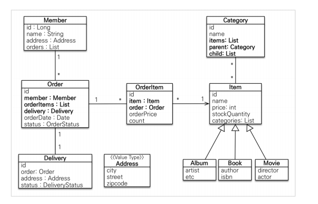

테이블 분석

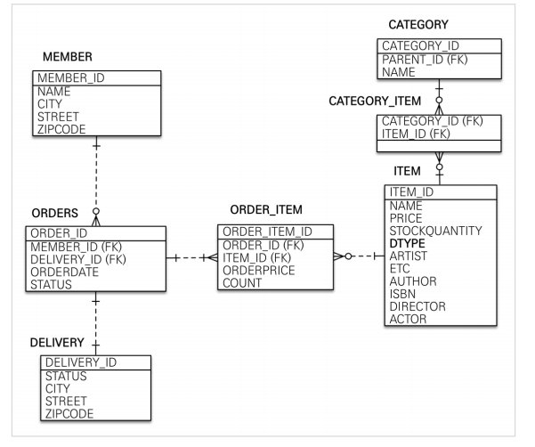

* 다대다 관계의 경우, 필연적으로 데이터 무결성을 위반하여 데이터의 삭제, 추가, 삭제에 문제를 발생하기 때문에 연결 테이블을 만들어서 해결한다.
* 실무에서 `주문과 order의 관계는 필요없다`. 우리가 생각하기에 회원이 주문을 하는 것 같지만 단순히 주문할 때 회원이 필요한 개념이다. 그래서 주문에만 회원을 넣어주면 나중에 쿼리에서 필터링할 수 있다. 
* Getter은 열되 Setter은 `꼭 필요한 경우에만 사용`하는 것을 추천한다.


### 상속 전략

* ITEM의 경우 앨범, 도서, 영화 타입을 통합해 하나의 테이블로 만들었다.

  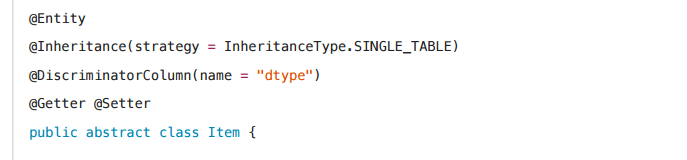

  * 단일 테이블 전략 
    * 조인이 필요없어 조회성능이 빠르고 간단하지만,
    * 자식 엔티티가 매핑한 컬럼은 null을 허용하고 테이블이 커질 수 있다.
  * 구현 클래스 테이블 전략
    * 데이터베이스 설계자와 ORM 전문가가 `추천하지 않음`
    * 서브 타입을 명확하게 구분할 수 있지만,
    * 여러 자식 테이블과 함께할 경우 UNION사용으로 성능이 느리고, 통합해서 관리하기 힘들다.
  * 조인 전략
    * 테이블이 정규화되고, 저장공간의 효율적이지만
    * 조회시 조인을 많이 사용해 성능이 저하되고 조회 쿼리가 복잡하다.


### 연관관계 주인

Member class

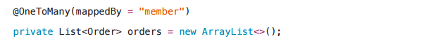

Order class

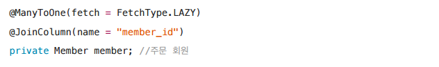

* 다대일, 일대다의 경우 `외래키가 있는 곳을 연관관계의 주인`으로 정한다.
* 일대일 경우 많이 사용하는 곳을 연관관계의 주인으로 정한다.


### 임베디드(복합값) 타입

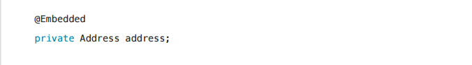

* @Embeddable : 값 타입을 정의하는 곳에 표시
* @Embedded : 값 타입을 사용하는 곳에 표시
* 임베디드의 장점은 재사용이 가능하고, 임베디드 타입을 포함한 모든 값 타입은 값 타입을 소유한 `엔티티의 생명주기에 의존`한다.
* 값 타입의 실제 인스턴스를 공유하지 않고 복사해서 사용해야한다. 그러므로 불변 객체로 만든다.


### 테이블 컬럼명 지정

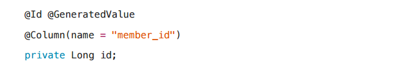

PK 컬럼명을 member_id로 사용한 이유는 테이블은 타입이 없어 구분이 힘들기 때문이다. 이렇게 member_id라고 구분하면 테이블에서 쉽게 알아 볼 수 있다.


### 테이블 명 지정

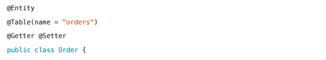

테이블 명이 orders로 바꾼 것은 데이터 베이스에서 order by가 예약어로 잡혀있어 오류가 발생할 가능성이 있기 때문이다.


### 스프링부트 매핑 전략

카멜 케이스를 `언더 스코어`로 바꾸고, 점을 `언더 스코어`로 바꾸고, 대문자를 `소문자`로 바꾼다.

예 : 

​	memberPoint -> member_point 


### 즉시로딩과 지연로딩

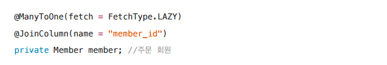

`ManyToOne` , `OneToOne` 의 경우 fetch default가 `EAGER`로 되어있다. EAGER의 경우 `N+1` 문제가 발생하는데 N+1 문제란?

예를들어, LAZY로 지정하고, 멤버와 팀과 연관관계를 갖는 상황이라면

멤버 조회시 팀은 프록시로 가지고 온다. 그리고 팀의 값을 조회하는 경우에  팀에 관련된 query가 나가게 된다.

하지만,, EAGER인 경우에는 멤버를 조회할 때 team도 join하여 한꺼번에 가져오게 된다.

N+1 문제랑 실제 멤버를 찾기 위한 쿼리 한번과 멤버와 관련된 팀 쿼리 N이 발송되기 때문에 그렇게 부른다.


### 영속성 전이

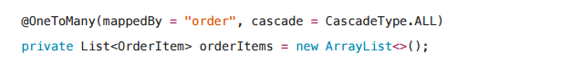

order의 엔티티를 영속화하거나 flush할 때, orderItem도 자동으로 persist or flush 되길 원할 때 사용한다.

영속성 전이는 `하나의 관리`에서만 사용해야한다. 즉, orderItem을 다른 곳에서도 관리를 한다면 영속성 전이를 사용하면 안된다. 라이프사이클이 거의 같을 때 사용하는 것이 좋다.


### EnumType의 주의

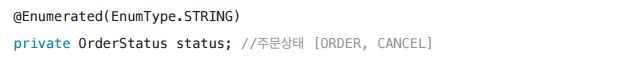

Enum 타입을 사용할 경우 defalut로 사용할 경우 Enum 타입의 순서로 결정되기 때문에 변경되면 큰 오류를 불러온다. String은 순서가 아닌 String으로 저장됨으로 순서가 바뀌거나 추가, 삭제해도 문제가 발생하지 않는다.


# 02. 애플리케이션 구현 준비

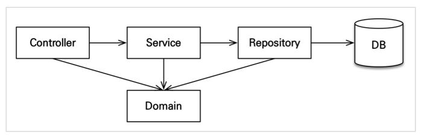

#### Controller , web

* 웹 계층이며, 클라이언트 요청에 대한 처리를 서비스 계층에게 위임한다. 그리고 클라이언트에게 응답해준다

#### Service

* 비지니스 로직, 트랜잭션 처리

#### Repository

* JPA를 직접 사용하는 계측, 엔티티 매니저 사용

#### Domain

* 엔티티가 모여있는 계측, 모든 계층에서 사용


# 03. 도메인 개발

## 회원

회원 리포지토리

```java
@Repository // 스프링 빈으로 등록
public class MemberRepository {
    
    @PersistenceContext // 엔티티 매니저 주입
    private EntityManager em;
 
    public void save(Member member) {
        em.persist(member);
    }
    
    public Member findOne(Long id) {
        return em.find(Member.class, id);
    }
 
    public List<Member> findAll() {
        return em.createQuery("select m from Member m", Member.class)
            .getResultList();
 	}
 
    public List<Member> findByName(String name) {
        return em.createQuery("select m from Member m where m.name = :name",
Member.class)
            .setParameter("name", name)
            .getResultList();
    }
}
```

회원 서비스

```java
@Service // 스프링 빈 등록
@Transactional(readOnly = true)
// 트랜잭션은 여러 쿼리를 논리적으로 하나의 작업으로 묶어주는 것을 말한다.
// readOnly는 트랜잭션 작업 안에 update, insert, delete 작업이 일어나는 것을 방지한다. 
// 이 어노테이션이 테스트 케이스에 사용될 때, 각 테스트가 끝나면 강제로 롤백한다.
@ReRequiredArgsConstructor // final 가진 필드의 생성자를 만들고 주입한다.
public class MemberService {
    
    // 생성자 Injection에 많이 사용, 생성자가 하나면 생략 가능하다.
    // @Autowired MemberRepository memberRepository;
    
    // 필드 주입 대신 생성자 주입을 사용하는 것이 좋다.
    private final MemberRepository memberRepository;
    
    // 별도 메서드에 Transactional을 붙이면 현재 붙인 옵션을 최우선으로 한다.
    @Transactional // 변경가능
    public Long join(Member member) {
        validateDuplicateMember(member); //중복 회원 검증
        memberRepository.save(member);
        return member.getId();
    }
    
    private void validateDuplicateMember(Member member) {
        List<Member> findMembers = memberRepository.findByName(member.getName());
 
        if (!findMembers.isEmpty()) {
            throw new IllegalStateException("이미 존재하는 회원입니다.");
        }
    }

    public List<Member> findMembers() {
        return memberRepository.findAll();
    }
 
    public Member findOne(Long memberId) {
        return memberRepository.findOne(memberId);
    }
}
```

> 참고로 ,,,
>
> 이름 중복 검증 로직이 있어도, 멀티 스레드 상황을 고려해서 회원 테이블의 회원명 컬럼을 UNIQUE 제약조건으로 걸어놓으면 안전하게 설계할 수 있다.


## 상품

상품 엔티티

```java
@Entity
@Inheritance(strategy = InheritanceType.SINGLE_TABLE)
@DiscriminatorColumn(name = "dtype")
@Getter @Setter
public abstract class Item {
    
    @Id @GeneratedValue
    @Column(name = "item_id")
    private Long id;
 
    private String name;
    private int price;
    private int stockQuantity;
    
    @ManyToMany(mappedBy = "items")
    private List<Category> categories = new ArrayList<Category>();
 
    //==비즈니스 로직==//
    public void addStock(int quantity) {
        this.stockQuantity += quantity;
    }
 
    public void removeStock(int quantity) {
        int restStock = this.stockQuantity - quantity;
        
        if (restStock < 0) {
            // RuntimeException을 상속받아 만든다.
            throw new NotEnoughStockException("need more stock");
        }
        this.stockQuantity = restStock;
    }
}
```

상품 리포지토리

```java
@Repository
@RequiredArgsConstructor
public class ItemRepository {
 
    private final EntityManager em;
 
    public void save(Item item) {
 
        if (item.getId() == null) { 
            em.persist(item);
        } else {
            em.merge(item);
        }
    }
 
    public Item findOne(Long id) {
        return em.find(Item.class, id);
    }
 
    public List<Item> findAll() {
        return em.createQuery("select i from Item i",Item.class)
            .getResultList();
    }
}
```

상품 서비스

```java
@Service
@Transactional(readOnly = true)
@RequiredArgsConstructor
public class ItemService {
 
    private final ItemRepository itemRepository;
 
    @Transactional
    public void saveItem(Item item) {
        itemRepository.save(item);
    }
 
    public List<Item> findItems() {
        return itemRepository.findAll();
    }
 
    public Item findOne(Long itemId) {
        return itemRepository.findOne(itemId);
    }
}
```


## 주문

주문 엔티티 - 주문생성메서드, 비지니스 로직 추가

```java
@Entity
@Table(name = "orders")
@Getter @Setter
public class Order { 
    ...;
    
    //==생성 메서드==//
    public static Order createOrder(Member member, Delivery delivery,OrderItem... orderItems) {
        Order order = new Order();
        order.setMember(member);
        order.setDelivery(delivery);
 
        for (OrderItem orderItem : orderItems) {
            order.addOrderItem(orderItem);
        }
 
        order.setStatus(OrderStatus.ORDER);
        order.setOrderDate(LocalDateTime.now());
        return order;
    }
    
    //==비즈니스 로직==//
    /** 주문 취소 */
    public void cancel() {
        if (delivery.getStatus() == DeliveryStatus.COMP) {
            throw new IllegalStateException("이미 배송완료된 상품은 취소가 불가능합니다.");
        }
        this.setStatus(OrderStatus.CANCEL);
        for (OrderItem orderItem : orderItems) {
            orderItem.cancel();
        }
    }
 
    //==조회 로직==//
    /** 전체 주문 가격 조회 */
    public int getTotalPrice() {
        int totalPrice = 0;
        for (OrderItem orderItem : orderItems) {
            totalPrice += orderItem.getTotalPrice();
        }
        return totalPrice;
    }
}
```

주문 상품 엔티티

```java
@Entity
@Table(name = "order_item")
@Getter @Setter
public class OrderItem {
    (...);
    
    //==생성 메서드==//
    public static OrderItem createOrderItem(Item item, int orderPrice, int
count) {
        OrderItem orderItem = new OrderItem();
        orderItem.setItem(item);
        orderItem.setOrderPrice(orderPrice);
        orderItem.setCount(count);

        item.removeStock(count);
 		return orderItem;
    }
 
    //==비즈니스 로직==//
    /** 주문 취소 */
    public void cancel() {
        getItem().addStock(count);
    }
 
    //==조회 로직==//
    /** 주문상품 전체 가격 조회 */
    public int getTotalPrice() {
        return getOrderPrice() * getCount();
    }
}
```

주문 리포지토리

```java
@Repository
@RequiredArgsConstructor
public class OrderRepository {
    private final EntityManager em;
 
    public void save(Order order) {
        em.persist(order);
        // orderItem은 persist하지 않아도 order의 영속성 전이로 같이 persist된다.
    }
 
    public Order findOne(Long id) {
        return em.find(Order.class, id);
    }

    public List<Order> findAll(OrderSearch orderSearch) {
		// Query DSL 공부하고 한번 도전해보기
    }
}
```

주문 서비스

```java
@Service
@Transactional(readOnly = true)
@RequiredArgsConstructor
public class OrderService {
 
    private final MemberRepository memberRepository;
    private final OrderRepository orderRepository;
    private final ItemRepository itemRepository;
 
    /** 주문 */
    @Transactional
    public Long order(Long memberId, Long itemId, int count) {
 
        //엔티티 조회
        Member member = memberRepository.findOne(memberId);
        Item item = itemRepository.findOne(itemId);
 
        //배송정보 생성
        Delivery delivery = new Delivery();
        delivery.setAddress(member.getAddress());
        delivery.setStatus(DeliveryStatus.READY);
 
        //주문상품 생성
        OrderItem orderItem = OrderItem.createOrderItem(item, item.getPrice(),count);
 
        //주문 생성
        Order order = Order.createOrder(member, delivery, orderItem);
        
        //주문 저장
        orderRepository.save(order);
        
        return order.getId();
    }
 
    /** 주문 취소 */
    @Transactional
    public void cancelOrder(Long orderId) {
        //주문 엔티티 조회
        Order order = orderRepository.findOne(orderId);
 
        //주문 취소
        order.cancel();
    }
 
    /** 주문 검색 */
    public List<Order> findOrders(OrderSearch orderSearch) {
        return orderRepository.findAll(orderSearch);
    }

}
```

> 참고
>
> 위에 처럼 엔티티가 비즈니스 로직을 가지고 객체 지향 특성을 적극 활용하는 것을 도메인 패턴이라고 한다.
>
> 반대로, 엔티티에 비즈니스 로직이 별로 없고 서비스 계층에서 대부분의 비즈니스 로직을 처리하는 것을 트랜잭션 스크립트 패턴이라고 한다.


# 04. 웹 계층 개발

### GetMapping

```java
// 해당 url에 접속하면 이 함수가 호출된다. 
@GetMapping(value = "/members/new")
public String createForm(Model model) {
    // 모델에 데이터를 담아서 
    model.addAttribute("memberForm", new MemberForm());
    // members - createMemberForm.html을 렌더링 한다.
    return "members/createMemberForm";
}
```


### PostMapping

```java
// 해당 url에서 post 전송이 일어나면 함수 호출
@PostMapping(value = "/members/new")
public String create(@Valid MemberForm form, BindingResult result) {
    
    // 에러가 발생할 경우 members-createMemberForm.html 렌더링
    if (result.hasErrors()) {
        return "members/createMemberForm";
    }
    
    // form에서 정보를 얻어
    Address address = new Address(form.getCity(), form.getStreet(), form.getZipcode());
    Member member = new Member();
    member.setName(form.getName()); member.setAddress(address);
    
    // 서비스 계층일 실행시키고
    memberService.join(member);
    
    // home으로 리다이렉트 시킨다.
    return "redirect:/";
}
```


### Form 만드는 이유

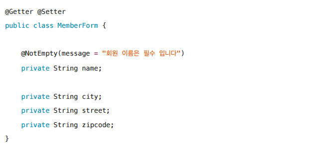

요구사항이 정말 단순할 때는 폼 객체( MemberForm ) 없이 엔티티( Member )를 직접 등록과 수정 화면 에서 사용해도 된다. 하지만 화면 요구사항이 복잡해지기 시작하면, 엔티티에 화면을 처리하기 위한 기능이 점점 증가한다. 결과적으로 `엔티티는 점점 화면에 종속적`으로 변하고, 이렇게 화면 기능 때문에 엔티티는 결국 유지보수하기 어려워진다.
실무에서 `엔티티는 핵심 비즈니스 로직`만 가지고 있고, 화면을 위한 로직은 없어야 한다. 화면이나 API에 맞는 `폼 객체나 DTO`를 사용해야 나중에 엔티티가 변경되었을 때 API 스펙이 변경되지 않는다. 엔티티의 변경에 따라 API 스펙이 바뀌면 큰 에러가 발생할 수 있다.


# 05. 변경감지와 병합

### 준영속 엔티티

준영속 엔티티는 영속성 컨테이너에 더이상 관리하지 않는 엔티티를 말한다.

이런 준영속 엔티티를 수정하는 방법 2가지가 있다.

1. 변경 감지 기능 사용
2. 병합(merge) 사용


### 변경 감지 기능 사용

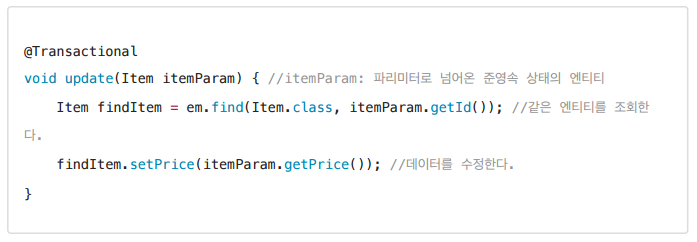

* itemParam과 findItem은 같지 않다.
* 이 방법은 영속성 컨텍스트에서 엔티티를 다시 조회하고 수정하는 방식이다.
* 트랜잭션 커밋 시점에 변경 감지(Dirty Checking) 이 동작해서 자동으로 데이터베이스에 UPDATE SQL 실행한다.


### 병합 merge 사용

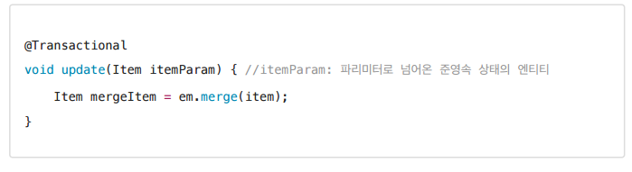

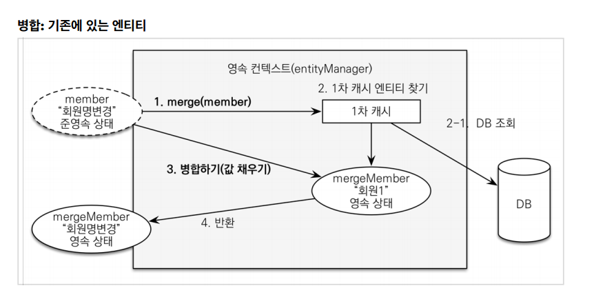

1. 파라미터로 넘어온 준영속 엔티티의 식별자로 1차 캐시에서 엔티티를 조회하고

2. 없으면 데이터베이스에서 엔티티를 조회하고 1차캐시에 저장

3. 조회한 영속 엔티티에 `모든 필드`를 교체한다.

   트랜잭션 커밋 시점에 변경 감지 기능이 동작해서 데이터 베이스에 UPDATE SQL 실행

4. 영속 상태의 엔티티를 반환한다.


#### 정리

* 변경감지는 `원하는 속성만` 바꿀수 있지만 merge는 `모든 필드`를 다 교체한다는 차이점을 가지고 있다. 
* 만약 병합시 값이 없으면 null로 업데이트할 가능성이 있기 때문에 `변경 감지의 방법`을 사용하는 것이 좋다.
* 기존 방식은, 컨트롤러에서 엔티티를 생성해서 넘겨줘야한다.

```java
public void save(Item item) {
    if (item.getId() == null) {
        em.persist(item);
    } else {
        em.merge(item);
    }
 }
```

* 컨트롤러에서 어설프게 엔티티를 생성하기보다 서비스 계층에 식별자id와 변경 데이터를 파라미터 나 dto로 전달하고, 서비스 계층에서 영속 상태의 엔티티로 조회하고 변경하는 변경감지를 사용하는 것이 더 좋다.
