## 목차

1. 객체 지향 프로그래밍 
2. 스프링 컨테이너와 스프링 빈
3. 싱글톤 컨테이너
4. 컴포넌트 스캔


-------

# 01. 객체지향 프로그래밍

객체 지향은 컴퓨터 프로그램을 명령어의 목록으로 바라보는 것이 아니라 여러 개의 독립적인 단위 즉, `객체`들의 모임으로 보는 것이다. 

각각의 객체는 `메시지`를 주고받고, 데이터를 처리할 수 있다. 또한 객체 지향 프로그래밍은 프로그램을 `유연`하고 `변경`을 용이하게 만들기 때문에 대규모 소프트웨어 개발에 많이 사용된다.


## Spring의 핵심

스프링은 자바 언어 기반의 프레임워크이다. 자바 언어의 가장 큰 특징은 `객체 지향 언어`인데 스프링은 이런 `객체 지향의 특징을 가장 살려내는 프레임워크`이다.


### 다형성

`역할과 구현`으로 구분

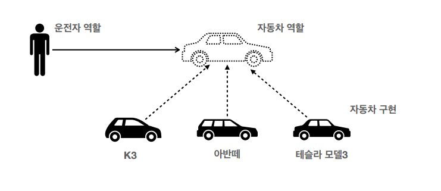

역할과 구현으로 구분하며 `단순해지고, 유연하며, 변경도 편리`해진다.

클라이언트는 대상의 역할 즉, 인터페이스만 알면 되기 때문에 내부 구조를 알지 않아도 되고 내부 구조가 변경되도 영향받지 않는다.

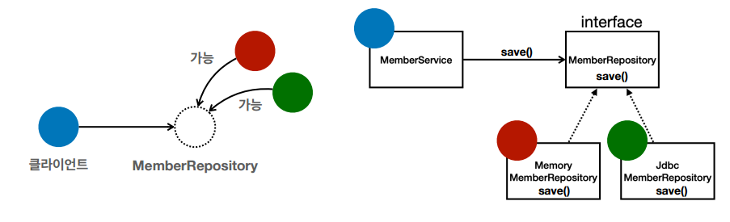

### 다형성의 본질

* 인터페이스를 구현한 객체 인스턴스를 `실행시점에 유연하게 변경`할 수 있어야 한다.
* 다형성의 본질은 `협력`이라는 객체사이의 관계에서 시작된다. 
* 클라이언트를 변경하지 않고, `서버의 구현기능을 유연하게 변경`할 수 있어야 한다.


### 스프링과 객체지향

스프링의 제어의 역전(IoC), 의존관계 주입(DI)은 다형성을 활용해 역활가 구현을 편리하게 다룰 수 있도록 지원한다.


## 좋은 객체 지향 설계의 5가지 원칙 (SOLID)

* SRP: 단일 책임 원칙(single responsibility principle)
* OCP: 개방-폐쇄 원칙 (Open/closed principle)
* LSP: 리스코프 치환 원칙 (Liskov substitution principle)
* ISP: 인터페이스 분리 원칙 (Interface segregation principle)
* DIP: 의존관계 역전 원칙 (Dependency inversion principle)


### SRP 단일 책임원칙

* 하나의 클래스는 하나의 책임만 가진다.
* 중요한 기준은 변경이다. 변경이 있을 때 파급 효과가 적으면 단일 책임 원칙을 잘 따르는 것이다.


### OCP 개방-폐쇄 원칙

* 소프트웨어 요소는 확장에는 열려있고 변경에는 닫혀있어야 한다.

  예를 들면, MemberService 클라이언트가 `구현 클래스를 직접 선택`해야 한다.

  * MemberRepository m = new **MemoryMemberRepository();** //기존 코드
  * MemberRepository m = new **JdbcMemberRepository();** //변경 코드

* 구현 객체를 변경하려면 `클라이언트 코드를 변경`해야 하기 때문에 다형성을 사용했지만 OCP 원칙은 지키지 못한 것이다.
* 이 문제를 해결하기 위해서는 객체를 생성하고 연관관계를 맺어주는 별도의 조립, 설정자가 필요하다.


### LSP 리스코프 치환원칙

*  프로그램의 객체는 정확성을 깨뜨리지 않으면서 하위 타입의 인스턴스로 바꿀 수 있어야 한다.
* 다형성에서 하위 클래스는 인터페이스 규약을 다 지켜야 한다. 
* 예를 들어, 엑셀의 인터페이스 규약 즉, 엑셀을 밟으면 앞으로 가야한다는 규약을 반드시 지켜야함을 말한다. (`기능적으로 보장`)


### ISP 인터페이스 분리원칙

* 특정 클라이언트를 위한 인터페이스 여러 개가 범용 인터페이스 하나보다 낫다.
* 분리하면 인터페이스가 변해도 클라이언트에 영향을 주지 않는다. 
* 인터페이스가 명확해지고, 대체 가능성이 높아진다. 


### DIP 의존관계 역전 원칙

프로그래머는 “추상화에 의존해야지, 구체화에 의존하면 안된다.” 즉, 구현 클래스에 의존하지 말고, 인터페이스에 의존하라는 뜻이다.

`역할(Role) == 인터페이스에 의존`해야 유연하게 구현체를 변경할 수 있다. 

예를 들어, OCP에서 설명한 MemberService는 인터페이스에 의존하지만, 구현 클래스도
동시에 의존한다.

```java
MemberRepository m = new MemoryMemberRepository();
```

* MemberService에서 클라이언트가 구현 클래스를 직접 선택 -> 구현 클래스에 의존한다.


### 예를 들어,

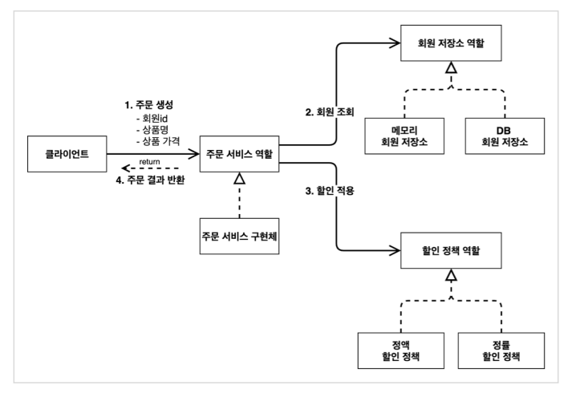

```java
public class OrderServiceImpl implements OrderService {
    // private final DiscountPolicy discountPolicy = new FixDiscountPolicy();
    private final DiscountPolicy discountPolicy = new RateDiscountPolicy();
}
```


### 문제점

역할과 구현에 충실하게 분리하고, 다형성도 활용하고 인터페이스와 구현 객체를 분리했지만,,,

클래스 의존관계를 분석해보면 추상(인터페이스) 뿐만 아니라 구체(구현) 클래스에도 의존하고 있다.

즉, 클라이언트 코드인 `OrderServiceImpl` 은 `DiscountPolicy` 의 인터페이스 뿐만 아니라 구체 클래스도 함께 의존한다. 그래서 구체 클래스를 변경할 때 클라이언트 코드도 함께 변경해야 한다. --> `DIP 위반`


### 해결법 - 관심사 분리 : AppConfig

```java
public class AppConfig {
    
    public MemberService memberService() {
        return new MemberServiceImpl(new MemoryMemberRepository());
    }
    
    public OrderService orderService() {
        return new OrderServiceImpl(
            new MemoryMemberRepository(),
            new FixDiscountPolicy());
	}
    
}
```

* AppConfig는 공연기획자 처럼 애플리케이션의 실제 동작에 `필요한 구현 객체를 생성자를 통해 주입(연결)`해준다.


### 조금 더 잘보이도록 리팩토링 : AppConfig

```java
public class AppConfig {
    
    public MemberService memberService() {
        return new MemberServiceImpl(memberRepository());
    }
    
    public OrderService orderService() {
        return new OrderServiceImpl(memberRepository(), discountPolicy());
    }
    
    public MemberRepository memberRepository() {
        return new MemoryMemberRepository();
    }
    
    public DiscountPolicy discountPolicy() {
        return new FixDiscountPolicy();
    }
}
```


### 정리 : 

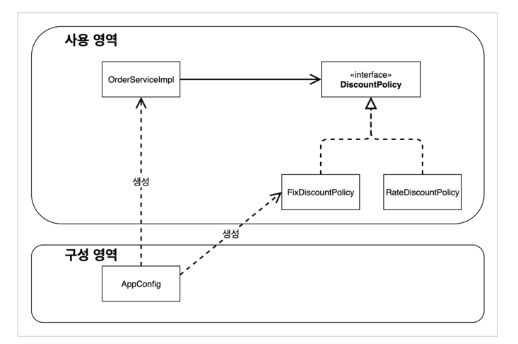

#### SRP 단일 책임 원칙 :

기존의 클라이언트 객체가 직접 구현 객체를 생성하고, 연결하고, 실행하는 다양한 책임을 가졌다면 관심사를 분리함으로써 AppConfig가 구현 객체를 생성하고 연결하는 책임을 담당하고 클라이언트 객체는 실행하는 책임만 담당한다.

#### DIP 의존관계 역전 원칙 : 

 기존의 클라이언트 코드(OrderServiceImpl)은 DiscountPolicy 인터페이스에 의존하는 동시에 FixDiscountPolicy 구체화 구현 클래스에도 의존했다. 

하지만 AppConfig가 객체 인스턴스를 클라이언트 코드 대신 생성하여 클라이언트 코드에 의존관계를 주입함으로써 DIP 원칙을 따르면서 문제도 해결한다.

#### OCP 개방 폐쇄 원칙 :

AppConfig가 의존관계를 변경하여 클라이언트 코드에 주입하므로 `클라이언트 코드는 변경하지 않아도` 된다. 

즉, **새롭게 확장해도 사용해도 사용영역의 변경은 닫혀 있다.**


## IoC, DI 그리고 컨테이너

#### 제어의 역전(Inversion of Control)

AppConfig가 등장한 이후 구현 객체는 자신의 로직의 실행하는 역할만 담당한다. 프로그램의 제어흐름은 AppConfig가 가져가므로 OrderServiceImpl은 필요한 인터페이스는 호출하지만 어떤 구현 객체가 실행될지 알 수 없다.

이렇듯 프로그램의 제어 흐름을 직접 제어하는 것이 아니라 외부에서 관리하는 것을 `제어의 역전(IoC)` 라고한다.


#### 의존관계 주입 DI(Dependency Injection)

애플리케이션 `실행시점(런타임)`에 외부에서 실제 구현 객체를 생성하고 클라이언트에 전달해서 클라이언트와 서버의 실제 의존관계가 연결되는 것을 **의존관계 주입**이라고 한다.

의존관계 주입을 사용하면 클라이언트는 코드를 변경하지 않고, 클라이언트가 호출하는 대상의 타입 인스턴스를 변경할 수 있다.


결론,...

AppConfig처럼 객체를 생성하고 관리하면서 의존관계를 연결해주는 것을 `IoC 컨테이너 또는 DI컨테이너`라고 한다.


# 02. 스프링 컨테이너와 스프링 빈

## 스프링

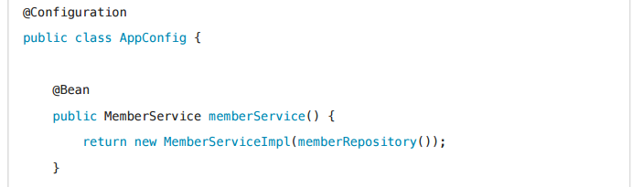

`@Configuration` 과 각 메서드의 `@Bean` 을 붙임으로써 스프링 컨테이너에 스프링 빈을 등록한다. 이전에는 개발자가 AppConfig를 사용해 직접 객체를 생성하고 DI했지만 이제부터는 `스프링 컨테이너`를 통해 사용한다.


스프링 컨테이너는 @Configuration 이 붙은 AppConfig 를 설정(구성) 정보로 사용한다. 여기서 @Bean 이라 적힌 메서드를 모두 호출해서 반환된 객체를 스프링 컨테이너에 등록한다. 이렇게 스프링 컨테이너에 등록된 객체를 스프링 빈이라 한다.


이제부터는 스프링 컨테이너를 통해서 필요한 스프링 빈을 찾아야한다. 이때 `applicationContext.getBean()` 메서드를 통해 찾을 수 있다.

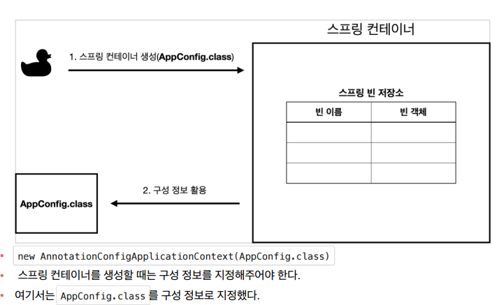

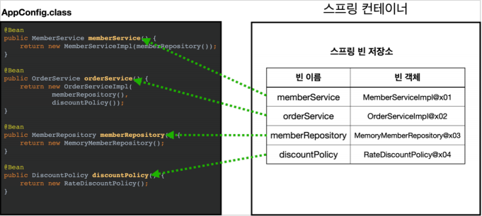

> @@@ 빈 이름은 메서드 이름을 사용한다. 직접 부여할 경우 같은 이름을 부여하면 다른 빈이 무시되거나 기존 빈을 덮어버릴 수 있기 때문에 조심해야 한다


### 빈 조회

```java
// 가장 기본적인 조회 방법
AnnotationConfigApplicationContext ac = new
AnnotationConfigApplicationContext(AppConfig.class);

// 1. ac.getBean(빈이름, 타입)
// 2. ac.getBean(타입)
// 조회 대상 스프링 빈이 없으면 예외가 발생한다.
// NoSuchBeanDefinitionException: No bean named 'xxxxx' available

@DisplayName("빈 이름으로 조회")
void findBeanByName() {
    MemberService memberService = ac.getBean("memberService",
MemberService.class);
    assertThat(memberService).isInstanceOf(MemberServiceImpl.class);
}

@DisplayName("이름 없이 타입만으로 조회")
void findBeanByType() {
    MemberService memberService = ac.getBean(MemberService.class);
   	assertThat(memberService).isInstanceOf(MemberServiceImpl.class);
}
```


타입으로 조회시 같은 타입의 스프링 빈이 둘 이상이면 오류가 발생한다. 이때는 빈 이름을 지정한다.

`ac.getBeansOfType()` 을 사용하면 해당 타입의 모든 빈을 조회할 수 있다.

```java
@DisplayName("타입으로 조회시 같은 타입이 둘 이상 있으면, 중복 오류가 발생한다")
void findBeanByTypeDuplicate() {
    assertThrows(NoUniqueBeanDefinitionException.class, () ->
ac.getBean(MemberRepository.class));
}

@DisplayName("특정 타입을 모두 조회하기")
void findAllBeanByType() {
    Map<String, MemberRepository> beansOfType = ac.getBeansOfType(MemberRepository.class);
    
    for (String key : beansOfType.keySet()) {
        System.out.println("key = " + key + " value = " + beansOfType.get(key));
    }
 
    System.out.println("beansOfType = " + beansOfType);
 
    assertThat(beansOfType.size()).isEqualTo(2);
}
```


## 스프링 빈 조회 - 상속관계

부모 타입으로 조회하면 자식 타입도 함께 조회한다.

그래서 모든 자바 객체의 최고 부모인 Object 타입으로 조회하면, 모든 스프링 빈을 조회한다.

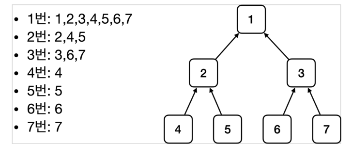


## BeanFactory와 ApplicationContext

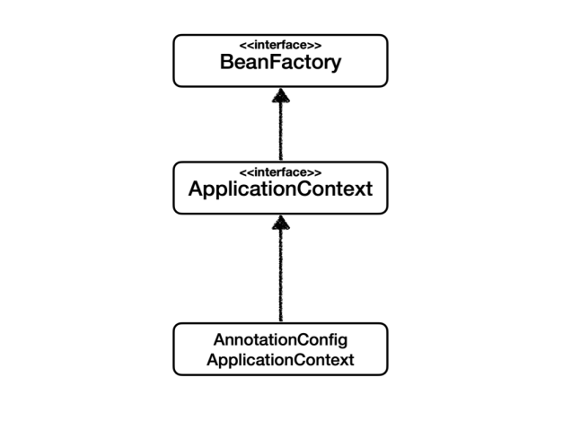

### BeanFactory

* 스프링 컨테이너의 최상위 인터페이스다.
* 스프링 빈을 관리하고 조회하는 역할을 담당한다.
* getBean() 을 제공한다.
* 지금까지 우리가 사용했던 대부분의 기능은 BeanFactory가 제공하는 기능이다.


### ApplicationContext

* BeanFactory 기능을 모두 `상속받아서 제공`한다.
* ApplicationContext은 빈을 관리하고 조회하는 기능은 물론이고, 수 많은 부가기능이 제공한다.
  * 메시지소스를 활용한 국제화 기능 : 예를 들어서 한국에서 들어오면 한국어로, 영어권에서 들어오면 영어로 출력
  * 환경변수 : 로컬, 개발, 운영등을 구분해서 처리
  * 애플리케이션 이벤트 : 이벤트를 발행하고 구독하는 모델을 편리하게 지원
  * 편리한 리소스 조회 : 파일, 클래스패스, 외부 등에서 리소스를 편리하게 조회


## 스프링 빈 설정 메타 정보 - BeanDefinition

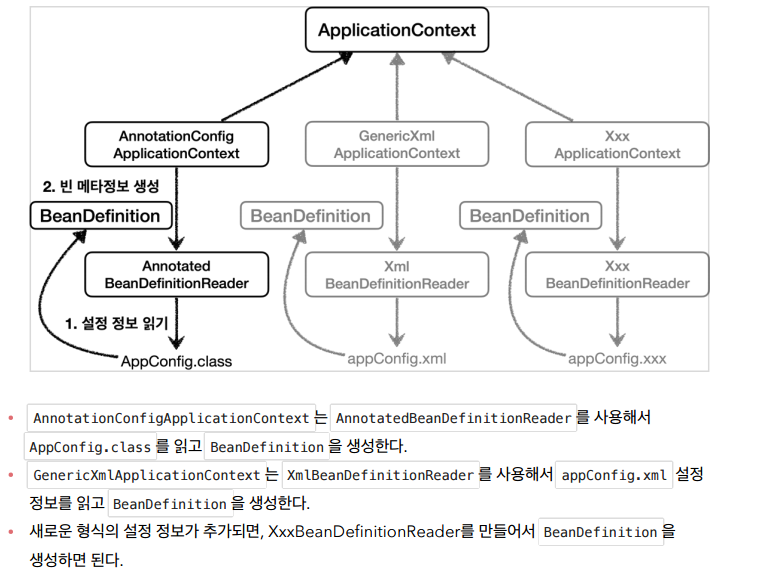


# ch3. 싱글톤 컨테이너

스프링 없는 순수한 DI 컨테이너인 AppConfig는 요청을 할 때 마다 객체를 새로 생성한다.

* 고객 트래픽이 초당 100이 나오면 초당 100개 객체가 생성되고 소멸된다 -> 메모리 낭비가 심하다.
* 해결방안은 해당 객체가 딱 1개만 생성되고, 공유하도록 설계하면 된다. -> 싱글톤 패턴


## 싱글톤 패턴

싱글톤 패턴이란 클래스의 인스턴스가 딱 1개만 생성되도록 보장하는 디자인 패턴이다.

### 싱글톤 패턴의 단점

* 싱글톤 패턴을 구현하는 코드 자체가 많이 들어간다.
* 의존관계상 클라이언트가 구체 클래스에 의존한다. DIP를 위반한다.
* 클라이언트가 구체 클래스에 의존해서 OCP 원칙을 위반할 가능성이 높다.
* 테스트하기 어렵다.
* 내부 속성을 변경하거나 초기화 하기 어렵다.
* private 생성자로 자식 클래스를 만들기 어렵다.
* 결론적으로 유연성이 떨어지고 안티패턴으로 불리기도 한다.


### 싱글톤 컨테이너

스프링 컨테이너는 싱글톤 패턴의 문제점을 해결하면서 객체 인스턴스를 싱글톤으로 관리한다.

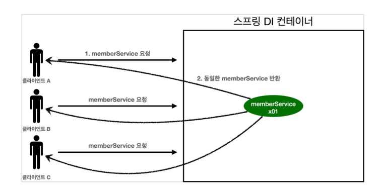

#### 싱글톤 방식의 주의점

 객체 인스턴스를 하나만 생성해서 공유하는 싱글톤 방식은 여러 클라이언트가 하나의 같은 객체 인스턴스를 공유하기 때문에 싱글톤 객체는 상태를 `유지(stateful)하게 설계하면 안된다`.
 즉, 특정 클라이언트에 의존적인 필드 없이, 특정 클라이언트가 값을 변경할 수 없도록 `무상태(stateless)로 설계`해야 한다.

* 가급적 읽기만 가능해야 한다.
* 필드 대신에 자바에서 공유되지 않는, 지역변수, 파라미터, ThreadLocal 등을 사용해야 한다.
* 스프링 빈의 필드에 공유 값을 설정하면 정말 큰 장애가 발생할 수 있다!!


### 스프링의 싱글톤 방식

스프링은 `@Configuration`을 사용하면, 클래스의 바이트 코드를 조작하는 라이브러리(CGLIB)를 사용해서 AppConfig 클래스를 상속받은 임의의 다른 클래스를 만들고, 그 다른 클래스를 스프링 빈으로 등록한다.

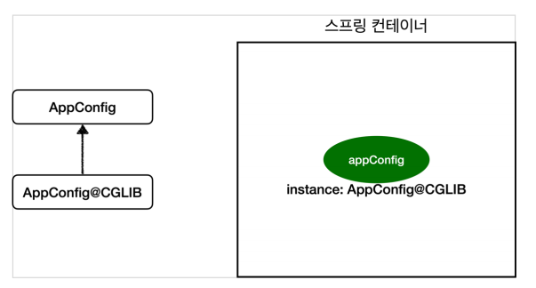

AppConfig@CGLIB 의 예상코드는...

```java
@Bean
public MemberRepository memberRepository() {

    if (memoryMemberRepository가 이미 스프링 컨테이너에 등록되어 있으면?) {
        return 스프링 컨테이너에서 찾아서 반환;
    } else { //스프링 컨테이너에 없으면
        기존 로직을 호출해서 MemoryMemberRepository를 생성하고 스프링 컨테이너에 등록
 		return 반환
    }
}
```

* @Bean 이 붙은 메서드마다 이미 스프링 빈이 존재하면 존재하는 빈을 반환하고, 그렇지 않으면 생성해서 스프링 빈을 등록하고 반환한다.


# 04. 컨포넌트 스캔

스프링은 설정 정보가 없어도 자동으로 스프링 빈을 등록하는 컴포넌트 스캔`@ComponentScan`이라는 기능을 제공한다.

* `@Component` 애노테이션이 붙은 클래스를 스캔해서 스프링 빈으로 등록한다.
* 컴포넌트 스캔을 사용하면 @Configuration이 붙은 설정 정보도 자동으로 등록된다.
  * 왜냐하면  @Configuration 소스코드를 열어보면 @Component 애노테이션이 붙어 있다.
* `@Autowired` 을 지정하면 스프링 컨테이너가 자동으로 해당 스프링 빈을 찾아서 주입한다.


#### before : 기존 AppConfig 에 설정 정보 저장

```java
@Configuration
public class AppConfig {
    @Bean
    public OrderService orderService() {
        return new OrderServiceImpl( memberRepository(), discountPolicy());
    }
```


#### after : 설정정보 없이 가능

```java
@Component
public class OrderServiceImpl implements OrderService {
    private final MemberRepository memberRepository;
    private final DiscountPolicy discountPolicy;
    
    @Autowired
    public OrderServiceImpl(MemberRepository mr, DiscountPolicy dp){
         this.memberRepository = mr;
         this.discountPolicy = dp;
    }
}
```

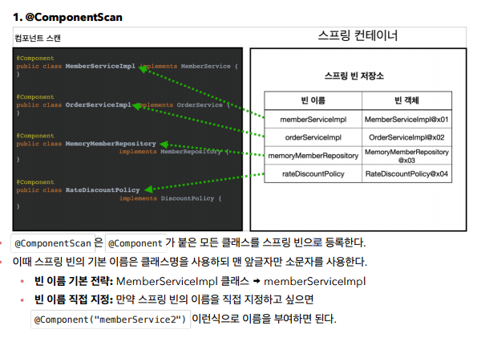


#### 탐색 위치와 기본 스캔 대상

* 모든 자바 클래스를 다 컴포넌트 스캔할 경우 시간이 오래걸린다. 그러므로 위치를 지정하면 해당 위치부터 탐색을 시작한다. 
  * 하위는 모두 자동으로 컴포넌트 스캔의 대상이 된다.
* 스프링 부트의 시작 정보는 `@SpringBootApplication`이다. 그러므로 이 프로젝트를 시작 루트에 위치해두는 것이 관례이다. 


#### 컴포넌트 스캔 대상

컴포넌트 스캔은 @Component 뿐만 아니라 다음과 내용도 추가로 대상에 포함한다.

1. @Component : 컴포넌트 스캔에서 사용
2. @Controlller : 스프링 MVC 컨트롤러에서 사용
3. @Service : 스프링 비즈니스 로직에서 사용
   * Service는 특별한 처리는 하지 않지만 개발자들이 핵심 비즈니스 로직이 여기 있다고 인식할 수 있도록 도움을 준다.
4. @Repository : 스프링 데이터 접근 계층에서 사용
5. @Configuration : 스프링 설정 정보에서 사용


#### 필터

* includeFilters : 컴포넌트 스캔 대상을 추가로 지정한다.
* excludeFilters : 컴포넌트 스캔에서 제외할 대상을 지정한다

예를 들어, 예시 애노테이션 생성

```java
import java.lang.annotation.*;

@Target(ElementType.TYPE)
@Retention(RetentionPolicy.RUNTIME)
@Documented
public @interface MyExcludeComponent {
    
}
```

컴포넌트 스캔 대상에 제외할 클래스

```java
@MyExcludeComponent
public class BeanB {
}
```

AppConfig

```java
@Configuration
@ComponentScan(
    includeFilters = @Filter(type = FilterType.ANNOTATION, classes =
MyIncludeComponent.class),
    excludeFilters = @Filter(type = FilterType.ANNOTATION, classes =
MyExcludeComponent.class)
)
static class ComponentFilterAppConfig {
    
}
```


### 중복등록과 충돌

1. 자동 빈 등록 vs 자동 빈 등록
2. 수동 빈 등록 vs 자동 빈 등록


#### 자동 빈 등록 vs 자동 빈 등록

이 경우, 이름이 같은 스프링 빈이 등록된다면 오류를 발생시킨다.

* `ConflictingBeanDefinitionException 예외 발생`


#### 수동 빈 등록 vs 자동 빈 등록

이 경우에는 수동 빈이 우선권을 가지기 때문에 수동 빈이 자동 빈을 오버라이딩 해버린다.

보통의 경우에는 개발자가 의도적으로 설정하기보다 여러 설정들이 꼬여서 만들어내는 버그인 경우가 많고, 오버라이딩 될 경우 버그를 찾기 힘들기 때문에

최근 스프링부트의 경우, 수동 빈과 자동 빈이 충돌이 일어나더라도 `오류가 발생`시킨다.

* `Consider renaming one of the beans or enabling overriding by setting `

  `spring.main.allow-bean-definition-overriding=true`


# 05. 의존관계 자동 주입

의존관계 주입 방법은 크게 4가지 방법이 있다.

* 생성자 주입
* 수정자 주입
* 필드 주입
* 일반 메서드 주입


#### 생성자 주입 -> 권장

* 생성자를 통해 의존 관계 주입을 받는 방법으로 생성자 호출 시점에 딱 1번 호출된다.
* `불변, 필수` 의존관계에 사용된다.
* 생성자가 딱 하나 있으면 `@Autowired` 역시 생략된다.
* 생성자 주입을 권장하는 이유는 크게 `불변, 누락` 때문이다.
  * 불변 : 대부분의 의존관계 주입은 한번 일어나면 애플리케이션 종료시점까지 의존 관계를 변경할 일이 없다. 또한 수정자 주입을 열어둘 경우 누군가 실수로 변경할 여지가 있기 때문에 좋은 설계 방법이 아니다.
  * 누락 : 프레임워크 없이 순수한 자바 코드를 단위로 테스트하는 경우에 생성자 주입을 사용하면 주입 데이터가 누락되었을 때 `컴파일 오류`가 발생한다. 하지만 수정자 주입의 경우에는 `컴파일 오류`가 아니라 실행 후 NullPoint Exception 에러가 발생한다.
* 추가로, 생성자 주입시 필드에 `final` 키워드를 사용하면, 값이 설정되지 않은 오류를 컴파일 시점에 막아준다.
  * final을 설정하면 한번 설정된 값은 바뀌지 않는다. 그래서 final은 초기값을 넣어주거나 생성자를 통해서만 값이 변경가능하다.


#### 수정자 주입(Setter)

* Setter라는 수정자 메서드를 통해 의존 관계를 주입하는 방법이다.
* `선택, 변경` 가능성이 있는 의존관계에 사용된다.

```java
@Component
public class OrderServiceImpl implements OrderService {
    private MemberRepository memberRepository;
    private DiscountPolicy discountPolicy;
    
    @Autowired
    public void setMemberRepository(MemberRepository memberRepository){
        this.memberRepository = memberRepository;
    }
    (...)
}
```


#### 필드 주입 -> 사용 하지 말것

* 이름 그대로 필드에 바로 주입하는 방법이다.
* 코드가 간결하지만 외부에서 변경이 불가능해 테스트가 힘들다.

```java
@Component
public class OrderServiceImpl implements OrderService {
    @Autowired
    private MemberRepository memberRepository;
    
    (...)
}
```


#### 일반 메서드 주입

* 말 그대로 일반 메서드를 통해 주입 받는 것을 말하며 일반적으로 잘 사용하지 않는다.


#### 옵션처리

`@Autowired`는 `required` 옵션의 기본 값이 `true`이기 때문에 자동 주입 대상이 없으면 오류가 발생한다. 만약 주입할 스프링 빈이 없어도 동작해야 한다면...

1. `@Autowired(required=false)` : 자동 주입할 대상이 없으면 수정자 메서드 자체가 `호출 안됨`

   ```java
   @Autowired(required = false)
   public void setNoBean1(Member member) {
   }
   ```

   

2. `org.springframework.lang.@Nullable` : 자동 주입할 대상이 없으면 `null`이 입력된다.

   ```java
   @Autowired
   public void setNoBean2(@Nullable Member member) {
   }
   ```

   

3. `Optional<>` : 자동 주입할 대상이 없으면 `Optional.empty` 가 입력된다

   ```java
   @Autowired(required = false)
   public void setNoBean3(Optional<Member> member) {
   }
   ```

   

#### 롬봄 (Lombok)

* `@RequiredArgsConstructor` 기능을 사용하면 final이 붙은 필드를 모아서 생성자로 자동 만들어준다. 

> 롬복 라이브러리 적용방법
>
> build.gradle 라이브러리 및 환경 추가
>
> ```java
> //lombok 설정 추가 시작
> configurations {
>     compileOnly {
>         extendsFrom annotationProcessor
>     }
> }
> 
> dependencies {
>     //lombok 라이브러리 추가 시작
>     compileOnly 'org.projectlombok:lombok'
>     annotationProcessor 'org.projectlombok:lombok'
>  
>     testCompileOnly 'org.projectlombok:lombok'
>     testAnnotationProcessor 'org.projectlombok:lombok'
> 	...
> }
> ```
>
> 1. Preferences(윈도우 File Settings) plugin lombok 검색 설치 실행 (재시작)
>
> 2. Preferences Annotation Processors 검색 Enable annotation processing 체크 (재시작)
> 3. 임의의 테스트 클래스를 만들고 @Getter, @Setter 확인


#### 조회 빈이 2개이상인 경우....

@Autowired는 타입으로 조회한다. 

```java
@Autowired
private DiscountPolicy discountPolicy;
// == ac.getBean(DiscountPolicy.class)
```

그렇기 때문에 @Component로 등록된 DiscountPolicy가 두 개 이상이면 `NoUniqueBeanDefinitionException`이 발생한다.


이를 해결하는 방법은 3가지가 있다.

1. @Autowired 필드 명 매칭

   * Autowired는 타입 매칭을 시도하고 여러 빈이 있으면 `필드 이름, 파라미터 이름`으로 빈 이름을 추가 매칭한다.

     ```java
     @Autowired
     private DiscountPolicy rateDiscountPolicy;
     // 1차적으로 타입 DiscountPolicy 으로 매칭하고
     // 두 개 이상일 경우, 필드 이름인 rateDiscountPolicy 으로 매칭한다.
     ```

     

2. @Qualifier @Qualifier끼리 매칭 빈 이름 매칭

   * 빈 등록시 @Qualifier을 사용하여 추가 구분자를 붙여주는 방법이다.

   * 이 방법은 주입시 추가적인 방법을 제시하는 것이지 빈 이름을 변경하는 것은 아니다.

   * @Qualifier("mainDiscountPolicy")을 만약 못 찾는다면, mainDiscountPolicy 이름의 스프링 빈을 추가로 찾는다.

   * 빈을 등록하고,,

     ```java
     @Component
     @Qualifier("mainDiscountPolicy")
     public class RateDiscountPolicy implements DiscountPolicy {
         ....
     }
     ```

   * 생성자 자동 주입시 

     ```java
     @Autowired
     public OrderServiceImpl(MemberRepository mr,
                             @Qualifier("mainDiscountPolicy") DiscountPolicy 
     dp) {
         ....
     }
     ```

     

3. @Primary 사용

   * 이 방법은 우선순위를 정하는 방법으로 여러 빈이 매칭되는 경우 @Primary가 우선권을 가진다.

   * @Qualifier의 경우 빈 등록과 주입시 둘 다 붙여야하지만 @Primary를 빈 등록시만 붙이면 된다.

     ```java
     @Component
     @Primary
     public class RateDiscountPolicy implements DiscountPolicy {}
     ```

     

#### 추가

자주 사용하는 메인 데이터베이스의 커넥션을 획득하는 스프링 빈과 특별한 기능으로 가끔 사용하는 서브 데이터베이스의 커넥션을 획득하는 스프링 빈이 있다면,  메인 데이터베이스의 커넥션을 획득하는 스프링 빈은 @Primary 를 적용하고, 서브 데이터베이스 커넥션 빈을 획득할 때는 @Qualifier 를 지정해서 명시적으로 획득 하는 방식으로 사용하면 코드를 깔끔하게 유지할 수 있다. 

또한, Primary와 Qualifier 중에 `Qualifier가 더 우선권이 높다`. 보통 스프링에서는 자동보다 수동처럼 상세하게 지정한 것이 우선권이 더 높다.


> 자동 빈 등록과 수동 빈 등록

애플리케이션은 크게 업무 로직과 기술 지원 로직으로 나눌 수 있다.

* 업무 로직 빈: 웹을 지원하는 컨트롤러, 핵심 비즈니스 로직이 있는 서비스, 데이터 계층의 로직을 처리하는 리포지토리 등이 모두 업무 로직이다. 보통 비즈니스 요구사항을 개발할 때 추가되거나 변경된다.
* 기술 지원 빈: 기술적인 문제나 공통 관심사(AOP)를 처리할 때 주로 사용된다. 데이터베이스 연결이나, 공통 로그 처리 처럼 업무 로직을 지원하기 위한 하부 기술이나 공통 기술들이다

업무 로직은 숫자도 많고, 유사한 패턴이 있기 때문에 자동 기능을 적극 사용하는 것이 좋다. 

하지만 기술 지원 로직은 업무 로직과 비교해서 그 수가 적고 `어플리케이션 전반에 걸쳐 광범위하게 영향`미치기 때문에 `수동 빈`으로 사용하는 것이 좋다.


# 06. 빈 생명주기 콜백

* 스프링 빈은 `스프링 컨테이너 생성 -> 스프링 빈 생성 -> 의존관계 주입 -> 초기화 콜백 -> 사용 -> 소멸전 콜백 -> 스프링 종료` 의 라이프 사이클을 가진다.

* 스프링 빈은 객체를 생성하고 의존관계 주입이 끝난 후 필요한 데이터를 사용할 수 있는 준비가 완료 된다.
* 객체 생성


#### 빈 생명주기 콜백 지원

1. 인터페이스(InitializingBean, DisposableBean)

   ```java
   public class NetworkClient implements InitializingBean, DisposableBean{
       @Override
       public void afterPropertiesSet() throws Exception {
           connect();
           call("초기화 연결 메시지");
       }
    
       @Override
       public void destroy() throws Exception {
           disConnect();
       }
   }
   ```

   * 스프링 전용 인터페이스이기 때문에 초기화, 소멸 메서드의 이름을 변경할 수 없다.
   * 외부 라이브러리의 경우 코드를 고칠 수 없기 때문에 적용할 수 없다.
   * 해당 방법은 스프링 초창기 사용한 방법이고, 현재 거의 사용하지 않는다.

2. 설정 정보에 초기화 메서드, 종료 메서드 지정

   ```java
   @Bean(initMethod = "init", destroyMethod = "close") 
   ```

   * 메서드 이름을 자유롭게 줄 수 있고, 스프링 빈이 스프링 코드에 의존하지 않는다.
   * 코드가 아니라 설정정보를 사용하기 때문에 외부 라이브러리에도 초기화, 종료 메서드를 적용할 수 있다.
   * `종료메서드 == destroyMethod` 의 경우, close or shutdow 이라는 이름의 메서드를 추론해서 호출해준다. 즉, 종료 메서드는 따로 적어주지 않아도 추론을 통해 잘 작동할 수 있다. 
   * 추론 기능을 사용하지 않을 때는 `destroyMethod=""` 공백으로 지정한다. 

3. @PostConstruct, @PreDestroy 애노테이션 지원

   ```java
   public class NetworkClient{
       @PostConstruct
       public void init() {
           System.out.println("NetworkClient.init");
           connect();
           call("초기화 연결 메시지");
       }
    
       @PreDestroy
       public void close() {
           System.out.println("NetworkClient.close");
           disConnect();
       }
   }
   ```

   * 스프링에서 가장 권장하는 방법이고 가장 편리하다.
   * 이 방법은 `javax.annotation.PostConstruct` 으로 JSR-250 이라는 자바 표준이다. 그러므로 다른 컨테이너에서도 사용 가능하다.
   * 단점은 외부 라이브러리에 적용하지 못한다. 그러므로 외부 라이브러리 경우 2번 방법을 사용하면 된다.


# 07. 빈 스코프

스프링 빈은 기본적으로 싱글톤 스코프로 생성되지만 다양한 스코프를 지원한다.

* 싱글톤: 기본 스코프, 스프링 컨테이너의 시작과 종료까지 유지되는 가장 넓은 범위의 스코프이다
* 프로토타입: 스프링 컨테이너는 프로토타입 빈의 생성과 의존관계 주입까지만 관여하고 더는 관리 하지 않는매우 짧은 범위의 스코프이다.
* 웹 관련 스코프
  * request: 웹 요청이 들어오고 나갈때 까지 유지되는 스코프이다.
  * session: 웹 세션이 생성되고 종료될 때 까지 유지되는 스코프이다.
  * application: 웹의 서블릿 컨텍스트와 같은 범위로 유지되는 스코프이다.


## 프로토 타입 스코프

프로토 타입 스코프는 컨테이너를 조회하면 항상 새로운 인스턴스를 생성해 반환한다.

스프링 컨테이너는 프로토 타입 빈을 생성하고, 의존관계 주입, 초기화만 처리하고 `더 이상 관리하지 않는다.` 

그러므로 종료 메서드가 호출되지 않는다. 종료 메서드를 호출하고 싶다면, 클라이언트가 직접해야 한다.

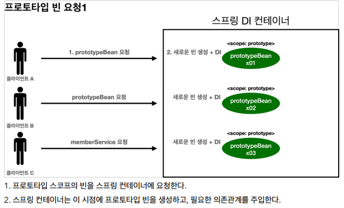

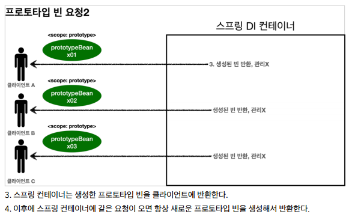


### Provider

싱글톤에서 프로토타입을 등록하고 매번 요청시 새로운 빈을 생성하는 방법은 provider을 사용하면된다.

* 그냥 싱글톤에서 프로토타입을 등록하고 사용하면, 항상 똑같은 프로토타입 빈을 주게 되는데  그 이유는 싱글톤 빈을 생성할 때 프로토타입 빈의 주입이 끝났기 때문이다.
* 주입 시점에 스프링 컨테이너 요청에 의해 프로토타입 빈이 생성되는 것이지 사용할 때마다 새로 생성되는 것이 아니다.


#### ObjectFactory, ObjectProvide

의존관계를 외부에서 주입(DI) 받는게 아니라, 필요한 의존관계를 찾는 것을 Dependency Lookup(DL) 의존관계 탐색이라고 한다.

```java
static class ClientBean {
    @Autowired
    private ObjectProvider<PrototypeBean> prototypeBeanProvider;
    
    ...
        
    public int logic() {
        PrototypeBean prototypeBean = prototypeBeanProvider.getObject();
        prototypeBean.addCount();
        int count = prototypeBean.getCount();
        return count;
	}
    
   	....
}
```

* ObjectProvider 의 getObject() 를 호출하면 내부에서는 스프링 컨테이너를 통해 해당 빈을 찾아서 새로운 프로토타입 빈을 반환한다. (DL)
* ObjectFactory와 ObjectProvider은 둘 다 스프링에 의존적이고 별도의 라이브러리가 필요없다. 하지만 차이점은
  * ObjectFactory는 기능이 단순하다.
  * ObjectProvider는 ObjectFactory 상속하고 옵션, 스트림 처리 등 편의 기능이 많다. 
* javax.inject.Provider 라는 JSR-330 자바 표준을 사용하면 별도의 라이브러리를 추가해야하지만 자바 표준이므로 다른 컨테이너에서 사용할 수 있다.


## 웹 스코프

웹 스코프는 웹 환경에서 동작하고 프로토타입과 다르게 해당 스코프의 종료시점까지 관리한다.


#### 웹 스코프 종류

* request: HTTP 요청 하나가 들어오고 나갈 때 까지 유지되는 스코프, 각각의 HTTP 요청마다 별도의 빈 인스턴스가 생성되고, 관리된다.
* session: HTTP Session과 동일한 생명주기를 가지는 스코프
* application: 서블릿 컨텍스트( ServletContext )와 동일한 생명주기를 가지는 스코프
* websocket: 웹 소켓과 동일한 생명주기를 가지는 스코프


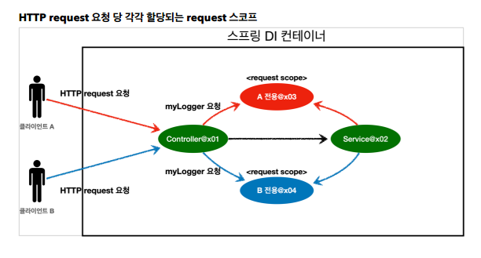


### 예시 : 

MyLogger

```java
@Component
@Scope(value = "request")
public class MyLogger {
    
    private String uuid;
    private String requestURL;

    ....
}
```

LogDemoController

```java
@Controller
@RequiredArgsConstructor
public class LogDemoController {
    private final LogDemoService logDemoService;
    private final MyLogger myLogger;
 
    @RequestMapping("log-demo")
    @ResponseBody
    public String logDemo(HttpServletRequest request) {
        String requestURL = request.getRequestURL().toString();
        myLogger.setRequestURL(requestURL);
        myLogger.log("controller test");
        logDemoService.logic("testId");
        return "OK";
    }
}
```

LogDemoService

```java
@Service
@RequiredArgsConstructor
public class LogDemoService {
    private final MyLogger myLogger;
    public void logic(String id) {
        myLogger.log("service id = " + id);
    }
}
```

#### 문제점

MyLogger 인 request 스코프 빈은 실제 고객의 요청이 왔을 때 생성되기 때문에 생성되지 않아 그 결과 오류가 발생한다.

#### 첫번째 해결

LogDemoController

```java
@Controller
@RequiredArgsConstructor
public class LogDemoController {
    private final LogDemoService logDemoService;
    private final ObjectProvider<MyLogger> myLoggerProvider;
    

    @RequestMapping("log-demo")
    @ResponseBody
    public String logDemo(HttpServletRequest request) {
        String requestURL = request.getRequestURL().toString();
        MyLogger myLogger = myLoggerProvider.getObject();
        myLogger.setRequestURL(requestURL); myLogger.log("controller test");
        logDemoService.logic("testId");
        return "OK";
    }
}
```

LogDemoService

```java
@Service
@RequiredArgsConstructor
public class LogDemoService {
    private final ObjectProvider<MyLogger> myLoggerProvider;
    
    public void logic(String id) {
        MyLogger myLogger = myLoggerProvider.getObject();
        myLogger.log("service id = " + id);
    }
}
```

* ObjectProvider.getObject() 를 호출하시는 시점에는 HTTP 요청이 진행중이므로 request scope 빈의 생성이 정상 처리된다.
* 또한, LogDemoController , LogDemoService 에서 각각 한번씩 따로 getObject가 호출되더라도 `같은 HTTP 요청이면 같은 스프링 빈이 반환`된다.


#### 두번째 해결 - 프록시

MyLogger

```
@Component
@Scope(value = "request", proxyMode = ScopedProxyMode.TARGET_CLASS)
public class MyLogger {
	...
}
```

+ LogDemoController, LogDemoService 를 이전으로 바꾼다

가짜 프록시 클래스를 만들어두면 HTTP request 요청에 상관없이 가짜 프록시를 생성하여 스프링 컨테이너에 등록한다. 그리고 가짜 프록시 객체는 `요청이 오면 내부에서 진짜 빈을 요청하는 위임 로직`을 호출한다. 

프록시 객체는 원본 클래스를 상속받았기 때문에 이 객체를 사용하는 클라이언트는 프록시인지 진짜인지 구분할 수 없고 동일하게 사용할 수 있다. (다형성)

* 가짜 프록시 객체는 실제 request scope와는 관계가 없다. 그냥 가짜이고, 내부에 단순한 위임 로직만 있고, 싱글톤 처럼 동작한다.
