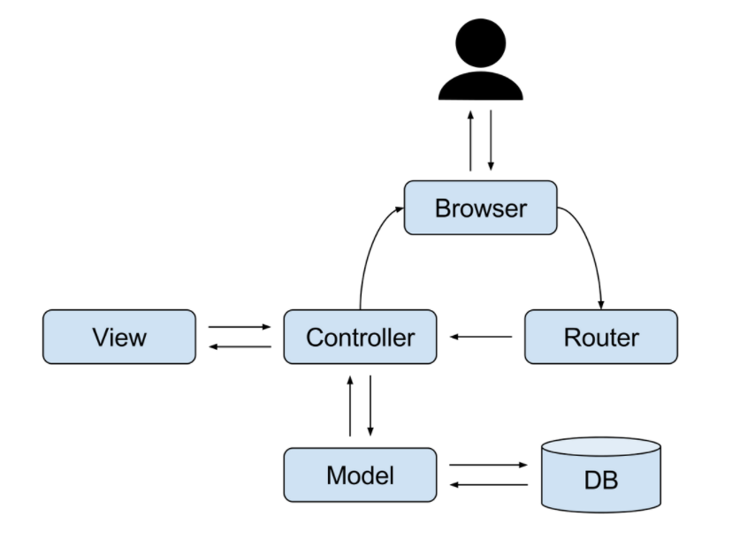
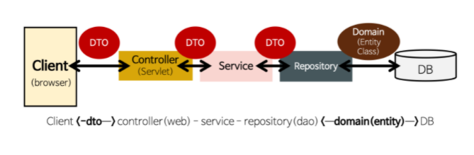

AOP (Aspect Oriented Programming)

관점 지향 프로그래밍이라고 불린다.

어떤 로직을 기준으로 핵심적인 관점, 부가적인 관점으로 나눠서 보고 그 관점을 기준으로 각각 모듈화하겠다는 것이다.

예를들어, 핵심적인 관점은 `핵심 비즈니스 로직`이고, 부가적인 관점은 로직을 실행하기 위해서 행해지는 `데이터베이스 연결, 로깅, 파일 입출력` 등을 예로 들 수 있다.

  

# MVC 패턴

MVC 패턴은 Model - View - Controller의 약자로 개발할 때 3가지 형태로 역할을 나누어 개발하는 방법론이다.

### Model

어플리케이션이 무엇을 할 것인지를 정의하는 부분으로 DB와 연동하여 사용자가 입력한 `데이터`나 사용자에게 출력할 `데이터`를 다룹니다.

## View

사용자에게 시각적으로 보여주는 부분이다.

## Controller

Model이 데이터를 어떻게 처리할지를 알려주는 역할을 한다. 클라이언트가 보낸 데이터가 있으면 모델을 호출하기 전에 적절히 가공하고 모델을 호출한다. 그다음 모델의 업무가 수행 완료되면 그 결과를 가지고 View에게 전달한다. 

# Repository / Service / Controller

서버의 처리 과정을 크게 3개로 분리한다.

### Repository

* DB 연결, 해제, 자원 관리
* DB CRUD 작업 처리

### Service

* 사용자 요구사항 처리
* DB 정보가 필요할 때 Repository를 통해 처리

### Controller

* 클라이언트의 요청을 받음
* 요청에 대한 처리는 서비스에 전담
* 클라이언트에게 응답

### Controller와 Service의 구분 이유

비즈니스 로직 코더가 컨트롤러에 구현

### Domain(Entity)

* 엔티티의 각 필드는 DB 테이블과 1:1 매칭되며 따라서 PK를 가진다.

* 엔티티는 순수한 도메인 로직과 비즈니스 로직만 가지고 있어야 한다.

* 엔티티는 DB의 데이터를 전달해주고 Service에서 사용할 비지니스 로직만 가져야 한다.

### DTO(Data Transfer Object)

Controller는 View와 도메인 Model의 데이터를 주고 받을 때 별도의 **DTO** 를 주로 사용한다. 왜냐하면 Model과 View 사이에 의존성을 만들면 안되기 때문이다.

UI에 사용하는 데이터만 선택적으로 DTO를 만들어 전달한다. 즉, DTO는 클라이언트 요청을 포함한 데이터를 담아 서버측에 전달하고, 서버측의 응답 데이터를 담아 클라이언트에게 전달하는 계층간 전달자 역할을 수행한다.

- Getter/Setter 없음
- Wrapping 된 순수한 데이터 객체
- 엔티티에 직접 접근하지 않기때문에 엔티티가 변경되어도 DTO만 변경하면 된다