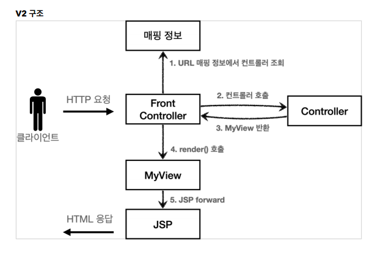

## 목차

1. 웹 애플리케이션 이해
2. 서블릿
3. 서블릿, JSP, MVC 패턴
4. MVC 프레임워크 만들기
5. 스프링 MVC - 구조 이해
6. 스프링 MVC - 기본 기능
7. 스프링 MVC - 웹 페이지 만들기


-----

# 01. 웹 애플리케이션 이해

## 웹서버

* HTTP 기반으로 동작

* 정적 리소스 제공, 기타 부가기능
* 정적(파일) HTML, CSS, JS, 이미지, 영상
* 예) NGINX, APACHE


### 웹 애플리케이션 서버 

* HTTP 기반으로 동작
* 웹 서버 기능 포함+ (정적 리소스 제공 가능)
* 프로그램 코드를 실행해서 `애플리케이션 로직` 수행
* 동적 HTML, HTTP API(JSON)
* 서블릿, JSP, 스프링 MVC
* 예) 톰캣(Tomcat) Jetty, Undertow


웹 서버와 웹 애플리케이션 서버의 용어는 모호하다. 왜냐하면 

* 웹서버도 프로그램을 실행하는 기능을 포함하고
* 웹 애플리케이션 서버도 웹 서버의 기능을 제공하기 때문이다.
* WAS는 애플리케이션 코드를 실행하는 데 더 특화되어있다고 생각하면 된다.


웹 시스템의 구성은 WAS, DB만으로도 가능하지만,,,

1. 이럴 경우 WAS가 너무 많은 역할을 담당하게 되어 서버 과부하가 우려 된다. 
2. HTML, CSS, JS 파일 같은 경우 간단하지만 애플리케이션 로직은 복잡하다. 애플리케이션 로직이 정적 리소스 때문에 수행이 어려운 경우가 발생하면 안 된다. 
3. WAS가 (개발자들의 실수 버그 날 가능성이 높음) 장애시 오류 화면도 노출 불가능하다. 


### 그러므로...

### 웹 시스템 구성 - WEB, WAS, DB


 정적 리소스는 웹 서버가 처리하고 애플리케이션 로직같은 동적인 처리가 필요하면 WAS에 요청을 위임한다. 즉, WAS는 중요한 애플리케이션 로직 처리 전담한다.

이렇게 나누면 효율적인 리소스 관리가 가능하다. 예를 들어, 정적 리소스가 많이 사용되면 Web 서버 증설하고 애플리케이션 리소스가 많이 사용되면 WAS 증설할 수 있다.

또한 정적 리소스만 제공하는 웹 서버는 잘 죽지 않고 애플리케이션 로직이 동작하는 WAS 서버는 잘 죽기 때문에 WAS, DB 장애시 `WEB 서버가 오류 화면 제공 가능`하다.


## 서블릿

HTML form 데이터를 전송하는 과정에서 서버는

1. 서버 TCP/IP 연결 대기/ 소켓 연결
2. HTTP 요청 메세지 파싱해서 읽기
3. POST 방식, /save 인지
4. Content-Type 확인
5. HTTP 메세지 바디 내용 파싱
6. 저장 프로세스 실행
7. 비즈니스 로직 실행 : 데이터베이스 저장 요청
8. HTTP 응답 메시지 생성 시작 (HTTP 시작 라인, header, body에 HTML 생성)
9. TCP/IP 응답 전달, 소켓 종료

의 과정을 거쳐야한다.


하지만 서블릿을 지원하는 WAS를 사용할 경우

`비즈니스 로직 실행 : 데이터 베이스 저장 요청` 만 실행하면 된다.

```java
@WebServlet(name = "helloServlet", urlPatterns = "/hello")
public class HelloServlet extends HttpServlet{
    
    @Override
    protected void service(HttpServletRequest request, HttpServletResponse response){
        // 애플리케이션 로직
        ...
    }
}
```

* HTTP 요청 정보를 편리하게 사용할 수 있는 `HttpServletRequest` 지원
* HTTP 응답 정보를 편리하게 제공할 수 있는 `HttpServletResponse` 지원


1. WAS는 Request, Response 객체를 새로 만들어서 서블릿 객체 호출
2. 개발자는 Request 객체에서 HTTP 요청 정보를 편리하게 꺼내서 사용 or Response 객체에 HTTP 응답 정보를 편리하게 입력
3. WAS는 Response 객체에 담겨있는 내용으로 HTTP 응답 정보를 생성


### 서블릿 컨테이너 특징

톰캣처럼 서블릿을 지원하는 WAS를 서블릿 컨테이너라고 한다. 서블릿 컨테이너는 서블릿 객체를 생성, 초기화, 호출, 종료의 생명주기를 관리한다.

* 서블릿 객체는 고객 요청이 올 때 마다 계속 객체를 생성하는 것은 비효율적이기 때문에 `싱글톤`으로 관리한다.
*  최초 로딩 시점에 서블릿 객체를 미리 만들어두고 재활용한다. 그러므로 모든 고객 요청은 동일한 서블릿 객체 인스턴스에 접근하고 `공유 변수 사용에 주의`해야한다. 
* 서블릿 컨테이너 종료시 함께 종료된다.
* JSP도 서블릿으로 변환 되어서 사용한다.
* 동시 요청을 위한 멀티 쓰레드 처리 지원


## 동시 요청 - 멀티 쓰레드

### 스레드

애플리케이션 코드를 하나씩 순차적으로 실행하는 것이 스레드이고 스레드가 없다면 자바 애플리케이션 실행이 불가능하다. 스레드는 한번에 `하나의 코드라인`만 수행한다. 동시 처리가 필요하면 스레드를 추가로 생성해야 한다.


### 1. HTTP 요청마다 스레드 생성시

#### 장점

하나의 스레드가 지연되어도 나머지 스레드가 정상 동작하고, 동시 요청을 처리할 수 있고, 리소스가 허용할때 까지 처리 가능하다.

#### 단점

고객 요청이 올 때 마다 스레드를 생성하면 응답 속도 늦어진다(스레드 생성비용 비쌈)

스레드는 "context switching" 발생할 때 프로세스만큼은 아니지만 비용이 발생한다.

고객 요청이 너무 많이 올 경우 CPU, 메모리 임계치가 넘어 서버가 죽을 가능성도 있다.


### 2. 스레드 풀로 관리


스레드 풀은 필요한 스레드를 미리 만들어 보관하고 관리한다. 톰캣의 경우 최대 200개 기본 설정이다.

스레드가 미리 생성되어 있어 스레드를 생성하고 종료하는 비용을 절약하고 응답 시간이 빠르다. 그리고 너무 많은 요청이 온다고 해도 스레드 최대치로 인해 최대치까지 안전하게 처리할 수 있다.


### 3. 스레드 풀의 실무 tip

* WAS의 튜닝포인트는 `최대 스레드 (max thread) 수`이다.
* 너무 낮으면, 서버 리소스는 여유롭지만 클라이언트는 금방 응답 지연
* 너무 높으면, 동시요청이 많을 시 리소스 임계점 초과로 서버 다운 가능성
* 스레드 풀의 적정 숫자는 애플리케이션 로직의 복잡도, CPU, 메모리, IO 리소스 상황에 따라 모두 다르다
* 성능 테스트 : 최대한 실제 서비스와 유사하게 성능 테스트 시도
  * 아파치 ab , 제이미터, nGrinder


## WAS 멀티 스레드 지원

WAS는 멀티스레드 부분을 처리해주기 때문에 개발자가 멀티스레드 관련 코드를 신경쓰지 않아도 된다. 마치 싱글스레드 프로그래밍하듯 편리하게 소스 코드를 개발한다. 

`멀티 스레드 환경이므로 싱글톤 객체(서블릿, 스프링 빈) 주의해서 사용`


### 서버사이드 렌더링, 클라이언트 사이드 렌더링

#### SSR - 서버 사이드 렌더링

서버에서 최종 HTML를 생성해서 웹 브라우저에 전달한다.

* 주로 정적인 화면에 사용
* 관련기술: JSP, 타임리프 -> 백엔드 개발자


#### CSR - 클라이언트 사이드 렌더링

HTML 결과를 자바스크립트를 사용해 웹 브라우저에서 동적으로 생성해서 적용한다.

* 주로 동적인 화면에 사용, 웹 환경을 마치 앱 처럼 필요한 부분부분 변경할 수 있음
* 예) 구글 지도, Gmail, 구글 캘린더
* 관련기술: React, Vue.js -> 웹 프론트엔드 개발자

> React, Vue.js를 CSR + SSR 동시에 지원하는 웹 프레임워크도 있음
> SSR을 사용하더라도, 자바스크립트를 사용해서 화면 일부를 동적으로 변경 가능


# 02. 서블릿

## HttpServletRequest

서블릿은 개발자가 HTTP 요청 메시지를 편리하게 사용할 수 있도록 HTTP 요청 메시지를 파싱하여 그 결과를 HttpServletRequest 객체에 담아 제공한다.

* `request.setAttribute(name, value)`
* `request.getAttribute(name)`


##### Start Line

* HTTP 메소드
* URL
* 쿼리 스트링
* 스키마, 프로토콜


##### Header

- Content-Type: 표현 데이터의 형식
  - text/html; charset=utf-8
  - application/json
  - image/png
- Content-Encoding: 표현 데이터의 압축 방식
- Content-Language: 표현 데이터의 자연 언어
- Content-Length: 표현 데이터의 길이


##### Body

* form 파라미터 형식 조회
* message body 데이터 직접 조회


#### 상태코드

- 1xx (Information): 요청이 수신되어 처리중
- 2xx (Successful): 요청 정상 처리
- 3xx (Redirection): 요청을 완료하려면 추가 행동이 필요
- 4xx (Client Error): 클라이언트 오류, 잘못된 문법등으로 서버가 요청을 수행할 수 없음
- 5xx (Server Error): 서버 오류, 서버가 정상 요청을 처리하지 못함


## HTTP 요청 데이터 개요

### 1. GET : 쿼리 파라미터

/url`?username=hee&age=20`

메세지 바디 없이, URL 쿼리 파라미터에 데이터를 포함해서 전달한다. 검색, 필터, 페이징 등에 많이 사용하는 방식이다.

* `?` 시작 표시이며, 추가 파라미터는 `&`으로 연결한다.

```java
// 단일 파라미터 조회
// 중복일 경우 첫번째 값을 반환한다.
String username = request.getParameter("username");

//파라미터 이름들 모두 조회
Enumeration<String> parameterNames = request.getParameterNames();
request.getParameterNames().asIterator()
    .forEachRemaining(paramName -> System.out.println(paramName +
"=" + request.getParameter(paramName)));

//파라미터를 Map으로 조회
Map<String, String[]> parameterMap = request.getParameterMap(); 

//복수 파라미터 조회
String[] usernames = request.getParameterValues("username"); 
```


### 2. POST : HTML Form

content-type:  `application/x-www-form-urlencoded`

메시지 `바디`에 쿼리 파리미터 형식으로 전달한다. username=hello&age=20 회원가입, 상품주문 등 HTML Form 사용한다.

* 쿼리 파라미터 조회 메소드를 그대로 사용하면 된다.
* 클라이언트 입장에서는 두 입장은 차이가 있지만 서버 입장에서는 둘의 형식이 동일하기 때문이다.


### 3. HTTP message body

body에 데이터를 직접 담아서 요청하는 방식으로 HTTP API에서 주로 사용한다. 

JSON, XML, TEXT 가능하고 주로 JSON 많이 사용한다. POST, PUT, PATCH가 가능하다.


#### 메시지 바디 - 단순 텍스트

content-type : `text/plain`

```java
@WebServlet(name = "requestBodyStringServlet", urlPatterns ="/request-bodystring")
public class RequestBodyStringServlet extends HttpServlet {
    
    @Override
    protected void service(HttpServletRequest request, HttpServletResponse response) throws ServletException, IOException {
        ServletInputStream inputStream = request.getInputStream();
        String messageBody = StreamUtils.copyToString(inputStream, StandardCharsets.UTF_8);
        
        System.out.println("messageBody = " + messageBody);
        response.getWriter().write("ok");
    }
}
```

* inputStream은 byte 코드를 반환하기 때문에 우리가 읽을 수 있는 문자(String)로 보려면 문자표(Charset)를 지정해주어야 한다. 여기서는 UTF_8 Charset을 지정해주었다.


#### 메시지 바디 - JSON

content-type : `application/json`

ObjectMapper을 통해 messagebody의 내용을 Data class로 변환해준다.

JSON 결과를 파싱해서 자바 객체로 변환하기 위해서는 Jackson, Gson 같은 JSON 변환 라이브러리가 필요하다.

스프링 MVC는 기본적으로 Jackson 라이브러리(ObjectMapper)을 제공한다.

```java
private ObjectMapper objectMapper = new ObjectMapper();

@Override
protected void service(HttpServletRequest request, HttpServletResponse 
response) throws ServletException, IOException {
    
 	ServletInputStream inputStream = request.getInputStream();
    String messageBody = StreamUtils.copyToString(inputStream, StandardCharsets.UTF_8);
    
    HelloData helloData = objectMapper.readValue(messageBody, HelloData.class); 

}
```


## HttpServletResponse

#### response 설정

``` java
//[status-line]
response.setStatus(HttpServletResponse.SC_OK); //200

//[response-headers]
response.setHeader("Content-Type", "text/plain;charset=utf-8");
response.setHeader("Cache-Control", "no-cache, no-store, mustrevalidate");
response.setHeader("Pragma", "no-cache");
response.setHeader("my-header","hello");

//[Header 편의 메서드]
content(response);
cookie(response);
redirect(response);

//[message body]
PrintWriter writer = response.getWriter();
writer.println("ok");
```

#### response 편의 메서드

```java
//[response-headers]
response.setContentType("text/plain");
response.setCharacterEncoding("utf-8");

//[Header 편의 메서드]
Cookie cookie = new Cookie("myCookie", "good");
cookie.setMaxAge(600); //600초
response.addCookie(cookie);

response.sendRedirect("/basic/hello-form.html");
```


## HTTP 응답 데이터

### 1. 단순 텍스트

* writer.println("OK");
* 처럼 OK를 그대로 HTML에 찍음


### 2. HTML 응답

* writer을 통해 직접 보내는 방식, content-type을 `text/html` 으로 지정해야 한다.

  ```java
   writer.println("<html>");
   writer.println("<body>");
   writer.println(" <div>안녕?</div>");
   writer.println("</body>");
   writer.println("</html>");
  ```


### 3. HTTP API - message body, JSON 응답

* content-type을 `application/json` 으로 지정해야 한다.

```java
	HelloData data = new HelloData();
	data.setUsername("kim");
	data.setAge(20);
 
	String result = objectMapper.writeValueAsString(data);
	//{"username":"kim","age":20}
 	response.getWriter().write(result);
```

* application/json 은 스펙상 utf-8 형식을 사용하도록 정의되어 있다. 그래서 스펙에서 charset=utf-8 과 같은 추가 파라미터를 지원하지 않는다. 
  * application/json ( o )
  * application/json;charset=utf-8 ( x )
* response.getWriter()를 사용하면 추가 파라미터를 자동으로 추가해버린다. 이때는
  response.getOutputStream()으로 출력하면 그런 문제가 없다.


# 03. 서블릿, JSP, MVC 패턴 

### 서블릿

서블릿으로 개발할 경우 뷰 화면을 위한 HTML 만드는 작업이 자바 코드와 섞여 지저분 하다.

예시 : 

```java
@WebServlet(name = "memberListServlet", urlPatterns = "/servlet/members")
public class MemberListServlet extends HttpServlet {
    private MemberRepository memberRepository = MemberRepository.getInstance();

    @Override
    protected void service(HttpServletRequest request, HttpServletResponse response) throws ServletException, IOException {
        response.setContentType("text/html");
        response.setCharacterEncoding("utf-8");
	 	List<Member> members = memberRepository.findAll();
 		
        PrintWriter w = response.getWriter();
        w.write("<html>");
        w.write("<head>");
        w.write(" <meta charset=\"UTF-8\">");
        ....
    }
}
```


### JSP

JSP 성능과 기능면에서 다른 템플릿 엔진과의 경쟁에서 밀리면서 점점 사라지는 추세이다. 

JSP를 사용하면 기존의 서블릿보다는 깔끔하지만 여전히 jsp 코드 내에 비즈니스 로직과 HTML 영역이 섞여 있다.

JSP가 많은 역할을 하고 있기 때문에 유지보수하기 힘들게 된다. 그래서 비즈니스 로직과 view역할을 구분하는 MVC 패턴이 등장하게 되었다.


#### build.gradle 추가

```java
//JSP 추가 시작
implementation 'org.apache.tomcat.embed:tomcat-embed-jasper'
implementation 'javax.servlet:jstl'
//JSP 추가 끝
```


* jsp는 첫 줄에 추가해줘야 한다. 그 이후에는 HTML와 똑같다.

  `<%@ page contentType="text/html;charset=UTF-8" language="java" %>`

* 자바 import의 경우

  `<%@ page import="hello.servlet.domain.member.MemberRepository" %>`

* 자바 코드 입력

  `<%     %>`

* 자바 코드 출력

  `<%=    %>`  OR

  ```java
  <%
  	for (Member member : members) {
  	out.write(" <tr>");
  	out.write(" <td>" + member.getId() + "</td>");
  	out.write(" <td>" + member.getUsername() + "</td>");
  	out.write(" <td>" + member.getAge() + "</td>");
  	out.write(" </tr>");
   	}
  %>
  ```

  

### MVC 패턴

1. 너무 많은 역할을 분리 : 비즈니스 로직과 뷰 렌더링 처리를 구분 -> 유지보수 
2. 변경의 라이프사이클 : UI 일부 수정과 비즈니스 로직의 수정하는 라이프 사이클이 다를 가능성이 높고 서로 영향을 미치지 않는다. 그렇기 때문에 라이프사이클이 다른 부분을 나눠 관리하는 것이 좋다.
3. 기능 특화 : 특히 JSP의 경우 뷰 템플릿 화면 렌더링에 최적화되어있기 때문에 이 부분만 담당하는 것이 효과적이다.


## MVC (Model, View, Controller)

MVC 패턴은 Model - View - Controller의 약자로 개발할 때 3가지 형태로 역할을 나누어 개발하는 방법론이다.


#### Controller :

 HTTP 요청 받아 파라미터를 검증하고, 비즈니스 로직을 실행한다. 그리고 뷰에 전달할 결과 데이터를 조회해 모델에 담는다.

* 비즈니스 로직은 서비스(Service)라는 계층을 별도 만들어 처리한다.
* 컨트롤러는 비즈니스 로직이 있는 서비스 호출을 담당한다.

#### Model :

뷰에 출력할 데이터를 담아둔다. 뷰에 필요한 데이터를 모두 모델에 담아서 전달해주기 때문에 뷰는 `비즈니스 로직, 데이터 접근을 알 필요가 없고`, 화면 렌더링에 집중할 수 있다.

#### View : 

모델에 담겨있는 데이터를 사용해 화면에 출력한다.


### Step 1

서블릿 컨트롤러, JSP 뷰

```java
@WebServlet(name = "mvcMemberSaveServlet", urlPatterns = "/servlet-mvc/members/save")
public class MvcMemberSaveServlet extends HttpServlet {
 
    private MemberRepository memberRepository = MemberRepository.getInstance();
 
    @Override
    protected void service(HttpServletRequest request, HttpServletResponse response) throws ServletException, IOException {
 
        String username = request.getParameter("username");
        int age = Integer.parseInt(request.getParameter("age"));
        
        Member member = new Member(username, age);
        memberRepository.save(member);
 
        //Model에 데이터를 보관한다.
        request.setAttribute("member", member);
        
        String viewPath = "/WEB-INF/views/save-result.jsp";
        RequestDispatcher dispatcher = request.getRequestDispatcher(viewPath);
        dispatcher.forward(request, response);
    
    }
}
```

* `dispatcher.forward` : 다른 서블릿이나 JSP로 이동할 수 있는 기능이다.
* `/WEB-INF` 이 경로에 JSP을 넣으면 `항상 컨트롤러를 통해 JSP를 호출할 수 있다.`


### Step 2

#### 한계 :

1. View 이동 코드가 반복해서 호출되어야 한다. (RequestDispatcher, forward 호출 등)
2. ViewPath가 중복된다.
3. parameter로 HttpServletRequest, HttpServletResponse 가 둘 다 있지만 항상 사용하는 것은 아니다.   
4. 기능이 복잡해질 수 록 컨트롤러에서 공통으로 처리해야 하는 부분이 더 많이 증가할 것이다. 단순 공통 기능으로 메소드를 추출한다고 해도 결국 메서드도 항상 호출해야하고 실수로 누락될 가능성도 있다.

##### 결론 : 컨트롤러 호출 전 프론트 컨트롤러를 도입해 처리한다.


# 04. MVC 프레임워크 만들기


프론트 컨트롤러 서블릿 하나로 클라이언트의 요청을 받고, 요청에 맞는 컨트롤러를 호출한다. 그러면 나머지 컨트롤러는 `서블릿`을 사용하지 않아도 된다.


### Step 1


1. 서블릿 모양의 컨트롤러 인터페이스를 선언하고 각 컨트롤러들은 이 인터페이스를 구현한다. 

   ```java
   # 컨트롤러 인터페이스
   public interface ControllerV1 {
       
       void process(HttpServletRequest request, HttpServletResponse response) throws ServletException, IOException;
       
   }
   ```

   ```java
   # 컨트롤러 인터페이스 구현한 컨트롤러들
   public class public class MemberFormControllerV1 implements ControllerV1 {
       @Override
       (....)
   }
   
   public class MemberSaveControllerV1 implements ControllerV1 {
   	@Override
       (....)
   }
   .
   .
   .
   ```

   

2. 프론트 컨트롤러를 만들어서 url 요청을 각 맞는 컨트롤러와 연결한다.

   ```java
   # 프론트 컨트롤러
   @WebServlet(name = "frontControllerServletV1", urlPatterns = "/frontcontroller/v1/*")
   public class FrontControllerServletV1 extends HttpServlet {
    
       private Map<String, ControllerV1> controllerMap = new HashMap<>();
    
       public FrontControllerServletV1() {
           controllerMap.put("/front-controller/v1/members/new-form", new MemberFormControllerV1());
           controllerMap.put("/front-controller/v1/members/save", new
   MemberSaveControllerV1());
           ....
       }
    
       @Override
       protected void service(HttpServletRequest request, HttpServletResponse response) throws ServletException, IOException {
           
           String requestURI = request.getRequestURI();
           ControllerV1 controller = controllerMap.get(requestURI);
    
           if (controller == null) {
               response.setStatus(HttpServletResponse.SC_NOT_FOUND);
               return;
           }
           
           controller.process(request, response);
       }
   }
   ```

   * `urlPatterns = "/front-controller/v1/*"` : /front-controller/v1/ 하위 모든 요청은 이 서블릿에서 처리
   * 해당 URI 에 따른 컨트롤러를 찾아 해당 컨트롤러를 실행한다.


### Step2 - viewPath 분리



1. MyView class 선언한다.

   ```java
   # viewPath 클래스
   public class MyView {
       
       private String viewPath;
       
       public MyView(String viewPath) {
           this.viewPath = viewPath;
       }
    
       public void render(HttpServletRequest request, HttpServletResponse 
   response) throws ServletException, IOException {
           RequestDispatcher dispatcher =  request.getRequestDispatcher(viewPath);
           dispatcher.forward(request, response);
       }
       
   }
   ```

2. Controller interface - > process 매서드의 반환 값을 MyView로 수정

3. interface를 구현한 다른 컨트롤러도 전부 수정

   ```java
   # 컨트롤러 인터페이스 구현한 컨트롤러들
   public class MemberFormControllerV2 implements ControllerV2 {
    
       @Override
       public MyView process(HttpServletRequest request, HttpServletResponse  response) throws ServletException, IOException{
       
           return new MyView("/WEB-INF/views/new-form.jsp");
       
       }
   }
   ```

4. 프론트 컨트롤러 변경

   ```java
   # 프론트 컨트롤러
   @Override
   (.....  다른 부분 동일)
       
       MyView view = controller.process(request, response);
    	view.render(request, response);
   ```

   

### Step 3 - 서블릿 종속성 제거, 뷰 이름 중복 제거

1. 프론트 컨트롤러 제외한 다른 컨트롤러에서 HttpServletRequest, HttpServletResponse을 제거하고 요청 파라미터 정보는 Map으로 넘기고 request 객체는 별도의 Model 객체로 반환한다.

2. 컨트롤러에서 지정한 뷰 이름 중복을 제거하여 뷰 논리 이름으로 처리하고 물리 이름은 프론트 컨트롤러에서 처리하도록 한다.

   예시1 : `/WEB-INF/views/new-form.jsp` : `new-form`

   예시2 : `/WEB-INF/views/members.jsp` : `members`


1. ModelView 클래스 만들기

   ```java
   # ModelView 클래스
   public class ModelView {
       private String viewName; private Map<String, Object> model = new HashMap<>();
       
       public ModelView(String viewName) {
           this.viewName = viewName;
       }
       
       //getter, setter
   }
   ```

2. interface Controller 변경

   ```java
   public interface ControllerV3 {
       ModelView process(Map<String, String> paramMap);
   }
   ```

   HttpServletRequest가 제공하는 파라미터를 Map에 담아 전달하고, 결과로 뷰 이름과 Model 데이터를 포함하는 ModelView를 반환한다.

3. 인터페이스를 구현하는 컨트롤러 변경

   ```java
   public class MemberSaveControllerV3 implements ControllerV3 {
    
       private MemberRepository memberRepository = MemberRepository.getInstance();
    
       @Override
       public ModelView process(Map<String, String> paramMap) {
           
           String username = paramMap.get("username");
           int age = Integer.parseInt(paramMap.get("age"));
           Member member = new Member(username, age);
           memberRepository.save(member);
    
           ModelView mv = new ModelView("save-result");
           mv.getModel().put("member", member);
    
           return mv;
       }
   }
   ```

4. 프론트 컨트롤러 변경

   ```java
   @WebServlet(.. 동일)
   public class FrontControllerServletV3 extends HttpServlet {
    
       @Override
       protected void service(HttpServletRequest request, HttpServletResponse response) throws ServletException, IOException {
    
           String requestURI = request.getRequestURI();
           ControllerV3 controller = controllerMap.get(requestURI);
    
           if (controller == null) {
               response.setStatus(HttpServletResponse.SC_NOT_FOUND);
               return;
           }
    
           // 추가
           Map<String, String> paramMap = createParamMap(request);
           ModelView mv = controller.process(paramMap);
           
           String viewName = mv.getViewName();
           MyView view = viewResolver(viewName);
           view.render(mv.getModel(), request, response);
       }
     
       private Map<String, String> createParamMap(HttpServletRequest request) {
           
           Map<String, String> paramMap = new HashMap<>();
           
           request.getParameterNames().asIterator()
               .forEachRemaining(paramName -> paramMap.put(paramName, request.getParameter(paramName)));
           
           return paramMap;
       }
    
       // 논리 viewpath -> 물리 viewpath
       private MyView viewResolver(String viewName) {
           return new MyView("/WEB-INF/views/" + viewName + ".jsp");
       }
   ```

5. MyView render overloading

   ```java
   // overloading
   public void render(Map<String, Object> model, HttpServletRequest request, HttpServletResponse response) throws ServletException, IOException {
       
       modelToRequestAttribute(model, request);
       RequestDispatcher dispatcher = request.getRequestDispatcher(viewPath);
       dispatcher.forward(request, response);
   }
   
   private void modelToRequestAttribute(Map<String, Object> model,
   HttpServletRequest request) {
       
       model.forEach((key, value) -> request.setAttribute(key, value));
   
   }
   ```


### Step 4 : ModelView 객체 생성의 중복

ModelView 객체를 생성하고 반환하는 대신 view name만 반환하도록 설계

1. 컨트롤러 인터페이스 수정 + 그 외 컨트롤러 구현도 수정

   ```java
   public interface ControllerV4 {
    	/**
    	* @param paramMap
    	* @param model
    	* @return viewName
    	*/
       String process(Map<String, String> paramMap, Map<String, Object> model);
   }
   ```

2. 프론트 컨트롤러 수정

   ```java
   @Override
   protected void service(HttpServletRequest request, HttpServletResponse response){
   
       (..동일..)
       Map<String, String> paramMap = createParamMap(request);
       Map<String, Object> model = new HashMap<>(); //추가
    
       String viewName = controller.process(paramMap, model);
    
       MyView view = viewResolver(viewName);
       view.render(model, request, response);
   }
   ```

   

### 어댑터

프론트 컨트롤러를 가지고 여러가지 인터페이스를 사용하고싶을 때 사용하는 것이 바로 어댑터 이다.


1. 어댑터 interface 정의

   ```java
   public interface MyHandlerAdapter {
       boolean supports(Object handler);
       
       ModelView handle(HttpServletRequest request, HttpServletResponse response,Object handler) throws ServletException, IOException;
   
   }
   ```

   support는 어댑터가 handler(컨트롤러)를 처리할 수 있는지 알려준다.

   handle은 실제 컨트롤러를 호출하고 그 결과로 ModelView를 반환한다. 이전에는 프론트 컨트롤러가 실제 컨트롤러를 호출했지만 이제 `어댑터를 통해 실제 컨트롤러를 호출`한다.

2. 어댑터 구현

   ```java
   // V3 어댑터
   public class ControllerV3HandlerAdapter implements MyHandlerAdapter{
    
       @Override
       public boolean supports(Object handler) {
           return (handler instanceof ControllerV3);
       }
    
       @Override
       public ModelView handle(HttpServletRequest request, HttpServletResponse response, Object handler) {
           
           ControllerV3 controller = (ControllerV3) handler;
           Map<String, String> paramMap = createParamMap(request);
           ModelView mv = controller.process(paramMap);
           return mv;
       }
   }
   
   // V4 어댑터
   public class ControllerV4HandlerAdapter implements MyHandlerAdapter{
       (...생략)
   
       @Override
       public ModelView handle(HttpServletRequest request, HttpServletResponse response, Object handler) {
           ControllerV4 controller = (ControllerV4) handler;
    
           Map<String, String> paramMap = createParamMap(request);
           Map<String, Object> model = new HashMap<>();
   
           String viewName = controller.process(paramMap, model);
           ModelView mv = new ModelView(viewName);
    
           mv.setModel(model);
           return mv;
    }
   ```

   각 컨트롤러 반환 값을 ModelView로 형식을 맞춰 반환한다.

3. 프론트 컨트롤러

   ```java
   @WebServlet(name = "frontControllerServletV5", urlPatterns = "/frontcontroller/v5/*")
   public class FrontControllerServletV5 extends HttpServlet {
       
       private final Map<String, Object> handlerMappingMap = new HashMap<>();
       private final List<MyHandlerAdapter> handlerAdapters = new ArrayList<>();
    
       public FrontControllerServletV5() {
           initHandlerMappingMap();
           initHandlerAdapters();
       }
    
       private void initHandlerMappingMap() {
           handlerMappingMap.put("/front-controller/v5/v3/members/new-form", new MemberFormControllerV3());
           ...추가
       }
    
       private void initHandlerAdapters() {
           handlerAdapters.add(new ControllerV3HandlerAdapter());
           ...추가
       }
       
       @Override
       protected void service(HttpServletRequest request, HttpServletResponse response) throws ServletException, IOException {
    		// 맞는 handler
           Object handler = getHandler(request);
   
           if (handler == null) {
               response.setStatus(HttpServletResponse.SC_NOT_FOUND);
               return;
           }
    	
           // 맞는 어댑터
           MyHandlerAdapter adapter = getHandlerAdapter(handler);
           ModelView mv = adapter.handle(request, response, handler);
   
           MyView view = viewResolver(mv.getViewName());
           view.render(mv.getModel(), request, response);
       }
    
       private Object getHandler(HttpServletRequest request) {
           
           String requestURI = request.getRequestURI();
           return handlerMappingMap.get(requestURI);
       }
    
       private MyHandlerAdapter getHandlerAdapter(Object handler) {
           // 등록된 모든 어탭터 확인
           for (MyHandlerAdapter adapter : handlerAdapters) {
               if (adapter.supports(handler)) {
                   return adapter;
               }
           } throw new IllegalArgumentException("handler adapter를 찾을 수 없습니다. handler=" + handler);
       }
    
       private MyView viewResolver(String viewName) {
           return new MyView("/WEB-INF/views/" + viewName + ".jsp");
       }
   }
   ```


### 정리

step 1: 기존 구조를 최대한 유지하면서 프론트 컨트롤러를 도입

step 2: 단순 반복되는 뷰 로직 분리

step 3: Model 추가, 서블릿 종속성 제거, 뷰 이름 중복 제거

step 4: ModelView가 아닌 뷰 네임 반환 - 단순하고 실용적인 컨트롤러, 구현 입장에서 ModelView를 직접 생성해서 반환하지 않도록 편리한 인터페이스 제공

어댑터 : 유연한 컨트롤러, 어댑터를 추가해서 프레임워크를 유연하고 확장성 있게 설계


# 05. 스프링 MVC - 구조 이해


* FrontController -> DispatcherServlet
  * MVC의 프론트 컨트롤러가 `디스패처 서블릿`이다.
  * DispatcherServlet은 HttpServlet읠 상속받아 사용하고 서블릿으로 동작한다.
    * `DispatcherServlet`  -> `FrameworkServlet` -> `HttpServletBean`  -> `HttpServlet`
  * 스프링부트는 디스패처 서블릿을 서블릿으로 등록하면서 모든 경로(urlPatterns="/") 에 대해 매핑한다.
* HandlerMappingMap -> HandlerMapping
* MyHandlerAdapter -> HandlerAdapter
* ModelView -> ModelAndView
* viewResolver -> ViewResolver
* MyView -> View


### 요청 흐름

서블릿이 호출되면 Httpservlet이 제공하는 service() 가 오버라이드 된 frameworkServlet의 service()가 호출되고 `DispatcherServlet.doDispatch()`가 호출된다.

1. 핸들러 조회: 핸들러 매핑을 통해 요청 URL에 매핑된 핸들러(컨트롤러)를 조회한다.

2. 핸들러 어댑터 조회: 핸들러를 실행할 수 있는 핸들러 어댑터를 조회한다.
3. 핸들러 어댑터 실행: 핸들러 어댑터를 실행한다.
4. 핸들러 실행: 핸들러 어댑터가 실제 핸들러를 실행한다.
5. ModelAndView 반환: 핸들러 어댑터는 핸들러가 반환하는 정보를 ModelAndView로 변환해서
반환한다.
6. viewResolver 호출: 뷰 리졸버를 찾고 실행한다.
JSP의 경우: InternalResourceViewResolver 가 자동 등록되고, 사용된다.
7. View 반환: 뷰 리졸버는 뷰의 논리 이름을 물리 이름으로 바꾸고, 렌더링 역할을 담당하는 뷰 객체를
반환한다.
JSP의 경우 InternalResourceView(JstlView) 를 반환하는데, 내부에 forward() 로직이 있다.
8. 뷰 렌더링: 뷰를 통해서 뷰를 렌더링 한다


### 스프링부트가 자동 등록하는 핸들러 매핑과 어댑터

순서대로 찾고 없으면 다음 순서로 넘어간다.

#### HandlerMapping(핸들러 매핑)

0 : `RequestMappingHandlerMapping` - 애노테이션@ 기반의 컨트롤러인 `@RequestMapping`에서 사용한다.

1 : `BeanNameUrlHandlerMapping` - 스프링 빈의 이름으로 핸들러를 찾는다.


#### HandlerAdapter(핸들러 어댑터)

handlerAdapter의 supports()를 순서대로 호출해 지원대상을 찾고 어댑터를 실행하면서 핸들러 정보를 함께 넘겨준다. 그리고 그 결과를 반환한다. 

0 : `RequestMappingHandlerAdapter` : 애노테이션@ 기반의 컨트롤러인 @RequestMapping에서 사용

1 : `HttpRequestHandlerAdapter` : HttpRequestHandler 처리

2 : `SimpleControllerHandlerAdapter` : Controller 인터페이스(애노테이션X, 과거에 사용)에서 처리


예를들어,,,

```java
@Component("/springmvc/old-controller")
public class OldController implements Controller {
	...
}
```

* 핸들러 매핑 - > `BeanNameUrlHandlerMapping` 실행을 통해 OldController 반환
* 핸들러 어댑터 -> `SimpleControllerHandlerAdapte`을 통해 Controller 인터페이스를 찾고 OldController를 내부에서 실행


대부분의 핸들러 매핑과 어댑터는 `RequestMappingHandlerAdapter` , `RequestMappingHandlerMapping` 으로 사용한다.


### 뷰리졸버

스프링부트는 `InternalResourceViewResolver` 라는 뷰 리졸버를 자동으로 등록하는데, 이때 application.properties 에 등록한 `spring.mvc.view.prefix`, `spring.mvc.view.suffix` 설정 정보를 사용해서 등록한다.

```java
// application.properties

spring.mvc.view.prefix=/WEB-INF/views/
spring.mvc.view.suffix=.jsp
```


#### 스프링부트가 자동 등록하는 뷰 리졸버

1 : `BeanNameViewResolver` - 빈 이름으로 뷰를 찾아서 반환한다.

2 : `InternalResourceViewResolver` - JSP를 처리할 수 있는 뷰를 반환한다.

* JSP처럼 포워드 `forward ()`를 호출해서 처리할 수 있는 경우에 사용한다.
* 만약 JSTL 라이브러리가 있다면, InternalResourceView를 상속받은 JstView를 반환한다. JstView는 JSTL 태그 사용시 약간의 부가 기능이 추가된다.


* JSP를 제외한 나머지 뷰 템플릿은 forward() 과정 없이 바로 렌더링 된다.
* Thymeleaf 뷰 템플릿은 사용하면 `ThymeleafViewResolver`를 등록해야하지만 최근에는 라이브러리만 추가하면 스프링 부트가 자동으로 등록해준다.


### @RequestMapping

```JAVA
@Controller
public class SpringMemberFormControllerV1 {
    
    @RequestMapping("/springmvc/v1/members/new-form")
    public ModelAndView process() {
        return new ModelAndView("new-form");
    }
}
```

`@Controller` : 내부의 `@Component` 애노테이션으로 인해 컴포넌트 스캔의 대상이 되고 스프링 빈으로 등록된다. 스프링 MVC에서는 애노테이션 기반 컨트롤러로 인식한다.

`@RequestMapping` : 요청 정보를 매핑하고 해당 URL이 호출되면 이 메소드가 호출된다.

`ModelAndView` : 모델과 뷰 정보를 담아서 반환한다.

* `RequestMappingHandlerMapping`은 클래스 레벨에 `@Controller` 또는 `@RequestMapping`가 붙어있는 경우 매핑 정보로 인식한다.


예시 : 

```java
@Controller
public class SpringMemberSaveControllerV1 {
    private MemberRepository memberRepository = MemberRepository.getInstance();
 
    @RequestMapping("/springmvc/v1/members/save")
    public ModelAndView process(HttpServletRequest request, HttpServletResponse response) {
        
        String username = request.getParameter("username");
        int age = Integer.parseInt(request.getParameter("age"));
 
        Member member = new Member(username, age);
        memberRepository.save(member);
 
        ModelAndView mv = new ModelAndView("save-result");
        mv.addObject("member", member);
 
        return mv;
    }
}
```

* @RequestMapping -> @GetMapping , @PostMapping 
  * @RequestMapping(value = "/new-form", method = RequestMethod.GET)
* Model 도입
* ViewName 직접 반환 : 논리 이름을 반환할 수 있다.
* @RequestParam을 사용 : request.getParameter() 과 거의 비슷 

```java
@Controller
@RequestMapping("/springmvc/v3/members")
public class SpringMemberControllerV3 {
    private MemberRepository memberRepository = MemberRepository.getInstance();

    @PostMapping("/save")
    public String save(@RequestParam("username") String username, @RequestParam("age") int age, Model model) {

        Member member = new Member(username, age);
        memberRepository.save(member);
        
        model.addAttribute("member", member);
        
        return "save-result";
    }
}
```


# 06. 스프링 MVC 기본기능

* 스프링 부트에 `Jar`을 사용하면 `/resource/static/index.html` 를 넣으면 welcome 페이지로 처리한다.


## 1 ) 로그 

스프링 부트 라이브러리를 사용하면 `Spring-boot-starter-logging` 함께 포함되고 사용할 수 있다. slf4j는 인터페이스로 그 구현체로 Logback 같은 라이브러리를 선택하면 된다. 대부분은 이것을 사용한다.

* Slf4j :  http://www.slf4j.org
* Logback :  http://logback.qos.ch
* 스프링 부트가 제공하는 로그 기능 : https://docs.spring.io/spring-boot/docs/current/reference/html/spring-bootfeatures.html#boot-features-logging


##### 로그 선언

```java
private Logger log = LoggerFactory.getLogger(getClass());
private static final Logger log = LoggerFactory.getLogger(Xxx.class)
```

##### 롬복사용

```java
@Slf4j : 롬복 사용 가능
```

##### 로그 호출

```java
	log.trace("trace log={}", name);
 	log.debug("debug log={}", name);
 	log.info(" info log={}", name);
 	log.warn(" warn log={}", name);
 	log.error("error log={}", name);
```


로그는 `시간, 로그 레벨, 프로세스 ID, 스레드 명, 클래스 명, 로그 메세지` 가 함께 출력된다.

로그 레벨은 : trace -> debug -> info -> warn -> error 순이다.

* 개발 서버는 debug 호출하고, 운영서버는 info 출력한다.
* trace 로그로 설정하면 trace, debug, info, warn, error를 다 볼 수 있다.
* System.out.println은 레벨에 관계없이 모두 다 볼 수 있다.
* dafault는 info로 info, warn, error를 볼 수 있다.


#### 로그레벨 설정

```java
// application.properties
// 전체 로그 레벨 설정(기본 info)
logging.level.root=info

//hello.springmvc 패키지와 그 하위 로그 레벨 설정
logging.level.hello.springmvc=debug
```


로그를 `log.debug("data="+data)` 와 같이 문자열 처럼 연산할 수 있지만 연산을 함으로써 메모리를 사용하게 된다.

그렇기 때문에 파라미터를 넘기는 작업을 해야한다. 즉, `log.debug("data={}", data)` 을 사용한다.

* 만약 로그 출력 레벨을 info로 설정했을 경우 debug로는 출력되지 않는다. 


#### 로그 장점

1. 스레드 정보, 클래스 정보처럼 부가 정보를 함께 볼 수 있다.
2. 로그 레벨에 따라 개발서버에서 로그를 출력하고, 운영서버에서는 출력되지 않게 조절할 수 있다.
3. println처럼 콘솔에만 출력하는게 아니라 `파일, 네트워크` 등에 별도 위치에 남길 수 있다.
4. 파일로 남길 때는 일별 혹은 특정 용량에 따라 로그 분할이 가능하다. 최근에는 로그가 100MB 넘으면 분할하거나 압축해서 백업하는 기능이 추가되었다.
5. 내부 버퍼링 기능이 있어서 버퍼링 최적화에 따라 한꺼번에 출력이 모여 성능 측면에서도 좋다. (그 외 멀티스레드 등)


## 2 ) 요청 매핑

##### @RestController

* @Controller는 반환값이 String이면 뷰 이름으로 인식하고 뷰를 찾아 렌더링한다.
* @RestController는 반환값으로 뷰를 찾는게 아니라 `Http 메시지 바디`에 바로 입력한다. 


##### @RequestMapping("/hello-basic")

* URL 호출이 오면 이 메서드가 호출된다. 
* method 속성으로 HTTP 메서드를 지정하지 않으면 메서드와 무관하게 호출된다. 즉, GET, HEAD, POST, PUT, PATCH, DELETE 모두 허용


##### @PathVariable(경로 변수)

````java
@GetMapping("/mapping/{userId}")
public String mappingPath(@PathVariable("userId") String data) {
    ...
}
````

* 만약 `@PathVariable`의 이름과 파라미터 이름이 같으면 생략할 수 있다.

  ```java
  @GetMapping("/mapping/{userId}")
  public String mappingPath(@PathVariable String userId) {
      ...
  }
  ```


##### 특정 헤더 조건 매핑

```java
/**

 * 특정 헤더로 추가 매핑
 * headers="mode",
 * headers="!mode"
 * headers="mode=debug"
 * headers="mode!=debug"
 
 * Content-Type 헤더 기반 추가 매핑 Media Type
 * consumes="application/json"
 * consumes="!application/json"
 * consumes="application/*"
 * consumes="*\/*"
 * MediaType.APPLICATION_JSON_VALUE
 
 * Accept 헤더 기반 Media Type
 * produces = "text/html"
 * produces = "!text/html"
 * produces = "text/*"
 * produces = "*\/*"
 
 */
@GetMapping(value = "/mapping-header", headers = "mode=debug")
@PostMapping(value = "/mapping-consume", consumes = "application/json") // 맞지않으면 415 상태코드 반환(Unsupported Media Type)
@PostMapping(value = "/mapping-produce", produces = "text/html") // 만지 않으면 406 상태코드 반환(Not Acceptable)
```


### HTTP 요청 - 기본, 헤더 조회

```java
@Slf4j
@RestController
public class RequestHeaderController {
    
    @RequestMapping("/headers")
    public String headers(HttpServletRequest request,
                          HttpServletResponse response,
                          HttpMethod httpMethod, Locale locale,
                          @RequestHeader MultiValueMap<String, String> headerMap,
                          @RequestHeader("host") String host,
                          @CookieValue(value = "myCookie", required = false) String cookie) {
        
        log.info("request={}", request);
        log.info("response={}", response);
        log.info("httpMethod={}", httpMethod);
        log.info("locale={}", locale);
        log.info("headerMap={}", headerMap);
        log.info("header host={}", host);
        log.info("myCookie={}", cookie);
 
        return "ok";
    }
}
```

`@RequestHeader MultiValueMap<String, String> headerMap` 

* 모든 HTTP 헤더를 MultiValueMap 형식으로 조회한다.
* MAP과 유사하지만 하나의 키에 여러 값을 받을 수 있다. value는 리스트로 반환한다.

`@RequestHeader("host") String host` : 특정 HTTP 헤더를 조회한다.

* 속성 : 필수 값 여부: required, 기본 값 속성: defaultValue

`@CookieValue(value = "myCookie", required = false) String cookie` : 특정 쿠키를 조회한다.

* 속성 : 필수 값 여부: required , 기본 값: defaultValue


> 참고 : @Controller의 사용가능 파라미터와 응답 값 - 공식 메뉴얼
>
> [공식메뉴얼](https://docs.spring.io/spring-framework/docs/current/reference/html/web.html#mvc-annarguments)


## HTTP 요청 데이터 조회

클라이언트에서 서버로 요청 데이터를 전달하는 방법 3가지

1. GET : 쿼리 파라미터
   * /url?username=hello&age=20
   * 메시지 바디 없이, URL의 쿼리 파라미터에 데이터를 포함해서 전달
   * 예) 검색, 필터, 페이징등에서 많이 사용하는 방식
2. POST : HTML form
   * content-type: application/x-www-form-urlencoded
   * `메시지 바디`에 `쿼리 파리미터 형식`으로 전달 username=hello&age=20
   * 예) 회원 가입, 상품 주문, HTML Form 사용
3. HTTP message body
   * HTTP API에서 주로 사용, JSON, XML, TEXT
   * 데이터 형식은 주로 JSON 사용
   * POST, PUT, PATCH


### 요청 파라미터(request parameter)

#### 1. @RequestParam

GET 쿼리 파라미터 전송 방식 혹은 POST HTML form 방식 모두 요청 파라미터 조회라고 한다.

* `@ReqeustParam` 을 사용하면 파라미터 이름으로 바인딩이 된다. == request.getParameter("username")
* HTTP 파라미터 이름이 변수 이름과 같으면 @RequestParam(name="xx") 생략 가능
* 더 나아가, `String, int 등` 단순 타입이면 @RequestParam도 생략가능
* `@ResponseBody` : View 조회를 무시하고 HTTP message body에 직접 내용을 입력

(V1) - 전체

```java
@ResponseBody
@RequestMapping("/request-param-v2")
public String requestParamV2( @RequestParam("username") String memberName){ ... }
```

(V2) - 파라미터 이름과 변수 같으면 생략

```java
@ResponseBody
@RequestMapping("/request-param-v3")
public String requestParamV3( @RequestParam String username){...}
```

(V3) - @RequestParam 생략

```java
@ResponseBody
@RequestMapping("/request-param-v4")
public String requestParamV4(String username) {..}
```

* 만약 `@RequestParam` 애노테이션을 생략하면 스프링 MVC 내부에서는 `required=false`를 적용한다.
* required는 기본값이 true이다. 만약 파라미터가 없으면 400 예외가 발생한다. 하지만 만약 false이면 파라미터가 없어도 가능하다.

##### 주의점

* 파라미터 이름만 있고 값이 없는 경우 : 빈 문자로 통과된다.
  * 예를들어, /request-param?username= 
  * 빈 문자로 통과된다.
* 기본형(primitive)에 null 입력
  * int에 null을 입력하는 것은 불가능하다(500 예외 발생)
  * 그러므로 Integer로 변경하거나 defaultValue를 사용해야한다.

##### defaultValue

기본 값을 설정하면 파라미터에 값이 없는 경우에도 기본 값을 적용할 수 있다.

```java
@ResponseBody
@RequestMapping("/request-param-default")
public String requestParamDefault(@RequestParam(required = true, defaultValue = "guest") String username){
    ...
}
```


#####  파라미터 - Map, MultiValueMap 조회

`@RequestParam Map`  ex ) Map(key=value)

`@RequestParam MultiValueMap` ex ) MultiValueMap(key=[value1, value2, ...] 즉, (key=userIds, value=[id1, id2])

* 파라미터의 값이 1개인 경우에는 Map을 사용하고 값이 여러개인 경우 MultiValueMap을 사용한다.


#### 2. @ModelAttribute

요청 파라미터를 받아서 `객체에 값`을 넣어주는 것을 말한다. 

```java
@ResponseBody
@RequestMapping("/model-attribute-v1")
public String modelAttributeV1(@ModelAttribute HelloData helloData) {
    ...
}
```

HelloData 객체를 만들고 요청 파라미터의 값도 모두 들어가게 된다.

1. HelloData 객체를 생성한다.
2. 요청 파라미터 이름으로 객체의 프로퍼티를 찾고 Setter을 호출해 파라미터 값을 바인딩한다.


##### 바인딩 오류

만약 숫자가 들어가는 자리에 문자를 넣으면 `BindException`이 발생한다. 이 바인딩 오류를 처리하는 부분은 `검증`에서 처리한다.


> 참고 @Data
>
> @Getter, @Setter, @ToString, @EqualsAndHashCode, @RequiredArgsConstructor 를 자동으로 등록해준다.


@ModelAttribute도 역시 @RequestParam과 마찬가지로 생략할 수 있다. 

이때 스프링은 String, int Integer와 같이 단순 타입일 경우 -> `@RequestParam`으로 적용하고

나머지는 `@ModelAttribute` 를 적용한다.


### HTTP 요청 메세지 - 단순 텍스트

Http message body에서 데이터를 담아서 넘어오는 경우에는 RequestParam, ModelAttribute 을 적용할 수 없다.

1. 직접 읽는 경우 - InputStream 사용

```java
@Slf4j
@Controller
public class RequestBodyStringController {
    
    @PostMapping("/request-body-string-v1")
    public void requestBodyString(HttpServletRequest request, HttpServletResponse response) throws IOException {
        
        ServletInputStream inputStream = request.getInputStream();
        String messageBody = StreamUtils.copyToString(inputStream, StandardCharsets.UTF_8);

        response.getWriter().write("ok");
    }
}
```

2. Input, Output Stream 사용
   * InputStream : HTTP 요청 메세지 바디의 내용을 직접 조회
   * OutPutStream : HTTP 응답 메세지의 바디에 직접 결과 출력

```java
@PostMapping("/request-body-string-v2")
public void requestBodyStringV2(InputStream inputStream, Writer responseWriter)throws IOException {
 
    String messageBody = StreamUtils.copyToString(inputStream, StandardCharsets.UTF_8);
    responseWriter.write("ok");
}
```

3. HttpEntity 사용
   * HttpEntity는 HTTP header, body 정보를 편리하게 `조회`할 수 있다. 그리고 `응답`도 할 수 있다.
   * RequestEntity를 상속받아 HttpMethod, url 정보 추가
   * ResponseEntity를 상속받아 Http 상태코드 설정
     * 메세지 바디에 직접 반환한다. view를 사용하지 않는다.
     * return new ResponseEntity<String>("Hello World", responseHeaders, 
       HttpStatus.CREATED)

```java
@PostMapping("/request-body-string-v3")
public HttpEntity<String> requestBodyStringV3(HttpEntity<String> httpEntity) {
    String messageBody = httpEntity.getBody();
    log.info("messageBody={}", messageBody);
    return new HttpEntity<>("ok");
}
```

4. @RequestBody 사용

```java
@ResponseBody
@PostMapping("/request-body-string-v4")
public String requestBodyStringV4(@RequestBody String messageBody) {
    log.info("messageBody={}", messageBody);
    return "ok";
}
```

* RequestBody를 사용하면 HTTP 메세지 바디 정보를 편리하게 조회할 수 있다.
* 헤더 정보가 필요하다면 HttpEntity를 사용하거나 @RequestHeader을 사용해야한다.
* @Responsebody를 사용시 메시지 바디에 직접 담아서 전달할 수 있고 view를 사용하지 않는다.


> HTTP 메세지 바디에서 읽어서 문자나 객체로 변환하는 기능을 `HTTP 메세지 컨버터`가 수행한다.


### HTTP 요청 메세지 - JSON

1. HttpServletRequest를 사용해서 직접 HTTP 메시지 바디에서 데이터를 읽어오거나 @RequestBody를 통해 메세지 바디에서 데이터를 꺼내고 --->  문자로 된 JSON 데이터를 `Jackson` 라이브러리인 `ObjectMapper`을 통해 자바 객체로 변환한다.

```java
private ObjectMapper objectMapper = new ObjectMapper();

@PostMapping("/request-body-json-v1")
public void requestBodyJsonV1(HttpServletRequest request, HttpServletResponse response) throws IOException {
    
    ServletInputStream inputStream = request.getInputStream();
    String messageBody = StreamUtils.copyToString(inputStream, StandardCharsets.UTF_8);
 
    HelloData data = objectMapper.readValue(messageBody, HelloData.class);
    response.getWriter().write("ok");
}
```

2. @RequestBody 객체 변환

```java
@ResponseBody
@PostMapping("/request-body-json-v3")
public String requestBodyJsonV3(@RequestBody HelloData data) {
    log.info("username={}, age={}", data.getUsername(), data.getAge());
    return "ok";
}

or 
public String requestBodyJsonV4(HttpEntity<HelloData> httpEntity) {
    HelloData data = httpEntity.getBody();
    log.info("username={}, age={}", data.getUsername(), data.getAge());
    return "ok";
}
    
```

* @RequestBody에 직접 만든 객체를 지정한다.
* HttpEntity, @RequestBody를 사용하면 `HTTP 메세지 컨버터`가 메세지 바디 내용을 `문자든 JSON이든` 우리가 원하는 `객체`로 변환해준다.
* @RequestBody는 생략 `불가능`하다.
* HTTP 요청시 content type이 application/json인지 꼭 확인해야 JSON을 처리하는 메세지 컨버터가 실행된다.
* @ResponseBody를 사용하면 객체를 JSON으로 응답한다.


168


아규먼트리졸버는 아규먼트를 찾는것이고

아규먼트 중에서 http body를 그대로 처리하는 것들은 http 컨버터가 처리해줌


프로듀서 = 컨텐트 타입

accept (producer), content type(consume)

 

핵심 엔티티는 data 사용할때 주의 - setter까지 나올 수 있으므로

그러므로 DTO에만 @data를 쓴다.


```
<!--  추가  param 타임리프 자체에서 쿼리 파라미터를 조회할 수 있게 함  -->
<h2 th:if="${param.status}" th:text="저장완료"></h2>
```