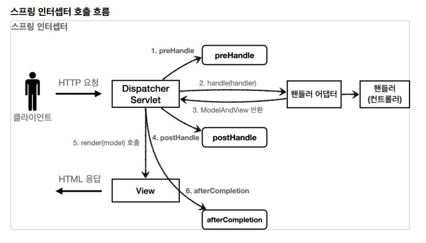

### Escape

HTML 문서는 `<` ,` >` 같은 특수 문자를 기반으로 정의된다. 따라서 뷰 템플릿으로 HTML 화면을 생성할 때는 출력하는 데이터에 이러한 특수 문자가 있는 것을 주의해서 사용해야 한다.

는 < 를 HTML 테그의 시작으로 인식한다. 따라서 < 를 테그의 시작이 아니라 문자로 표현할 수 있는 방법이 필요한데, 이것을 HTML 엔티티

고 이렇게 HTML에서 사용하는 특수 문자를
HTML 엔티티로 변경하는 것을 이스케이프(escape)라 한다. 그리고 타임리프가 제공하는 th:text ,
[[...]] 는 기본적으로 이스케이스(escape)를 제공

`<`   -> `&lt`

`>` : `&gt`


### Unescape

`th:text` `th:utext`
`[[...]]`  `[(...)]`


escape가 기본인 이유: 게시판을 만든다고 했을 때, 사용자는 다양한 글을 올린다. 만약 excape 되지 않으면 사용자 작성 글이 깨질 가능성이 있기 때문이다.

실제 서비스를 개발하다 보면 escape를 사용하지 않아서 HTML이 정상 렌더링 되지 않는 수 많은 문제가
발생한다. escape를 기본으로 하고, 꼭 필요한 때만 unescape를 사용하자


### 변수 표현식 (springEL)

- Object

- ${user.username} = userA
- ${user['username']} = userA
- ${user.getUsername()} = userA

- List

- ${users[0].username} = userA
- ${users[0]['username']} = userA
- ${users[0].getUsername()} = userA

- Map

- ${userMap['userA'].username} = userA
- ${userMap['userA']['username']} = userA
- ${userMap['userA'].getUsername()} = userA


변수 선언

```html
<h1>지역 변수 - (th:with)</h1>
<div th:with="first=${users[0]}">
 <p>처음 사람의 이름은 <span th:text="${first.username}"></span></p>
</div>
```


### 기본객체


```javascript
<!-- username = userA:라고나오기때문에오류 -->
<!-- var username = "[[${user.username}]]" 으로 사용-->
var username = [[${user.username}]];
var age = [[${user.age}]];
```


타입 에러가 발생할 경우 스프링이 자동으로 fielderror를 생성해서 만들어놓기 때문에 

검증오류시사용자 값을 불러와 보여줄 수 있다.

하지만 이런 에러가 아닌경우에는

```java
new FieldError("item", "price", item.getPrice(), false, null, null, "가격은 1,000 ~ 1,000,000 까지 허용합니다.")
```

설정해둬야 한다.


파일은 보통 데이터베이스에 저장하지 않는다. 스토리지에 저장하고

데이터베이스에는 파일이 저장된 경로만 저장한다.  경로의 fullpath보다 상대 경로만 저장한다. 


헤더없이 보내면 다운이 안된다.

```java
// 추가
String contentDisposition = "attachment; filename\""+uploadFileName+"\"";


return ResponseEntity.ok()
        .body(resource);
```


파일명이 한글, 특수문자 깨지지 않기 위해서 추가해야한다.

```java
        String encodeUploadFileName = UriUtils.encode(uploadFileName, StandardCharsets.UTF_8);
        String contentDisposition = "attachment; filename\""+encodeUploadFileName+"\"";

```


엔티티를 직접 노출할 경우 

-> 지연로딩의 경우에는 실제 엔티티대신 프록시가 존재하고 jackson 라이브러리는 기본적으로 이 프록시 객체의 json을 알지 못하기 때문에 예외가 발생한다.

그러므로 Hibernate5Module을 설치해야한다.

Hibernate5Module은 기본적으로 초기화된 프록시 객체만 노출한다. 초기화하지 않은 객체는 노출하지 않는데 설정을 바꾸면 모든 객체를 강제로 가져올 수 있다.

```java
	@Bean
	Hibernate5Module hibernate5Module(){
		Hibernate5Module hibernate5Module = new Hibernate5Module();
        Hibernate5Module.configure(Hibernate5Module.Feature.FORCE_LAZY_LOADING, true);
		return hibernate5Module;
	}
```


옵션을 설정하지 않고 원하는 값을 가져오는 방법은

반환하기 전에 강제로 초기화를 시켜는 방법이다.

```java
    @GetMapping("/api/v1/simple-orders")
    public List<Order> ordersV1(){
        List<Order> all = orderRepository.findAllByString(new OrderSearch());
        for (Order order : all) {
            order.getMember().getName(); // 강제 초기화
            order.getDelivery().getAddress(); // 강제 초기화
        }
        return all;
    }
```


V3는 재사용성이 높지만

V4는 재사용성은 낮다. 하지만 성능 최적화로는 더 좋다. 그리고 화면이 바뀌면 바꿔야하는 단점을 가지고 있다. 

애플리케이션 전체 관점에서 보았을 때 - 성능이 엄청 차이 나지 않는다.


# 07. 필터, 인터셉터

여러 로직에서 공통으로 인증에 대한 관심을 가지고 있는 경우 서블릿 필터 혹은 스프링 인터셉터를 사용한다. 

## 1. 서블릿 필터

#### 필터 흐름

HTTP 요청 -> WAS -> 필터 -> 서블릿 -> 컨트롤러

필터를 적용하면 필터 호출 다음에 서블릿이 호출된다. 그러므로 필터를 통해 적절하지 않은 요청 (즉, 로그인이 안된 경우) 서블릿을 호출하지 않을 수 있다.

* 모든 고객의 요청 로그를 남기고 싶다면 필터를 사용하면 된다. 
* 필터는 특정 URL 패턴을 적용할 수 있다. `/*`


#### 필터

init ( ) : 필터 초기화 메서드, 서블리 컨테이너가 생성될 때 호출

doFilter ( ) : HTTP 요청이 올 때 마다 해당 메서드 호출, 필터 로직 구현

destroy ( ) : 필터 종료 메서드, 서블릿 컨테이너 종료될 때 종료


### 1. 요청 로그 남기기

만약 HTTP 요청시 같은 요청 로그에 같은 식별자를 자동으로 남기는 방법은 `logback mdc`로 검색!!!

##### 사용자 정의 필터

```java
@Slf4j
public class LogFilter implements Filter {
 
    @Override
    public void init(FilterConfig filterConfig) throws ServletException {
        log.info("log filter init");
    }
 
    
    @Override
    public void doFilter(ServletRequest request, ServletResponse response, FilterChain chain) throws IOException, ServletException {
 
        HttpServletRequest httpRequest = (HttpServletRequest) request;
 
        String requestURI = httpRequest.getRequestURI();
        String uuid = UUID.randomUUID().toString();
        try {
 
            log.info("REQUEST [{}][{}]", uuid, requestURI);
            chain.doFilter(request, response);
 
        } catch (Exception e) {
            throw e;
        } finally {
            log.info("RESPONSE [{}][{}]", uuid, requestURI);
        }
    }
 
    
    @Override
    public void destroy() {
        log.info("log filter destroy");
    }
}
```

* doFilter에서 ServletRequest는 HTTP 요청이 아닌 경우까지 고려해서 만든 인터페이스이다. HTTP를 사용할 경우에는 HttpServletRequest로 다운캐스팅해서 사용하면 된다.
* doFilter에서 `chain.doFilter(request, response)` 이 부분이 가장 중요하다. 다음 필터가 있으면 필터를 호출하고 필터가 없으면 서블릿을 호출한다. 호출하지 않으면 다음 단계로 진행되지 않는다.

 

##### 필터 등록

스프링부트를 사용할 경우 `FilterRegistrationBean`을 사용해서 등록한다.

```java
// WebConfig
@Configuration
public class WebConfig {
    
    @Bean
    public FilterRegistrationBean logFilter() {
 
        FilterRegistrationBean<Filter> filterRegistrationBean = new FilterRegistrationBean<>();
        // 등록할 필터 지정한다.
        filterRegistrationBean.setFilter(new LogFilter());
        // 낮을 수록 우선순위를 가진다.
        filterRegistrationBean.setOrder(1);
        // 어떤 URL일 경우 작동할 건지 설정한다.
        filterRegistrationBean.addUrlPatterns("/*");
 
        return filterRegistrationBean;
    
    }
}
```

* `@ServletComponentScan` , `@WebFilter(filterName = "logFilter", urlPattern ="/*")` 으로도 등록이 가능하지만 필터 순서 조절이 안된다.


 ### 2. 인증 체크

```java
@Slf4j
public class LoginCheckFilter implements Filter {
 
    // 화이트 리스트는 인증 필요없이 바로 서블릿 호출 가능
    private static final String[] whitelist = {"/", "/members/add", "/login", "/logout","/css/*"};
 
    @Override
    public void doFilter(ServletRequest request, ServletResponse response,FilterChain chain) throws IOException, ServletException {
 
        HttpServletRequest httpRequest = (HttpServletRequest) request;
        String requestURI = httpRequest.getRequestURI();
        HttpServletResponse httpResponse = (HttpServletResponse) response;
 
        try {
            log.info("인증 체크 필터 시작 {}", requestURI);
            if (isLoginCheckPath(requestURI)) {
                log.info("인증 체크 로직 실행 {}", requestURI);
                // false인 경우 없으면 새로 생성하지 않음
                HttpSession session = httpRequest.getSession(false);
 
                if (session == null || session.getAttribute(SessionConst.LOGIN_MEMBER) == null) {
                    log.info("미인증 사용자 요청 {}", requestURI);

                    //로그인으로 redirect
                    httpResponse.sendRedirect("/login?redirectURL=" + requestURI);
 
                    return; //여기가 중요, 미인증 사용자는 다음으로 진행하지 않고 끝!
                }
            }
 
            chain.doFilter(request, response);
        } catch (Exception e) {
            throw e;
            //예외 로깅 가능 하지만, 톰캣까지 예외를 보내주어야 함
        } finally {
            log.info("인증 체크 필터 종료 {}", requestURI);
        }
    }

    private boolean isLoginCheckPath(String requestURI) {
        return !PatternMatchUtils.simpleMatch(whitelist, requestURI);
    }

}
```

* httpResponse.sendRedirect("/login?redirectURL=" + requestURI)
* 으로 설정하는 이유는 로그인 이후 기존에 했던 화면으로 돌아가기 위해 쿼리 파라미터로 가려고 했던 페이지의 URL를 넣어둔다.
* 컨트롤러에서 로그인 성공시 해당 경로로 이동할 수 있도록 처리해야 한다.

```java
@PostMapping("/login")
public String loginV4( @Valid @ModelAttribute LoginForm form, BindingResult bindingResult, @RequestParam(defaultValue = "/") String redirectURL, HttpServletRequest request) {
 
    if (bindingResult.hasErrors()) {
        return "login/loginForm";
    }
 
    Member loginMember = loginService.login(form.getLoginId(), form.getPassword());
 
    if (loginMember == null) {
        bindingResult.reject("loginFail", "아이디 또는 비밀번호가 맞지 않습니다.");
        return "login/loginForm";
    }
 
    //로그인 성공 처리
    //세션이 있으면 있는 세션 반환, 없으면 신규 세션 생성
    HttpSession session = request.getSession();
 
    //세션에 로그인 회원 정보 보관
    session.setAttribute(SessionConst.LOGIN_MEMBER, loginMember);
 
    //redirectURL 적용
    return "redirect:" + redirectURL;
}
```


> 참고!!!
>
> chain.doFilter(request, response); 를 호출해서 다음 필터 또는 서블릿을 호출할 때 request , response 를 다른 객체로 바꿀 수 있다. ServletRequest , ServletResponse 를 구현한 다른 객체를 만들어서 넘기면 해당 객체가 다음 필터 또는 서블릿에서 사용된다.


## 2. 스프링 인터셉터

스프링 인터셉터는 스프링 MVC가 제공하는 기술이다. 필터와 스프링 인터셉터 모두 웹 관련 공통사항을 처리하지만 `적용되는 순서, 범위, 사용방법`이 다르다.

* HTTP 요청 -> WAS -> 필터 -> 서블릿 -> 스프링 인터셉터 -> 컨트롤러
* 인터셉터는 결국 스프링 MVC가 제공하는 기능이기 때문에 디스패처 서블릿 이후 등장한다.
* 스프링 인터셉터는 서블릿 필터보다 더 정밀하게 URL 패턴을 설정할 수 있다.
* 인터셉터는 적절하지 않은 요청이라 판단되면 **거기서 끝낼 수 있다.**


서블릿 필터는 단순히 doFilter( ) 만 제공하지만 인터셉터는 컨트롤러 호출 전 (preHandle), 호출 후 (postHandler), 요청 완료 이후(afterCompletion) 으로 세분화 되어있다.

그리고 인터셉터는 어떤 컨트롤러(handler)가 호출되는지에 대한 호출 정보와 ModelAndView 응답 정보도 받을 수 있다. 




`preHandle` : 핸들러 어댑터 호출 전 호출된다. 응답 값이 true이면 다음으로 진행하고 false이면 진행하지 않는다. 

`postHandle` : 컨트롤러 호출 후 호출된다. (핸들러 어댑터 호출 후 실행)

`afterCompletion` : 뷰 렌더링 이후 호출된다.


컨트롤러에서 예외 발생하면 prehandle은 컨트롤러 호출 전에 호출하므로 실행되지만 posthandle는 호출되지 않는다.

그러나, `afterCompletion은 항상 호출`되기 때문에 어떤 예외가 발생했는지 로그에 출력할 수 있다.

결론적으로, 인터셉터는 스프링 MVC 구조에 특화된 필터 기능을 제공한다.


### 1. 요청 로그 남기기

##### 사용자 정의 인터셉터

```java
@Slf4j
public class LogInterceptor implements HandlerInterceptor {
    
    public static final String LOG_ID = "logId";
 
    @Override
    public boolean preHandle(HttpServletRequest request, HttpServletResponse response, Object handler) throws Exception {
 
        String requestURI = request.getRequestURI();
        String uuid = UUID.randomUUID().toString();
 
        request.setAttribute(LOG_ID, uuid);
 
        //@RequestMapping: HandlerMethod
        //정적 리소스: ResourceHttpRequestHandler
        if (handler instanceof HandlerMethod) {
            HandlerMethod hm = (HandlerMethod) handler;
            //호출할 컨트롤러 메서드의 모든 정보가 포함되어 있다.
        }
 
        log.info("REQUEST [{}][{}][{}]", uuid, requestURI, handler);
        return true; //false 진행X
    }
 
    
    @Override
    public void postHandle(HttpServletRequest request, HttpServletResponse response, Object handler, ModelAndView modelAndView) throws Exception {
        log.info("postHandle [{}]", modelAndView);
    }
 
    
    @Override public void afterCompletion(HttpServletRequest request, HttpServletResponse response, Object handler, Exception ex) throws Exception {
        String requestURI = request.getRequestURI();
        String logId = (String)request.getAttribute(LOG_ID);
 
        log.info("RESPONSE [{}][{}]", logId, requestURI);
 
        if (ex != null) {
            log.error("afterCompletion error!!", ex);
        }
    }
}
```

* 서블릿 필터는 uuid를 지역변수로 해결했지만 스프링 인터셉터는 호출 시점이 `분리`되어 있어 preHandle에서 지정한 uuid를 postHandle, afterCompletion에서 사용하기 위해서는 어딘가에 담아야 한다.
* Interceptor는 싱글톤처럼 사용되기 때문에 멤버 변수를 사용하면 위험하므로 request에 담아서 사용하면 된다.
* @Controller, @RequestMapping을 활용한 핸들러 매핑을 사용하는 경우 핸들러 정보를 `HandlerMethod`가 넘어온다.
* /resources/static 와 같은 정적 리소스가 호출되는 경우 `ResourceHttpRequestHandler`가 핸들러 정보로 넘어온다.


##### 인터셉터 등록

```java
@Configuration
public class WebConfig implements WebMvcConfigurer {
    
    @Override
    public void addInterceptors(InterceptorRegistry registry) {
        
        registry.addInterceptor(new LogInterceptor())
            .order(1)
            .addPathPatterns("/**")
            .excludePathPatterns("/css/**", "/*.ico", "/error");
    }
    //...
}
```

`WebMvcConfigurer`가 제공하는 `addInterceptors()`를 사용해 인터셉터를 등록할 수 있다.

addPathPatterns 으로 적용할 URL 패턴뿐만 아니라 excludePathPatterns를 지정해 제외할 패턴도 지정한다. 


> 참고
>
> [PathPattern](https://docs.spring.io/spring-framework/docs/current/javadoc-api/org/springframework/web/util/pattern/PathPattern.html)
>
> ### Examples
>
> `/pages/t?st.html` : 
>
> * `/pages/test.html` ok
> * `/pages/tXst.html` ok
> * `/pages/toast.html` no
>
> `/resources/*.png` :
>
> *  `resources` directory 에서`.png`  로 끝나는 모든 파일
>
> `/resources/**` :
>
> *  `/resources/` path 아래 including `/resources/image.png` and `/resources/css/spring.css`
>
> `/resources/{*path}` :
>
> * `/resources/` path 아래 모든 파일
>
> * path 변수 이름을 넣는다.
>
>   `/resources/image.png` will match with "path" → "/image.png"
>
>   `/resources/css/spring.css` will match with "path" → "/css/spring.css"
>
> `/resources/{filename:\\w+}.dat` : 
>
> *  `/resources/spring.dat` - assign the value `"spring"` to the `filename` variable


### 2. 인증 체크

##### 사용자 정의 인터셉터

```java
@Slf4j
public class LoginCheckInterceptor implements HandlerInterceptor {
 
    @Override
    public boolean preHandle(HttpServletRequest request, HttpServletResponse response, Object handler) throws Exception {
 
        String requestURI = request.getRequestURI();
        log.info("인증 체크 인터셉터 실행 {}", requestURI);
 
        HttpSession session = request.getSession(false);
        if (session == null || session.getAttribute(SessionConst.LOGIN_MEMBER) == null) {
            log.info("미인증 사용자 요청");
            //로그인으로 redirect
            response.sendRedirect("/login?redirectURL=" + requestURI);
            return false;
        }
        return true;
    }
}
```


##### 인터셉터 등록

```java
@Configuration
public class WebConfig implements WebMvcConfigurer {
    
    @Override
    public void addInterceptors(InterceptorRegistry registry) {
        registry.addInterceptor(new LogInterceptor())
            .order(1)
            .addPathPatterns("/**")
            .excludePathPatterns("/css/**", "/*.ico", "/error");
 
        registry.addInterceptor(new LoginCheckInterceptor())
            .order(2)
            .addPathPatterns("/**")
            .excludePathPatterns( "/", "/members/add", "/login", "/logout","/css/**", "/*.ico", "/error");
    }
 
    //...
}
```

