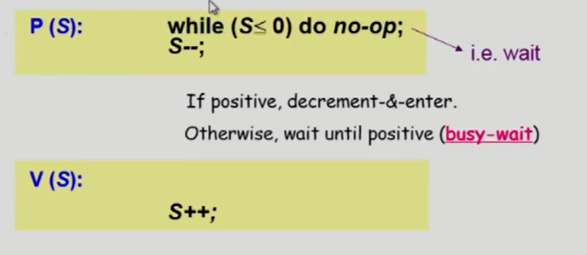
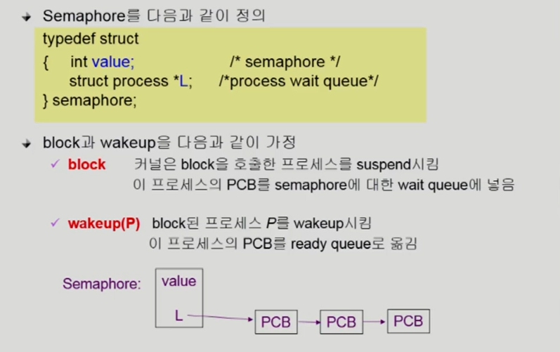
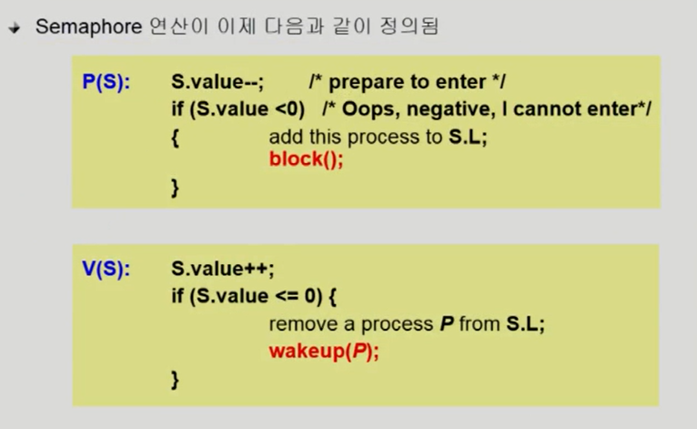
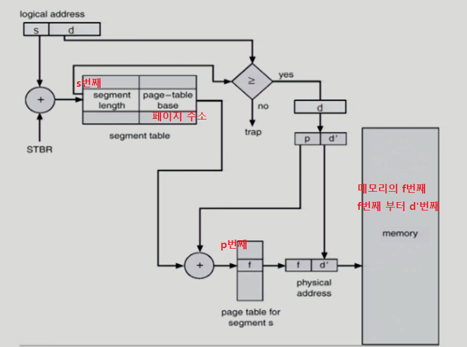

# 06. Process Synchronization

* Race Condition : 운영체제 안의 어떤 값을 변경하는 과정에서 발생 가능

  * 예 : 사용자 프로그램 A가 자신이 건드릴 수 없는 데이터를 System call을 이용해 불러오고 변경하는 과정에서 time out으로 인해 context switching이 발생 

    사용자 프로그램 B도 자신이 건드릴 수 없는 데이터이자 A가 변경하려고 했던 똑같은 데이터를 System call을 이용해 불러오고 변경하여 저장한 경우

    다시 time out으로 CPU 제어권이 사용자 프로그램 A에게 넘어가도 A는 이미 해당 데이터를 불러왔기 때문에 변경 전 데이터를 수정하게 된다. 그 결과 원하는 결과가 저장되지 않는 Race Condition이 발생한다.

* OS에서 race condition이 언제 발생하는가?

  1. kenel 수행 중 인터럽트 발생시

  2. 프로세스가 시스템 콜을 사용하여 kernel mode로 수행중인데 context switch가 발생하는 경우

  3. Multiprocessor에서 shared memory 내의 kernel data


### # 1. kenel 수행 중 인터럽트 발생시

* 인터럽트가 발생하면, 커널은 인터럽트 처리 루틴으로 넘어가게 된다.


### # 2. 프로세스가 System call을 사용하여 kernel mode로 수행중인데 context switch가 발생하는 경우


### #3. Multiprocessor에서 shared memory 내의 kernel data

* Multiprocessor의 경우 interrupt enable/disable로 해결되지 않는다.

  * 하나의 CPU의 interrupt를 diable했다고 다른 CPU에서 데이터를 읽어올 수 없는 것은 아님. 즉, 다른 해결 방법이 필요하다.

* 해결 방법

  1. 한번에 하나의 CPU만이 커널에 들어갈 수 있게 하는 방법

  2. 커널 내부에 있는 각 공유 데이터에 접근할 때마다 **그 데이터에 대한 lock/unlock**을 하는 방법


### # Process Synchronizaion 문제

* 공유 데이터의 동시 접근은 데이터의 불일치 문제를 발생시킨다.
* 일관성 유지를 위해서는 협력 프로세스(cooperating process)간의 실행 순서(orderly execution)을 정해주는 매커니즘이 필요


**Race Condition**

* 여러 프로세스들이 동시에 공유 데이터를 접근하는 상황에서 데이터의 최종 연산 결과는 마지막 데이터를 다룬 프로세스에 따라 달라진다.


* race condition을 막기 위해서는 concurrent process는 동기화(Synchronizaion) 되어야한다.


### **The Critical section problem**

* 각 프로세스의 code segment에는 공유 데이터를 접근하는 코드인 critical section이 존재


## entry section에 들어갈 알고리즘

#### Algorithm 1

**변수**

​	int turn = 0; // 초기값 0

``` c언어
do {

	while(turn != 0);
	critical section
	turn = 1;
	남은 부분
	
} while (1);
```

* mutual exclusion 만족하지만, progress requirement 만족하지 않음


**문제점**

* 과잉양보 : 반드시 한번씩 교대로 들어가야만 한다. 상대방이 turn 값을 내 값으로 변경해줘야 내가 들어갈 수 있기 때문에 특정 프로세스가 번번히 들어가야하는 경우에는 비효율적


> 프로그램적 해결법의 충족조건

1. Mutual Exclusion (상호 배제)
   * 프로세스 Pi가 critical section 부분을 수행 중이면 다른 모든 프로세스들은 그들의 critical section에 들어가면 안된다
2. Progress (진행)
   * 아무도 critical seciton에 있지 않은 상태에서 CS에 들어가고자 하는 프로세스가 있으면 들어갈 수 있어야 한다.
3. Bounded Waiting (유한 대기)
   * 프로세스가 critical section에 들어가려고 요청한 후부터 그 요청이 허용될 때까지 다른 프로세스들이 critical section에 들어가는 횟수에 한계가 있어야 한다. 
   * starvation을 막기 위한 조건


### Algorithm 2 

**변수**

​	boolean flag[n]; // 초기값 모두 false

​	critical section에 들어가면 flag는 true로 변경


* mutual exclusion 만족하지만, progress requirement 만족하지 않음


**문제점**

* flag만 변경한 뒤 아직 critical section에 들어가지 않은 상황이 발생할 수 있다. 즉, 끊임 없이 양보하는 상황이 발생


### Algorithm 3 (peterson's Algorithm)


**문제점**

* Busy waiting (= spin lock) : 비효율적이다. while문이 계속 돌기 때문에,,,


## #Critical section hardware

* 하드웨어 적으로 Test&modify를 atomic하게 수행한다면 앞의 문제는 간단히 해결할 수 있다.


### Semaphores

* 추상 자료형

* Semaphore S

  * integer variable
  * 연산
    * P(S) : 자원을 획득하는 과정
    * V(S) : 자원을 반납하는 과정

  

* Busy Wait

  

* Block & Wakeup(=sleep lock) 

  * while문을 돌지 않고 CPU를 아예 반납하고 blocked 상태에 돌아가고 mutex의 값이 생길때 wake up하는 방식으로 변환하면 busy wait가 발생하지 않음

  

  

  * V(S)에서 S의 값을 1 증가시킨 값이 0 혹은 음수라는 이야기는 아직 sleep된 프로세스가 있음을 의미, 반대로 양수라는 이야기는 아무도 critical section에 들어가고자 하지 않음을 의미한다. 


> 어느 것이 더 나은 방법인가?

* Critical section의 길이가 긴 경우 Block/Wake up이 적당
* Critical section의 길이가 매우 짧은 경우 Block/Wakeup 오버헤드가 busy wait 방식의 오버헤드보다 더 커질 수 있다.
* 일반적으로 Block/Wakeup 방식이 더 좋다.


> Two Type Of Semaphores

* Counting Semaphore
  * 도메인이 0 이상인 임의의 정수값
  * 주로 resource counting에 사용
* Binary Semaphore(= mutex)
  * 0 또는 1 값만 가질 수 있는 세마포
  * 주로 mutual exclusion (lock/ unlock)에 사용


### Deadlock and Starvation

Deadlock : 둘 이상의 프로세스가 서로 상대방에 의해 충족될 수 있는 event를 무한히 기다리는 현상

Starvation : indefinite blocking. 프로세스가 suspend된 이유에 해당하는 세마포어 큐에서 빠져나갈 수 없는 현상


### 동기화와 관련된 전통적인 문제

>  Bounded Buffer Problem (Producer Consumer Problem)

* 생산자 1이 빈 버퍼에 자원을 채워놓는 과정에서 넘어가게 되었을 경우, 다른 생산자 2가 버퍼에 자원을 채워놓으면 한 자원이 소실되는 현상이 발생한다.
  * 그래서, 버퍼를 채울 때 lock을 걸고, 입력 및 조작이 끝난 다음 lock을 풀고 buffer의 포인터를 다음으로 옮김
* 반대로, 소비자 역시 같은 방법을 하게 된다. 이때 lock은 binary semaphore(mutex) 사용
* 또한 생산자에게 빈 버퍼가 자원이기 때문에 빈 버퍼가 생길때 까지 기다려야 하고 소비자는 버퍼에 자원이 있어야 활동할 수 있기 때문에 기다려야 한다. 이 과정에서는 counting semaphore로 조절함


> Readers-Writers Problem

* 한 프로세스가 DB에 write 중일 때 다른 프로세스가 접근하면 안됨
* read는 동시에 여럿이 해도 문제가 발생하지 않음
* solution
  * writer가 DB 접근 허가를 아직 못한 상태에서는 모든 대기중인 reader들을 다 DB에 접근하게 해줌
  * writer는 대기 중인 reader가 하나도 없을 때 DB 접근이 허용된다
  * 일단 writer가 DB에 접근 중이면 Reader들은 접근이 금지된다
  * wirter가 DB에서 빠져나가야 Reader의 접근이 허용된다


접근 방식

* db : DB 자체의 접근을 막는 역할
* mutex : readcount의 증감을 담당 


문제점

* starvation 문제 발생 : reader가 계속해서 오게 되면 writer는 계속해서 기다려야 함


해결 방법

* 일정한 시간안에 오는 reader에 대해서만 동시 접근을 허용하고 그 다음은 writer에게 기회를 주면 됨 (마치 신호등처럼)


> Dining - Philosophers Problem (식사하는 철학자)

* 철학자들은 생각하거나 밥먹는 일을 한다.
* 식탁에서는 젓가락 한짝식이 사람 수 별로 존재하고 사람들 사이에 존재한다
* 배가 고파질 경우 왼쪽과 오른쪽 젓가락을 획득해야 밥을 먹을 수 있다.
* 


**앞의 solution의 문제점**

* 모든 철학자가 동시에 배가 고파져 왼쪽 젓가락을 집어버린 경우
* deadlock 가능성이 존재


**해결방안**

1. 4명의 철학자만이 테이블에 동시에 앉을 수 있도록 함

2. 젓가락을 두 개 모두 잡을 수 있을 때만 젓가락을 집을 수 있게 함

   

3. 비대칭 : 짝수 철학자는 왼쪽, 홀수 철학자는 오른쪽 젓가락을 먼저 집도록 함


### Monitor


* 동시 수행중인 프로세스 사이에서 abstract data type의 안전한 공유를 보장하기 위한 high - level synchronization construct
* 고급 언어 차원에서 제공하는 동기화
* 모니터는 공유 데이터에 대한 모든 책임을 담당함
  * 공유데이터의 접근 모두 모니터의 operation을 통해 처리
  * 세마포는 공유 데이터 접근을 프로그래머가 책임을 짐


> 세마포의 문제점

* 코딩하기 힘들다
* 정확성의 입증이 어렵다
* 자발적 협력이 필요하다
* 한번의 실수가 모든 시스템에 치명적 영향을 준다


> 특징

* 동기화문제를 모니터가 책임짐

* 모니터 내에서는 한번의 하나의 프로세스만 활동가능 (하나의 프로세스만 활성화)

  * 자원의 여부가 있을 때는 수행을 하면 됨
  * 자원의 여부가 없을 때는 blocked 시켜야 함. 이 때 condition variable을 사용하여 프로세스가 모니터 안에 기다릴 수 있도록 (x 큐에 대기) 함
    * x.wait( ) : 잠재우기
    * x.signal( ) : 깨우기

* 모니터는 자원의 개수를 세지 않고 자원의 여부가 없을 때 큐에 잠 재운다.

* 식사하는 철학자 -> 모니터 예시

  


# 07. Deadlock

* 일련의 프로세스들이 서로가 가진 자원을 기다리며 block된 상태

* 자원 :

  * 하드웨어, 소프트웨어 등을 포함하는 개념
  * IO device, CPU cycle, memory space, semaphore 등
  * 프로세스가 자원을 사용하는 절차 :
    * Request , Allocate, Use, Release

* 예 : binary semaphores A and B

  P0 : P(A); P(B);

  P1 : P(B); P(A);


> Deadlock 발생의 4가지 조건

1. Mutual exclusion (상호배제)

   매 순간 하나의 프로세스만이 자원을 사용할 수 있음

2. No preemption (비선점)

   프로세스는 자원을 스스로 내어놓을뿐 강제로 빼앗기지 않음

3. Hold and wait (점유대기)

   자원을 가진 프로세스가 다른 자원을 기다릴 때 보유 자원을 놓지 않고 계속 가지고 있음

4. Circular wait (순환대기)

   자원을 기다리는 프로세스간에 사이클이 형성되어야 함


> Deadlock 처리방법

**방지**

Deadlock Prevention (예방)

Deadlock Avoidance (회피)

**해결**

Deadlock Detection and recovery

Deadlock Ignorance


#### Deadlock prevention

* 데드락의 4가지 조건을 없애는 방법, 가장 강력한 방법이다.
* Mutual Exclusion
  * 자원의 특성이기 때문에 조건을 없앨 수 없다
* Hold and Wait 
  * 방법 1 : 프로세스 시작 시 모든 필요한 자원을 할당받는 방법
  * 방법 2 : 자원이 필요한 경우 보유 자원을 모두 놓고 다시 요청 (자진해서 놓기)
* No Preemption
  * state를 쉽게 save하고 restore할 수 있는 즉, 빼앗을 수 있는 자원(CPU, memory) 경우에는 빼앗으면 됨
  * 하지만 빼앗을 수 없는 자원에 대해서는 할 수 없다.
* Circular Wait
  * 할당 순서를 정해 정해진 순서대로만 자원 할당

데드락의 조건을 원천봉쇄할 수 있지만 이런 방법은 자원이용률을 감소시키고, throughput 감소, starvation 문제가 발생함


#### Deadlock Avoidance

* 시스템이 unsafe state에 들어가지 않는 것을 보장
* 추가적인 정보를 이용해서 데드락을 막음
* 즉, 자원 할당이 데드락으로부터 안전한지를 동적으로 조사해서 안전한 경우에 할당
* 가장 단순하고 일반적인 모델은 프로세스들이 필요한 자원의 최대량을 미리 선언하도록 한다.


* 2가지 경우의 알고리즘

  * single instance per resource types

    * Resource Allocation Graph algorithm을 사용해서 프로세스 생명주기동안 필요한 자원을 점선으로 표현하고 그것을 이용해 안전한 경우의 한해서 자원을 전달하고 데드락을 방지

  * multiple instance per resource types

    * Banker's Algorithm
    * 추가요청 가능성 자원과 가용자원을 비교해서 결정내림

    


#### Deadlock Detection and recovery

* 여유자원이 있으면 무조건 준다. 즉, 데드락 발생은 허용하되 그에 대한 detection하고 데드락 발생시 recovery

**Deadlock Detection**

* Resource type 당 single instance인 경우 : 자원 할당 그래프에서의 사이클이 곧 데드락을 의미

* 자원할당 그래프에서 더 쉽게 데드락 가능성을 보기 위해 resource를 빼고 process만 연결한 wait for graph를 만듦

  

* Resource type 당 multiple instance인 경우 : Banker's algorithm가 유사한 방법으로 활용

* 

  * 하지만 banker's algorithm과 다르게 현재만으로 내어줌. 즉, 현재 요청한 자원이기 때문 avoidance처럼 미래를 확인하는 게 아니라 낙관적으로 현재 요청자원으로 내어준다.

**Recovery**

* Process termination (프로세스 종료)
  * 데드락에 관련된 모든 프로세스를 죽임
  * 데드락에 관련된 프로세스를 하나씩 죽여서 데드락 사이클이 사라졌는지 확인
* Resource Preemption (자원 뺏기)
  * 비용을 최소화할 victim을 선정
  * safe state로 rollback하여 process를 restart
  * Starvation 문제 : 동일한 프로세스가 계속해서 희생자가 되는 경우, 롤백 횟수도 같이 고려해서 희생자 선정


#### Deadlock ignorance

* 데드락이 드물게 발생하기 때문에 운영체제가 일을 한다는 것이 낭비이기 때문에 아무것도 하지 않는다.
* UNIX, windows 등 대부분의 범용 OS가 채택


# 08. Memory Management

#### Logical address (=virtual)

* 프로세스마다 독립적으로 가지는 주소 공간
* 각 프로세스마다 0번지부터 시작
* CPU가 보는 주소는 Logical address임


#### Physical address

* 메모리가 실제 올라가는 위치


> 주소 바인딩 : 주소를 결정하는 것
>
> Symbolic Address(프로그래머는 실제 주소가 아닌 변수이름으로 접근) -> Logical Address -> Physical address


### 주소 바인딩 (Address Binding) or 주소 변환

* Logical Address -> Physical address로 넘어가는 과정
* 하드웨어가 해준다


#### Compile time binding

* 물리적 메모리 주소가 컴파일시 알려짐
* 시작 위치 변경시 재 컴파일
* 컴파일러는 절대 코드를 생성
* 현대적인 방법은 아님. 예전의 한 컴퓨터 당 한 프로그램만 사용할 때 썻던 방식
* 논리적인 주소가 곧 물리적인 주소이기 때문에 주소변환이 필요없고 바로 메모리에 올려서 실행가능


#### Load time binding

* Loader의 책임하에 물리적 메모리 주소 부여
* 실행되는 시점에 결정되고 중간에 바뀌지 않음
* 컴파일러가 재배치가능코드(relocatable code)를 생성한 경우 가능


#### Execution time binding(= Run time binding)

* 실행되는 시점에 결정되지만 **수행이 시작된 이후에도 프로세스의 메모리 상 위치를 옮길 수 있음**
* CPU가 주소를 참조할때마다 binding 점검 (address mapping table)
* 하드웨어적인 지원이 필요


### Memory Management Unit (MMU)

* Logical address를 Physical address로 매핑해주는 즉, 주소변환을 하는 하드웨어
* MMU scheme : 사용자 프로세스가 CPU에서 수행되며 생성해내는 모든 주소값에 대해 base register(=relocation register)의 값을 더 함
  * base register 프로세스의 시작주소를 알고 있음
  * limit register : 논리적 주소의 범위(크기)를 갖고 있음
* 사용자 프로그램은 logical address만을 다룬며 실제로 physical address를 볼 수 없고 알 필요도 없음


### Dynamic Loading

* 프로세스 전체를 메모리에 미리 올리는 것이 아니라 해당 루틴이 불러질 때 메모리에 load하는 것
* memory utilization의 향상
* 가끔씩 사용되는 많은 양의 코드의 경우 유용
* 운영체제의 특별한 지원없이 프로그램 자체에서 구현가능 (OS는 라이브러리를 통해 지원 가능)


### Overlay

* Dynamic Loading과 의미가 같음
* 메모리에 프로세스의 부분 중 실제 필요한 정보만을 올림
* 프로세스의 크기가 메모리보다 클 때 유용
* 운영체제의 지원없이 사용자에 의해 구현
* 작은 공간의 메모리를 사용하던 초창기 시스템에서 수작업으로 프로그래머가 구현 -> 프로그래밍이 복잡


### Swapping

* 프로세스를 일시적으로 메모리에 backing store로 쫓아내는 것
* Swap in / out
  * 중기 스케줄러(swapper)에 이해 swap out 시킬 프로세스 선정
  * 우선순위가 낮은 프로세스를 swapped out 시키고 우선순위가 높은 프로세스를 메모리에 올려놓는다.
  * swap time의 상당 부분은 transfer time 이 차지한다
  * Compile time binding이나 Load time binding은 원래 메모리 위치로 swap in해야하는 번거로움이 있으나
  * Execution time binding은 추후 빈 메모리 영역 아무 곳이나 올릴 수 있음


### Dynamic Linking

#### Static linking (static library)

* 라이브러리가 프로그램 실행파일 코드에 포함

* 동일한 라이브러리를 각각 프로세스 메모리에 올리므로 메모리 낭비

#### Dynamic linking (shared library)

* 라이브러리가 실행시 연결됨
* 라이브러리 호출 부분에 라이브러리 루틴의 위치를 찾기 위한 stub라는 작은 코드를 둠
* 프로그램 실행코드에 포함되지 않음
* 라이브러리가 이미 메모리에 있으면 그 루틴의 주소로 가고 없으면 디스크에서 읽어옴
* 운영체제의 도움이 필요


### Allocation of Physical Memory

* 메모리는 일반적으로 OS 상주하는 영역과 사용자 프로세스 영역으로 나뉜다

#### 사용자 프로세스 영역의 할당 방법

##### Contiguous allocation (연속 할당)

* 각각의 프로세스가 메모리의 연속적인공간에 적재되도록 하는 것
* 프로세스가 쪼개지지 않고 통째로 올라가는 방식으로 현재는 사용하지 않는 방식임

​	

* Fixed Partition allocation (고정분할 방식)
  * 물리적 메모리를 영구적 분할로 나눈 방식
  * 분할당 하나의 프로그램 적재
  * 동시에 메모리에 load되는 프로그램 수 고정
  * 내부조각, 외부조각 발생
* Variable Partition allocation (가변분할 방식)
  * 프로그램의 크기를 고려해서 할당
  * 분할 크기, 개수가 동적으로 변함
  * 외부조각 발생
    * B가 끝나고 D가 수행될 때 B에서 사용했던 공간이 적기 때문에 D는 다른 곳에 적재되고 그로 인해 외부 조각이 발생함

##### Noncontiguous allocation (비연속 할당)

* Paging
* Segmentation
* Paged Segmentation


> 내부조각, 외부조각

**내부조각**

프로그램 크기보다 분할의 크기가 커서 분할 내부에서 발생하는 사용되지 않는 메로리 조각

**외부조각**

프로그램 크기보다 분할의 크기가 작은 경우, 아무 프로그램에도 배정되지 않은  빈 곳임에도 올라갈 수 없는 메모리 조각


> Hole

* 가용 메모리 공간
* 프로세스가 실행되고 종료되고 하다보면 여기저기 흩어져 있게 된다.
* 운영체제는 hole을 관리해야함

**Dynamic Storage Allocation Problem**

1. **First fit**

   최초로 찾아지는 hole

2. **Best fit**

   가장 작은 hole

   리스트가 크기순으로 정렬되지 않은 경우 모든 hole을 탐색해야함

   프로세스 크기보다는 크지만 가장 작은 공간을 사용하기 때문에 딱 들어맞으면 좋지만 그렇지 않을 경우 많은 수의 아주 작은 hole들이 생성될 수 있음.

3. **Worst fit**

   가장 큰 hole

   역시 모든 리스트를 탐색

   상대적으로 아주 큰 hole들이 생성

First-fit과 best-fit이 worst fit보다 속도와 공간 이용률 측면에서 효과적


**Compaction**

* external fragmentation 문제를 해결하는 한 가지 방법
* 사용중인 메모리 영역을 한 군데로 몰고 hole들을 다른 한곳으로 모아 큰 block을 만드는 것
* 매우 비용이 많이 드는 방법임
* 최소한의 메모리 이동으로 compaction하는 것이 좋지만 이론적으로 매우 복잡한 문제임
* compaction은 프로세스의 주소가 실행 시간에 동적으로 재배치 가능한 경우에만 수행될 수 있음. run time binding에서만 가능

​	

### Noncontiguous allocation (비연속 할당)

#### 1. Paging

프로세스 virtual memory를 동일한 사이즈의 page 단위로 나눔

page의 단위로 비연속적으로 할당되고, 일부는 backing storage에, 일부는 physical memory에 저장

##### Basic method

* 물리적 메모리는 동일한 크기의 frame으로 나누고 논리적 메모리는 동일 크기의 page로 나눔 -> 외부 조각 발생 x 

* 동일한 크기로 나누기 때문에 마지막 부분에 짜투리 공간이 생길 수 있기 때문에 내부 조각은 발생할 수 있음

모든 가용 frame을 **page table을 사용해 logical address를 physical address로 변환**


* 상대적인 주소 d는 바뀌지 않음. 그 주소 안에 위치한 내역


##### Page Table

* page Table은 main memory에 상주
* Page table base register (PTBR) : page table 가리킴
* Page table length register(PTLR) : 테이블 크기 보관
* 모든 메모리 접근 연산에는 2번의 메모리 접근이 필요
  * page table에 한번 접근하고
  * data/instruction 접근 1번
* 두 번 접근으로 시간이 오래걸리기 때문에 **주소변환을 전담하는 캐시메모리 TLB** 사용( associative register or translation look aside buffer)


* page table은 배열이라는 자료구조를 통해 저장하고 있기 때문에 p번째라는 인덱스를 통해서 바로 접근할 수 있음. 즉, 인덱스번호가 물리적인 페이지번호 역할을 하기 때문
* 하지만 TLB는 일부분만 가지고 있기 때문에 page num과 frame num을 쌍으로 가지고 있어야 함
  * TLB는 하나씩 찾게되면 오래걸리기 때문에 parallel search 즉, 병렬적으로 찾는 하드웨어를 이용해 찾음
* TLB는 context switch 때 flush 함(remove old entries)


##### Two Level Page Table

* 32bit address 사용시 : 2^32 (4G)의 주소공간
  * page size가 4K시 1M개의 page table entry 필요
  * 각 page entry가 4B시 프로세스당 4M의 page table 필요
  * 그러나 **대부분의 프로그램은 일부분만 사용하므로 page table 공간이 심하게 낭비**
* page table 자체를 page로 구성하고
* 사용하지 않는 주소공간에 대한 outer page table 엔트리값은 NULL 로 처리되어 안쪽 page table 자체가 안 만들어져 있음
* 그래서 메모리 크기를 줄일 수 있다


* page 당 4KB이고 4KB안에서 바이트 단위로 위치구분을 위해 12비트가 필요 (위치)
* page table도 4KB인데 entry 하나가 4byte이기 때문에 1024 개를 구분하기 위한 2^10 즉, 10비트 필요
* 그리고 12 + 10 비트를 32비트에 뺀 나머지 10비트가 outer page table를 표현하는 비트임


> Memory Protection

* Page Table의 각 entry 마다 아래의 비트가 있다.
  * Protection Bit : page에 대한 접근 권한 즉, 쓰고 읽을 수 있는지 혹은 읽을 수만 있는지
    * 코드는 읽기만 가능해야 함
  * Valid-Invalid bit
    * valid :  해당 주소의 프레임에 유효한 내용이 있음을 뜻함
    * invalid : 해당 주소의 프레임에 유효한 내용이 없음을 뜻함


> Inverted Page Table Architecture

* 보통 페이지 테이블은 논리주소로부터 물리주소를 알아내는데 필요하다.
  * 프로세스마다 페이지 테이블이 존재하기 때문에 메모리의 낭비가 심하다.
  * 대응하는 page가 메모리에 있든 아니든 page table entry는 존재한다. -> 낭비
* 이것을 해결하기 위해 inverted page table이 생기게 되었는데 이것은 물리적인  메모리 당 inverted page table entry가 존재한다.
* 물리적 메모리 n번째에 해당하는 entry가 inverted page table의 n번째 entry이고 그 안에 프로세스 id와 p번째가 나와있어서 프로세스의 논리적 주소를 알 수 있다.

장점

* 페이지 하나만 있어도 된다.

단점

* 논리적인 주소로 물리적인 주소를 얻어야 하는 것에 맞지 않다. 즉, 테이블 전체를 탐색해야하기 때문에 오버헤드가 발생한다. -> 비효율적

해결점

* 병렬적으로 찾을 수 있는 associative register을 사용하면 메모리 공간도 줄이면서 속도도 낮출 수 있다. 하지만 비싼 단점을 갖고 있다.


##### Shared Pages (Re-entrant Code = Pure Code)

* 동일한 프로그램을 사용하게 될 경우 코드 영역은 똑같다. 동일한 코드가 여러번 올라가면 메모리가 낭비될 수 있기 때문에 한번만 메모리에 올리게 된다.
* shared memory는 read/write가 모두 가능했지만 shared code는 **read only로 올리는 것**이기 때문에 약간의 차이가 있다.
* shared code는 모든 프로세스의 **동일한 logical address space**에 있어야 한다. 


#### 2. Segmentation

* 프로그램을 구성하는 여러 의미 단위로 segment를 나눈다. 그렇기 때문에 메모리 공간이 다 다르게 되고 그로인해 동일한 크기로 frame을 나눠 관리할 수 없다.
* 일반적으로 code, data, stack 부분이 하나의 세그먼트로 정의될 수 있다. 


* Logical address는 <segment-number, offset> 으로 구성

* segment table

  

  * base 시작 - 몇 번째에 있는지
  * limit 범위

* Segment table base register (STBR) : 물리적 메모리에서의 segment table의 위치

* Segment table length register (STLR) : 프로그램이 사용하는 segment의 수


* Sharing
  * segment는 의미 단위로 쪼개지기 때문에 공유와 보안에 있어서 paging보다는 훨씬 효과적이다
* Allocation
  * segment의 길이가 동일하지 않기 때문에 어느 곳에 먼저 할당하느냐에 따라서 다르므로 가변 분할 방식과 동일한 문제들이 발생 (외부조각 발생)

* 구현 측면에서 세그먼트는 entry가 몇 개 없지만 페이지는 백 만개가 있기 때문에 다단계 페이징 기법을 사용하는 것이다. 하지만 pure segmentation 기법을 실제 사용하지 않는다. (가변 크기 등의 문제로)
* 실제로는 페이징 기법을 근간으로 많이 사용하고 있다.

 

#### Paged Segmentation

* 기본적으로 segmentation 기법을 사용하지만 segment는 page 길이의 배수로 나뉜다. 그리고 segment를 구성하는 page 단위로 물리적 메모리에 올라간다.

