# 08. Virtual Memory

물리적인 메모리의 주소변환은 운영체제가 관여하지 않는다. 하지만 virtual memory는 운영체제가 관여한다.

### Demand Paging

* 요청이 있으면 그 페이지를 메모리에 올리겠다는 의미이다.
  * 디스크에서 물리적 메모리로 올리는 작업을 I/O 작업이라고 한다. 요청이 있을 때 메모리에 올리기 때문에 I/O 양이 감소하고 메모리의 사용량도 감소한다. 
  * 물리적인 메모리가 줄어들기 때문에 멀티 프로그래밍 환경에서 더 많은 프로그램, 더 많은 사용자가 동시에 메모리에 올릴 수 있기 때문에 더 효과적이다. 그리고 그로 인해 응답시간도 더 빨라진다.
    * 한정된 메모리에서 여러 프로그램이 사용되기 때문에 의미있는 정보가 메모리에 올라간다는 것은 응답시간이 더 빨라지는 것으로 볼 수 있다.
* 앞서 page table에서 Valid/Invalid bit의 의미는 valid의 경우 물리메모리에 올라갔음을 의미하고, invalid의 경우 backing storage 즉, swap 영역에 있거나 아예 사용이 되지 않음을 의미한다.
  * 요청한 페이지가 메모리에 없는 경우 = page fault이고 CPU는 자동적으로 OS에게 넘어가서 디스크에서 메모리에 올리는 작업이 일어난다.

#### Page Fault

* Invalid page에 접근하면 MMU가 trap을 발생시킨다.
* 커널 모드로 들어가서 page fault handler가 invoke되게 되고 아래의 순서로 page fault를 처리한다.
  1. 잘못된 요청이 아닌지? 
     * 프로세스가 사용하지 않는지 혹은 protection violation인지 혹은 잘못된 주소인지 확인
  2. 물리적 메모리에 빈 페이지를 만들어야 한다. 
  3. disk에서 memory로 읽어온다
     * disk I/O가 끝나기까지 프로세스는 CPU를 뺏김 (block)
     * disk read가 끝나면 page table entry에 기록하고 valid bit에 체크
     * ready queue에 프로세스를 다시 넣고 후에 dispatch한다
  4. 프로세스가 CPU를 잡고 다시 running
  5. 아까 중단했던 instruction을 재개한다.

#### Free frame() 이 없는 경우

##### Page replacement

* 어떤 frame을 빼앗아올지 결정해야한다. 
* 운영체제가 하는 일이다. 

##### replacement algorithm

* page fault rate을 최소화하는 것이 목표이다.

* victim이 결정되었을 때,
  * 만약 희생자가 write로 새로운 내용이 적힌 경우 디스크에 반영해야함
  * 만약 변경되지 않았다면 메모리에서 삭제하면 됨

### Algorithm

#### Optimal Algorithm

* 미래에 참조되는 페이지를 알고 있다고 가정하기 때문에 가정 최적화된 알고리즘이다. 
* 가장 먼 미래에 참조되는 page를 replace 시킨다.
* 하지만 미래를 알 수 없기 때문에 실제로 적용될 수 없다.
  * 다른 알고리즘 성능에 대한 upper bound를 제공
  * 즉, 다른 알고리즘의 성능을 평가할 때 참고할 수 있다.

#### FIFO (First In First Out) Algorithm

* FIFO : 먼저 들어온 것을 먼저 내쫓는다.
* FIFO Anomaly : frame 수가 늘어났는데 오히려 page fault가 늘어나는 현상을 말한다.

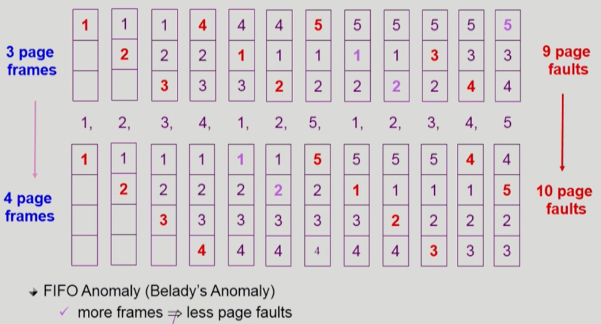

#### LRU (Least Recently Used) Algorithm

* 가장 오래 참조된 것을 먼저 지운다.

#### LFU (Least Frequently Used) Algorithm

* 참조 횟수가 가장 적은 페이지를 지움
* 최저 참조 횟수가 여러개 있는 경우 임의로 선정한다. 하지만 성능 향상을 위해 가장 오래 전 참조된 page를 지우게 구현할 수도 있다.
* LRU처럼 직전 참조 시점만 보는 것이 아니라 장기적 시간 규모를 보기 때문에 page의 인기도를 정확하게 반영할 수 있다.
* 하지만 **참조 시점의 최근성을 반영**하지 못하고 LRU보다 구현이 복잡한 단점을 가지고 있다.

* LRU의 경우, 링크드 리스트로 연결해서 최신의 참조된 경우 아래로 내린다. 비교할 필요가 없기 때문에 O(1)으로 처리 가능하다.
* LFU의 경우, 링크드 리스트로 구현하면 최악의 경우 O(n)이 될 수 있기 때문에 heap 구조를 사용하게 된다. 최악의 경우 O(log n) 이 수행된다.

### caching

* 페이지 교체 알고리즘은 꼭 페이징 시스템에서 발생하는 것은아니고 cache - main memory, buffer caching, web caching 등에서 사용된다.
  * buffer - disk (file system)
* 한정된 빠른 공간(=캐쉬)에 요청된 데이터를 저장해두었다가 후속 요청시 캐쉬로부터 직접 서비스하는 방식이다.
*  교체 알고리즘에서 삭제할 항목이 지나치게 많은 시간이 걸리는 경우 실제 시스템에서 사용하지 않음
  * Buffer caching , web caching의 경우
    * O(1) ~ O(log n) 정도까지 허용
  * paging system인 경우
    * page fault가 발생하면 OS가 관여함
      * 주소변환 과정은 OS가 관여하지 않음
    * 페이지가 **이미 메모리에 존재하는 경우 OS가 관여하지 않음**. 즉, 참조시각 등의 정보를 OS가 알 수 없다. 
      * **O(1)인 LRU list 조작조차 불가능**

### Paging System에서 LRU, LFU 가능한가?

주소변환 과정에서 운영체제는 전혀 관여하지 않는다. 하지만 페이지 폴트가 발생한 경우에만 운영체제가 관여하게 된다.

즉, 주소변환 과정에서 이미 페이지가 메모리에 존재하는 경우 운영체제의 역할 없이 하드웨어적으로 작업이 완료되는 것이다. LRU 알고리즘 구현에 있어서 최근 참조했던 시간이 중요하게 되는데 이 시각의 정보를 운영체는 알 수 없게 된다.

운영체제는 맨 처음 페이지 폴트가 발생했을 때 페이지를 올린 시간은 알지만 다시 참조되는 경우의 시간을 알지 못하게 되어 **반만 알고 있는 것이 된다.**

그래서 실제 사용하는 알고리즘은 LRU, LFU를 근사시킨 **clock algorithm**을 사용하게 된다.

### Clock Algorithm

* LRU 근사 알고리즘
  * Second chance algorithm
  * NUR(Not Used Recently) 또는 NRU(Not Recently Used)
* reference bit을 사용해서 교체 대상 페이지 선정(circular list)
* referrence bit의 변환은 하드웨어가 변경해준다.
* 운영체제가 페이지 폴트로 페이지를 교체해야한다고하면, referrence bit를 확인해서
  * 만약 1이면, 0으로 바꾸고 다음 클락으로 넘어간다.
  * 만약 0이면, 페이지를 쫓겨냄
  * 즉, bit를 1로 바꾸는 것은 하드웨어가 처리하고, 0으로 바꾸는 것은 OS가 처리함 
  * 자주 사용되는 페이지라면 second chance가 왔을 때 1이다.
* Clock algorithm의 개선
  * reference bit(access bit)과 **modified bit(dirty bit)**을 함께 사용한다.
  * reference bit = 1 : 최근 참조된 페이지
  * modified bit = 1 : 최근에 변경된 페이지(I/O 동반하는 페이지)
  * 페이지에 대한 읽기만 발생했을 경우, reference bit만 1로 바뀜
  * 페이지에 대한 수정되었을 경우, reference bit, modified bit 둘 다 1로 바꾼다.
    * 쫓아낼 때 디스크에 수정을 반영되어야 하기 때문이다.

### Page Frame의 Allocation

* 프로세스에게 미리 page frame을 할당한다는 의미이다.
* Allocation의 필요성
  * 프로그램을 실행되기 위해서는 어느 정도의 page frame이 필요하다.
  * 명령어 수행을 위해 최소한 할당되어야 하는 frame 수가 있다.
  * 만약 loop를 구성하는 프로그램이 있다면, 최소한의 allocation이 없다면 매 loop마다 page fault가 발생하게 된다.
* Allocation Scheme
  * Equal allocation : 모든 프로세스에 똑같은 개수 할당
  * Proportional allocation : 프로세스 크기에 비례하여 할당
  * Priority allocation : 프로세스의 우선순위에 따라 다르게 할당
    * 프로세스가 CPU를 바로 사용할 수 있는가에 대한 ..

### Global vs Local Replacement

#### Global

* 할당 개념없이 경쟁하는 구조
* replace시 다른 프로세스에 할당된 프레임을 빼앗을 수 있다.
* 메모리를 많이 사용하는 프로그램이 메모리 독식이 발생할 수 있음
* FIFO, LRU, LFU 등의 알고리즘을 global replacement로 사용시 해당
* Working set, PFF 알고리즘 사용

#### Local

* 자신에게 할당한 frame에서만 replacement
* FIFO, LRU, LFU 등의 알고리즘을 process 별로 운영시

### Thrashing

* 메모리에 올라간 프로그램 개수가 올라갈수록 CPU의 이용률이 올라가다가 어느순간 갑자기 이용률이 뚝 떨어지는 순간이 발생한다.

* 예를들어,

  프로세스 개수가 하나일 경우, IO를 하러간다면 CPU가 놀기 때문에 이용률이 낮다. 프로세스 개수가 두개일 경우, 하나가 IO를 하러갔다면 다른 프로세스가 CPU를 사용하기 때문에 이용률이 올라간다. 일반적으로 메모리에 프로그램이 많아질 수 록 CPU의 이용률이 올라가게 된다.

  그러다가 갑자기 CPU이 이용률이 뚝 떨어지는 경우가 발생하게 되는데 이것을 Thrashing이라고 한다.

  그 이유는 메모리에 너무 많은 프로그램이 올라가서 프로그램이 원활하게 실행되기 위해 필요한 최소한의 메모리마저 얻지 못하기 때문이다.

  각각의 프로그램이 메모리를 너무 조금 갖고 있기 때문에 CPU를 줘봐야 page fault가 계속 발생하게 된다.

  즉, CPU는 놀게 되고 page fault를 처리하는 작업(IO)이 많아지게 된다. 

#### Working set Model

* Thrashing을 방지하기 위해 등장하게 되었다.
* 적어도 locality set 부분은 보장을 해줘야지 프로세스가 원활하게 실행된다.

##### Locality of reference

* 프로세스는 특정 시간 동안 일정 장소만을 집중적으로 참조한다.
* 집중적으로 참조되는 해당 page들의 집합을 locality set이라고 한다.

##### Working set Model

* Locality의 기반하여 프로세스가 일정 시간 동안 원활하게 수행되기 위해 한꺼번에 메모리에 올라와 있어야하는 page들의 집합을 working set이라고 한다.
* Working set 모델에서는 프로세스의 **working set 전체가 메모리에 올라와있어야 수행되고 그렇지 않은 경우 모든 frame을 반납한 후 swap out(suspend)**한다.
  * 메모리가 남아돌때 suspend 되었던 것이 다시 보장받음 
* Multiprogramming degree를 결정함
* Working set의 결정
  * 과거의 어느 시간동안 사용한 페이지 몇 개를 유지함.
  * 과거를 통해서 추정한다.
  * 현재 시점부터 과거의 delta 크기만큼 window를 지정하고 움직인다.
  * 중복된 것은 제외!! 델타 크기만큼 사용된 페이지가 중복제거 2개뿐일 경우 working set은 2개이다.

* 결국 Global, Local replacement를 혼합한 것임.

### PFF (Page Fault Frequency) Scheme

* frame의 수가 많을 수록 page fault rate는 줄어든다. 하지만 frame의 수가 늘어나도 fault의 수가 완전히 사라지지 않기 때문에 page fault rate의 상한값과 하한값을 둔다.

* 어떤 프로세스의 page fault rate이 높으면 frame을 더 할당한다.
* 어떤 프로세스의 page fault rate이 낮으면 frame을 빼앗는다.
* 만약 빈 frame이 없으면 일부 프로세스를 swap out한다.

### Page Size 결정

* 요즘 추세 : 메모리 크기가 커지고 프로그램도 커지다보니 메모리에 들어가는 페이지 수가 점점 늘어나게 된다. 그래서 Larger Page size가 추세임.(보통 4KB)
* 만약 페이지 사이즈를 줄이게 되면? 즉, 페이지의 개수가 많아지면...
  * 페이지 테이블의 entry가 그만큼 늘어난다.
  * 불필요하게 낭비되는 메모리 공간은 줄어들 수 있다. (내부조각 줄어듬)
  * 메모리가 사용될 때 인접한 위치가 사용될 가능성이 있다. 같이 즉, 어느정도 크기만큼 메모리로 읽어왔으면 page fault가 발생하지 않지만 페이지 사이즈가 줄어들면 그 만큼 page fault가 발생할 가능성이 높아지기 때문에 disk transfer의 효율성이 감소한다.
  * 즉, 필요한 정보만 메모리에 올라오면 메모리 이용이 효율적이지만 Locality의 활용 측면에서는 좋지 않다.

# 09. File Systems

### File and File System

**File : 관련 정보를 이름을 가지고 저장**

* 일반적으로 비휘발성의 보조기억장치에 저장
* 운영체제는 일반파일뿐만 아니라 다양한 저장 자치들을 file이라는 논리적 단위로 관리한다.
* Operation : create, read, write, reposition (lseek), delete, open, close etc
  * reposition : 보통 파일을 읽으면 기존에 읽었던 곳의 다음 곳에 포인터가 가르키고 있는데 이 위치를 다른 곳으로 움직이고자 할 때 사용한다.
  * open, close는 metadata를 메모리에 올려놓는 작업이다.

**File attribute (or metadata)**

* 파일 자체의 내용이 아니라 파일을 관리하기 위한 각종 정보들
  * 파일 이름, 유형, 저장된 위치, 파일 사이즈
  * 접근 권한(읽기/쓰기/실행), 시간(생성/변경/사용), 소유자 등
* 보통 파일의 메타데이터는 파일이 포함된 디렉토리에 기록되어 있다.

**File System**

* 운영체제에서 파일을 관리하는 소프트웨어 부분이다.
* 파일 및 파일의 메타데이터, 디렉토리 정보 등을 관리
* 파일의 저장 방법 결정할지 혹은 파일 보호 등을 담당하고 있다.

### Directory and Logical Disk 

* 일반 파일은 그 파일의 내용을 담고 있지만 디렉토리 파일은 디렉토리 파일안에 존재하는 파일이 어떤 것인지, 그 디렉토리 안에 있는 파일의 메타데이터를 내용으로 하는 일종의 파일이다.
  * 디렉토리는 일부 메타 데이터는 직접 저장하지만 일부 데이터는 다른 곳에 저장하기도 한다. 

**Partition (= logical Disk)**

* 하나의 물리적인 디스크를 파티션을 통해 여러 논리적인 디스크로 구분할 수 있다.
* 하나의 물리적 디스크 안에 여러 파티션을 두는게 일반적이다.
* 혹은 여러 개의 물리적인 디스크를 하나의 파티션으로 구성하기도 한다.
* 물리적 디스크를 파티션으로 구성한 뒤 각각의 파티션에 file system을 깔거나 swapping 등 다른 용도로 사용할 수 있다.

#### Open

* 파일의 메타 데이터를 디스크에서 메인 메모리로 올려놓는 작업이다.

#### open("a/b")

* 사용자 메모리 영역의 프로세스가 open ("a/b") 하겠다는 system call 호출한다.
* CPU 제어권이 OS로 넘어가게 된다.
  * OS에는 프로세스별 PCB가 존재하고 전체 프로그램들의 open file을 관리하는 global한 테이블이 있다.  
* 디스크로부터 파일 c의 메타데이터를 메모리로 가지고 오기위 해서 directory path를 search한다. 이때 root metadata는 미리 OS에게 알려져있기 때문에 root metadata를 open한다.
  * 루트 디렉토리 "/"를 open하면 root metadata는 파일의 위치 정보가 들어있기 때문에 위치정보에서 metadata의 content를 확인합니다. 
  * root의 content에는 루트는 디렉토리이기 때문에 하위 파일인 a의  metadata 가 있다.
  * 그래서 파일 "a"의 metadata를 메모리에 올려놓는다. 즉, "a"를 open한다. 
  * a의 metadata는 a 파일시스템의 위치 정보가 들어있다. a의 위치정보에서 a의 content를 확인하고 그 안에 하위의 "b"의 metadata가 들어있다.
  * 파일 "b"의 metadata를 메모리에 올려놓는다. b의 open이 끝나면, system call이 끝나서 결과값을 리턴하게 된다.
    * 보통 프로세스 PCB에는 **각 프로세스가 오픈한 파일들의 metadata point를 가지고 있는 배열** 이 있는데 
    * "b"라는 파일의 metadata point를 가진 배열의 index 번호가 파일 디스크립터이자 리턴값이 된다.
* Directory path search는 많은 시간이 소요되지만 한번 open한 파일은 파일 디스크립터로 위치를 파악할 수 있기 때문에 read / write시 directory search가 불필요하다.

#### read(fd)

* read할 때 파일 디스크립터만 쓰면 된다. 예 : read(fd) 
* 그러면 파일 디스크립터 (즉, 인덱스)를 통해서 metadata를 읽을 수 있고, metadata 안에 파일 위치를 알 수 있다. content를 읽을 수 있다.
* 이 예시의 경우 아무런 조건을 주지 않았기 때문에 content에서 파일을 처음부터 읽게 되는데 디스크에서 읽은 것을 바로 **사용자 프로그램에게 직접주는 것이 아니라 **
* OS에서 자신의 메모리 공간 일부에 놓고 그 내용을 copy해서 사용자 프로그램에게 전달한다.
  * 다른 프로그램이 동일한 파일을 동일한 위치를 요청하게 되면, 디스크까지 가지 않아도 OS에서 저장된 것을 바로 줄 수 있다.
  * 이것을 buffer caching이라고 한다.

#### buffer caching

* paging 기법은 이미 메모리에 올라와있는 page의 경우 운영체제가 별도의 작업을 하지 않는다. 하드웨어가 바로 주소 변환을 통해서 바로 접근했다.
* page fault가 난 경우만 운영체제가 swap영역에서 읽어오는 작업을 했다.
* 반면 파일 시스템의 경우, OS가 버퍼캐시를 가지고 있고, 요청한 내용이 버퍼캐시에 있든 없든 **운영체제에게 CPU 제어권이 넘어가게 된다.**
* 즉, 모든 정보를 운영체제가 알기 때문에 LRU, LFU 알고리즘을 사용할 수 있다.

#### open file table

* 현재 open 된 파일들의 메타데이터 보관소(in memory)이다.
* 메타 데이터가 디스크에서 메모리로 올라가게 되면 디스크의 메타데이터보다 몇 가지 정보가 추가된다.
  * open한 프로세스의 수
  * file offset : 파일 어느 위치 접근 중인지 표시(별도 테이블 필요)
  * 왜냐하면 어떤 한 프로세스가 A라는 파일의 어떤 위치를 접근하고 있는지에 대한 정보가 추가가 되기 때문이다. offset은 프로세스마다 별도로 가지고 있게 된다.
    * a라는 프로세스가 A라는 파일의 어떤 위치에 접근했는지
    * b라는 프로세스가 A라는 파일의 어떤 위치에 접근했는지
    * 가 다르기 때문이다.

* file descriptor (file handle, file control block)
  * open file table에 대한 위치 정보(프로세스 별)

### File Protection

각 파일에 대해 누구에게 어떤 유형의 접근(read/write/execution)을 허락할 것인가?

#### Access Control의 방법

1. Access Control Matrix
   * 행렬을 통해서 표시
   * 사용자가 파일명에서 어떤 권한이 있는지를 확인
   * 단점 : 파일들이 엄청 많을텐데 특정 사용자가 접근권한을 가진 파일은 별로 없을 것이기 때문에 행렬 자체가 낭비가 된다.
   * 그래서 링크드 리스트로 연결시킨다.
     * Access control list - 파일별로 누구에게 접근 권한이 있는지
     * Capability - 사용자별로 어떤 파일에 접근 권한을 가지고 있는지
2. Grouping
   * 일반적인 운영체제에서 사용
   * 모든 사용자에게 접근 권한을 쓴 것이 아니라 user을 세 그룹(owner, group, public)으로 구분하여 세 그룹에 대한 접근 권한을 3비트(rwx)로 표시
   * 즉, 9비트만으로 모든 사용자에 대한 접근권한 표시 가능
   * 
3. Password
   * 파일마다 패스워드를 두는 방법이다.
   * 또는 디렉토리 파일에 패스워드를 두는 방법도 가능하다
   * 모든 접근 권한에 대해 하나의 패스워드를 쓸 것인지 혹은 접근 권한별로 패스워드를 둘 것인지

### File System의 Mounting

각각의 논리적인 디스크는 파일 시스템을 설치에서 관리할 수 있다.

루트 파일 시스템을 통해 사용하게 되는데 만약 다른 파일 시스템의 접근하고자할 때 사용하는 방식이 바로 Mounting이다.

특정 디렉토리 이름을 또 다른 파티션의 파일시스템의 루트에 연결시키는 것을 의미한다. 그래서 서로 다른 파일 시스템에 접근할 수 있게 된다.

### 파일에 접근하는 방법(Access Methods)

#### 순차접근(sequential access)

* 카세트 테이프를 사용하는 방식처럼 접근
* 읽거나 쓰면 offset은 자동적으로 증가

#### 직접접근

* LP 레코드 판과 같이 접근하도록 함
* 파일을 구성하는 레코드를 임의의 순서로 접근할 수 있다.

# 10. File System Implementation

직접접근, 순차접근은 매체에 따라서 다르지만 직접접근이 가능한 매체의 경우에도 데이터를 어떻게 관리하느냐에 따라서 순차접근만 가능한 경우도 있다.

#### 디스크에 파일에 데이터 저장하는 방법은 

1. Contiguous Allocation

   * 파일이 연속으로 들어감
   * 블록이 6개이면 6개가 인접한 파일에 순차적으로 저장 

   

   **단점 : **

   * **외부 조각 **발생할 수 있다.
   * 파일의 크기는 중간중간에 변경된다. 이때 파일의 크기를 커지는 것에 제약이 있을 수 있다.
   * 커질 것을 대비해서 빈 공간을 미리 확보하는 방법이 있지만 여전히 커지는 것이 제약이 있고, 당장 사용하지 않는 공간이기 때문에 **내부 조각**이 발생할 가능성이 있다.

   **장점 : **

   * fast I/O 가능하다. 한번의 seek/ rotation 으로 많은 바이트 transfer 가능
   * 디스크에서 읽어오는 대부분의 시간은 헤드가 움직이는 시간이 차지하게 된다. 보통은 읽거나 쓰는 시간은 별로 많지 않다.
   * 그렇기 때문에 contiguous한 방법은 많은 양의 데이터를 가져올 수 있다. 즉, 한번 seek를 하면 나머지 연속된 부분을 헤드의 움직임없이 한꺼번에 가져올 수 있다. 
   * 보통 프로세스의 swapping 용도에서 많이 사용된다. swap area부분은 계속 저장되는 디스크 부분이 아니라 임시로 프로세스의 일부분을 임시로 저장하는 공간으로  공간효율성보다 속도 효율성이 중요하기 때문에 빠른 I/O를  contiguous allocation을 사용한다.
   * 또는 real time이 중요한 경우 사용한다.
   * Direct (직접 접근)이 가능하다. 배열처럼 필요한 인덱스부분을 확인할 수 있다.  

2. Linked Allocation

   * 파일의 시작 위치만 가지고 있고 그 다음 위치를 기록해놓는 방법이다.

   

   **장점**

   * 외부 조각이 발생하지 않는다.

   **단점**

   * 디스크는 직접접근이 가능하지만 이 방법을 사용하게 되면 순차접근만 가능하게 된다.
     * Seek를 계속하기 때문에 I/O가 느리다
   * Reliability 문제 - 파일을 구성하는 sector가 고장나면 pointer가 유실되면 뒷 부분의 순서도 잃어버리게 된다.
   * pointer를 위한 공간이 block의 일부가 되어서 공간 효율성이 떨어진다.
     * 한 sector는 512byte저장 가능하다 그리고 포인터 저장은 4byte

   **File allocation table(FAT)** 파일 시스템

   * 포인터를 별도의 위치에 보관하여 Reliability와 공간 효율성 문제를 해결한방법이다.

3. Indexed Allocation

   * 직접 접근이 가능하기 위해서 한 block에 인덱스 정보를 저장하는 방식이다. 
   * 4번째 블록을 보고 싶으면 10으로 이동하면 된다.

   

   **단점**

   * 아무리 작은 파일이어도 최소 2개의 block이 필요하다. 그래서 작은 파일인 경우 공간 낭비가 발생한다. 또한 실제로 많은 파일들이 작은 파일에 해당한다.
   * 너무 큰 파일인 경우 하나의 인덱스 블록으로 다 표현할 수 없게 된다. 
     * linked scheme : 파일의 위치를 적다가 다 채울 수 없다고 판단한 경우 마지막 부분에 또 다른 인덱스 블럭을 적는다.
     * multi-level index : 2단계 페이지 테이블을 사용하는 것처럼 첫번째 인덱스 블록이 다른 인덱스 테이블 블록을 가리키도록 하는 방법이다.

   **장점**

   * 외부 조각이 발생하지 않는다.
   * Direct Access가 가능하다.

   

## 실제 사용하는 파일 시스템의 저장방법

### UNIX 파일 시스템 구조

* Indexed Allocation을 변형해서 사용한다. 
  * Inode - direct blocks :  작은 파일들로, 바로 위치를 가르킴
  * single - indirect block : 큰 파일들로, 인덱스 블록을 통해  그 안에 위치를 가르킴 

#### Boot Block

* 부팅에 필요한 정보(bootstrap loader)

#### Super Block

* 파일 시스템에 관한 총체적인 정보를 담고 있다.
  * 어디까지 빈 block이고 어디까지 사용한 block인지를 관리
  * 어디까지 Inode인지 등등

#### Inode list

* 파일 이름을 제외한 파일의 모든 **메타 데이터를 저장**한다.
* 파일의 메타데이터는 파일이 포함된 디렉토리에 들어있는데 유닉스의 경우 디렉토리가 메타데이터를 일부 가지고 있고 실제 메타데이터들은 별도의 공간에서 보관하게 된다. 그 공간이 바로 Inode list 부분이다.
* 파일 하나당 inode가 하나씩 할당된다. (빨간 네모)
* 그리고 파일의 메타데이터 중 **파일의 이름은 디렉토리**가 가지고 있다.

#### Data Block

* 파일의 실제 내용을 보관한다.

### FAT File System

* Linked Allocation을 사용한 방법이다.

#### FAT

* 파일의 메타데이터의 일부(**위치정보**만)를 FAT에 저장하고 나머지 메타 데이터는 Directory file이 가지고 있다.
* FAT은 Data block에 들어있는 n개의 파일 개수만큼의 길이를 갖는다.
* FAT은 **그 다음 블록의 주소**를 가지고 있다. 
  * 예를 들어 A라는 파일의 217 block에 있을 경우 다음 block은 618번이라는 것을 FAT을 통해 쉽게 알 수 있다.
  * 이를 통해 **직접 접근도 가능**하다. 예를 들어 A파일의 3번째 block에 접근할 경우 217 FAT을 보고 217-618-339으로 한번에 파악할 수 있다.
  * Linked Allocation을 단점을 극복했다고 볼 수 있다. block 유실되더라도 FAT을 통해 그 다음을 확인할 수 있음
* 보통 FAT은 중요한 정보이기 때문에 2 copy로 가지고 있다.

>  대표적으로 2개의 파일시스템을 보았지만 실제로 사용하는 파일시스템은 많이 있다.

## 비어있는 파일시스템 공간 관리(Free Space Management)

1. Bit map or bit vector

   * 비트맵을 통해서 비어있는 파일 시스템 공간을 관리하는 방법이다.
   * 비트맵의 크기는 block 개수로 만큼 있어서 각각의 비트를 통해서 0과 1로 표시한다. 
   * 비트맵은 부가적인 공간이 필요하다. (but 한 공간당 1비트만 차지하기 때문에 아주 작은 공간만 필요한 것임)
   * 연속적인 n개의 free block을 찾는데 효과적이다. 

2. Linked list

   * 비어있는 block들을 링크로 연결시키는 방법이다.
   * 비트맵처럼 추가적인 공간 낭비는 존재하지 않지만 연속적인 가용공간을 찾는 것이 쉽지 않다

   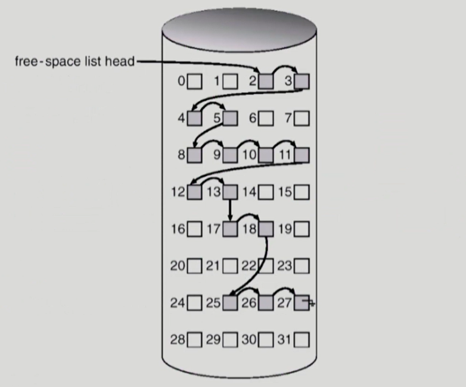

3. Grouping

   * indexed allocation 방법과 비슷한 방법이다.
   * 첫번째 free block에 비어있는 공간의 pointer을 가지는 방법이다. 마지막 부분은 또 다른 인덱스 블록을 가르키도록 한다. 

   

   * 연속적인 빈 공간을 찾기는 쉽지 않다.

4. Counting

   * 빈 공간 자체에 대한 포인터와 그 위치부터 연속적으로 몇개가 비어있는지를 알려줌으로써 연속적인 빈 블록에 대해 쉽게 접근할 수 있는 방법이다.
   * 첫번째 빈 공간을 가르키고 연속적인 빈 블록이 몇 개인지를 쌍으로 관리하는 방법이다.
   * (first free block, # of contiguous free blocks)

## Directory Implementation (디렉토리 구현)

#### 디렉토리 파일의 내용을 어떻게 구현할 것인가?

* Linear list : file name, file metadata를 순차적으로 저장
  * 가변적이지 않고 크기가 고정되어있다.
  * 예를 들어 file name, 접근 권한 등의 몇 바이트로 고정할 것인지 크기가 지정되어있다.
  * 구현은 간단하지만 특정 파일을 찾기 위해 다 검색을 해야하기 때문에 비효율적이다.
* hash table : linear list + hashing
  * hash 함수를 적용해서 파일 이름을 특정 범위 안으로 바꾼다. 
  * hash 함수를 적용한 결과값의 entry를 찾아보면 되기 때문에 search time을 없앨 수 있다.
  * 하지만 hash 함수는 collision이 발생할 가능성이 있다.

#### 파일의 메타데이터를 어디에 보관할 것인가?

* 디렉토리 내에 직접 보관할 수 있고
* 또는 디렉토리에 포인터를 두고 다른 곳에 보관할 수 있다. (예 : inode, FAT etc)

##### Long file name 지원 방식

* <file name, file의 metadata>의 list에서 각 entry는 일반적으로 고정된 크기이다.
* 물론 파일 이름을 특정 바이트 순으로 제한할 수 있지만 긴 파일 이름을 지원해야 한다.
* 방법 : 고정 크기만큼 저장하고 그 크기보다 더 길어지는 경우 마지막 부분에 포인터를 두어서 이동하고 반대로 거슬러 올라가는 방법이다.

## VFS and NFS

### VFS (Virtual File System)

* 여러 종류의 파일 시스템이 존재한다. 사용자는 파일 시스템에 접근할 때 시스템 콜을 해야한다. 만약 파일 종류별로 시스템 콜을 다르게 해야한다면 사용자는 매우 혼란스러울 것이다.
* 그래서 어떤 파일 시스템을 사용하든지 윗단에 VFS를 두어 동일한 시스템 콜 인터페이스를 사용하도록 한다. 
* 서로 다른 다양한 파일 시스템에 대해 동일한 시스템 콜 인터페이스(API)를 통해 접근할 수 있게 도와주는 OS의 layer이다.

### NFS (Network File System)

* 로컬 디스크에 있는 파일을 요청하는 것이 아니라 네트워크로 연결된 서버에서의 파일을 요청할 경우
* 분산 시스템에서는 네트워크를 통해 파일이 공유되는데 NFS는 분산 환경에서의 대표적인 파일 공유 방법이다.

### Page cache an Buffer Cache

> 디스크는 파일 시스템을 저장하기 위한 용도와 메모리의 연장공간으로 사용되는 swap area부분이 있다.

* cache 관점에서 paging system에서 사용하는 page frame은 캐쉬이다.
* 그리고 buffer cache는 파일시스템에서 파일을 디스크에서 읽어서 OS 영역에 저장하고 똑같은 파일을 요청하면 OS 영역에 저장된 버퍼에서 읽어 준다는 것을 의미한다.
* 최근에는 page cache와 buffer cache를 합쳐서 관리하는 경우가 많다. 그런 구조를 unified buffer cache라고 한다.
  * 버퍼 캐시가 커널 메모리 영역에 있는 것이 아니라 page cache(사용자 메모리 영역인)의 일부분이 buffer cache 용도로 사용된다.
  * buffer cache도 페이지 단위로 관리한다는 것을 의미한다.
* **Memory Mapped I/O**
  * 파일을 접근할 때 open하고 read /write를 사용했다. 
  * 그런데 메모리 맵드 I/O는 파일의 일부를 사용자 **메모리 영역에 매핑시키는 것**을 의미한다. 그래서 매핑 시킨 영역인 메모리에 대해 읽고 쓰는 방식을 통해 실제로는 **파일에다가 읽고 쓰는 방식**을 의미한다.
  * 장점 : OS에게 그때 그때 read /write 하는 것이 아니라 한번 자신의 주소공간에 매핑을 하면 자신의 주소공간에 read /write를 하면 된다.
  * 문제점은 여러 프로그램에서 같은 파일을 메모리 맵드 I/O하게 되면 일관성의 문제가 발생할 수 있다. 즉, 수정했는데 바로 그 수정 영역이 다른 프로그램에 보이지 않을 수 있다.
  * 보통 read/write 방식은 원본은 OS가 가지고 copy해주는 방식이고 write할 경우에도 OS에서 처리하기 때문에 최신본을 가지고 있으나
  * 메모리 맵드는 운영체제의 개입이 없기 때문에 효율성은 좋으나 일관성의 문제가 발생할 수 있다.

>  페이지 캐시의 페이지 하나 4KB, buffer cache의 한 블록은 512B 임

#### 추가

프로그램이 실행되면 가상 메모리 영역을 통해 독자적인 주소공간이 만들어진다.

이 중에서 당장 사용될 부분은 물리적인 메모리 영역에 올라가고 당장 사용되지 않을 부분은 swap area 영역에 있다.

이 중 코드 부분은 당장 사용하지는 않아도 파일 시스템에 실행파일에 포함되어 있기 때문에 swap area에 있을 필요없다. 필요할때가 되면 파일 시스템에서 읽어서 물리적 메모리에 올리면 되기 때문에 메모리 mapped I/O의 한 방식이다.

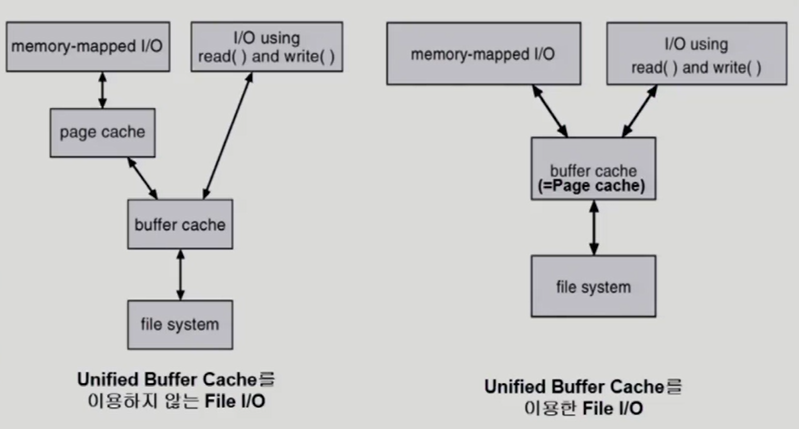

# 11. Disk Management and Scheduling

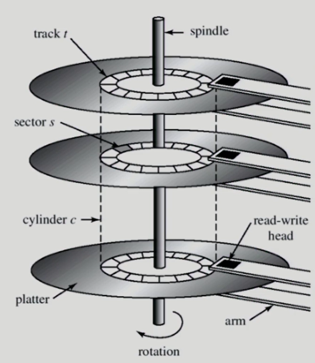

* Cylinder c : 같은 동심원상에 있는 트랙들을 말함 즉, 원판 1의 트랙1, 원판 2의 트랙 1 ...
* Track : 육상 선수의 트랙을 생각하면 쉽다.
* sector : 트랙에 있는 작은 단위들을 말한다. 실제 데이터를 쓰는 공간
* 여기서, 각각의 헤드들은 동일한 위치를 가르키게 되어있다. 즉, 원판 1의 헤드와 원판 2의 헤드는 똑같은 실린더 상에 존재한다. 

#### Access time

* Seek time : 헤드를 해당 실린더로 움직이는 시간 (**가장 많은 시간이 할애**)
* Rotational latency : 헤드가 원하는 섹터에 도달하기까지 걸리는 회전 지연시간 (seek time의 10분의 1)
* Transfer time : 실제 데이터의 전송시간 (굉장히 작은 시간을 차지)

> 시간을 효율적으로 관리하기 위해서는 seek time을 잘 관리하면 된다. (seek time 최소화가 목표)

보통 특정 원판, 트랙, 섹터를 이야기해야 헤드들이 가서 읽고 쓸 수 있지만 컴퓨터 내부에서는 logical block 번호를 말하면 특정 원판, 트랙, 섹터를 찾을 수 있게 된다.

##### Logical block

* 디스크의 외부에서 보는 디스크의 단위 정보 저장 공간들
* 1차원 배열처럼 취급한다.
* 정보를 전송하는 최소단위이다.

##### Sector

* Logical block이 물리적인 디스크에 매핑된 위치이다.
* Sector 0은 최외곽 실린더의 첫 트랙에 있는 첫번째 섹터이다.
  * 부팅을 위해 정해진 구간이다.

#### Physical Formating(low level formating)

* 디스크 컨트롤러가 **읽고 쓸 수 있도록 섹터를 나누는 과정**을 말한다.
* 각 섹터는 header + 실제 data(512 bytes) + trailer로 구성
* header와 trailer는 
  * sector number
  * ECC (Error Correcting Code) 등이 저장

#### Partitioning

* 물리적인 디스크를 partitioning하는 과정을 통해 독립적인 즉, 논리적인 디스크로 취급한다.
* 이렇게 나눠진 논리적인 디스크는 파일 시스템을 사용해서 사용하던지 혹은 swap area로 사용한다.
  * Logical Formatting 
    * FAT, inode, free space 등의 구조 포함하여 파일 시스템을 만드는 것을 의미한다.

#### Booting 과정

메모리에는 DRAM(전원끄면 사라지는)과 매우 작은 메모리인 ROM(전원꺼도 사라지지 않는)가 있다. 전원을 키면 CPU의 PC(Program counter)가 Rom의 주소를 가르키고 있어서 ROM 의 명령어를 실행한다.

* ROM의 명령어(small bootstrap loader) : 디스크의 0번 섹터(boot block)를 메모리에 올리고 0번 섹터를 실행해라(full bootstrap loader program) 

## Disk Scheduling Algorithm

#### FCFS(First Come First Served)

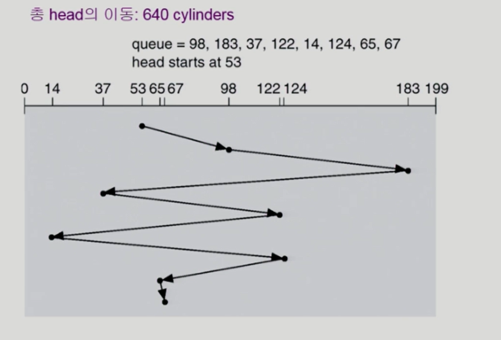

#### SSTF(Shortes Seek Time First)

* 현재 헤드에서 가장 가까운 거리로 이동하는 방법이다.
* 영원히 서비스가 되지 않는 starvation이 발생할 수 있다.

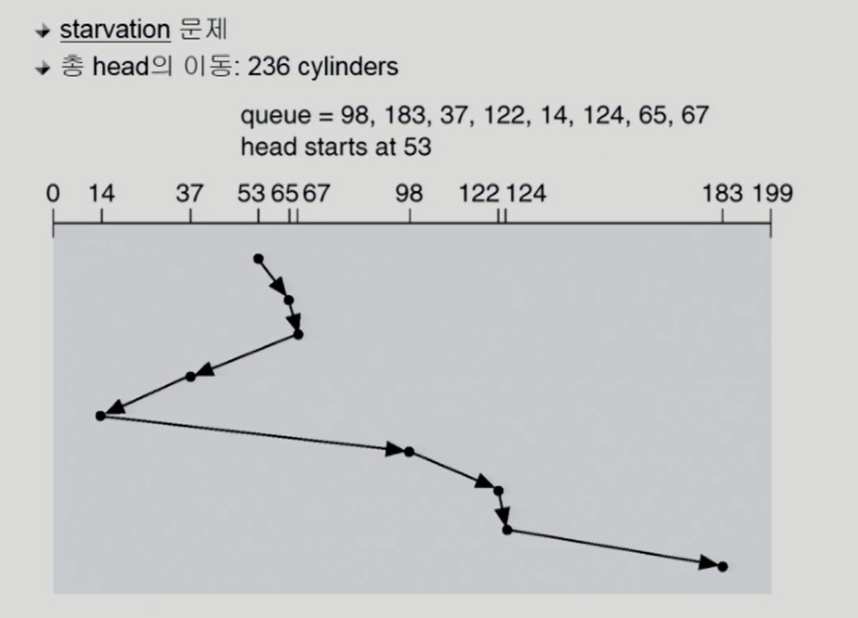

#### SCAN

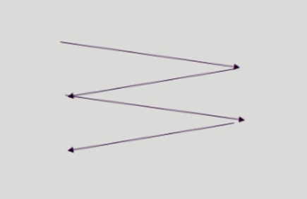

* 엘레베이터에서도 이 방법을 사용한다.
* 디스크 헤드는 본인의 소신대로 한쪽 끝에서 다른쪽 끝으로 이동하며 요청이 있는 모든 요청을 처리한다.
* 다른 한쪽에 도달하면 역방향으로 이동한다.
* 문제점 : 트랙의 위치 실린더 위치에 따라 대기 시간이 다르다.
  * 헤드가 출발하자마자 그 부분이 요청이 오는 경우 : 트랙이 가장 끝에 있는 경우와 트랙이 안쪽 중간지역에 있는 경우 한바퀴 돌고 오는 (기다리는 시간)이 다르다. (기다리는 대기시간의 편차가 있다)

#### C-SCAN

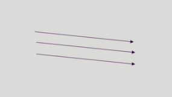

* SCAN을 개선한 방법으로 SCAN보다 균일한 대기 시간을 제공한다.
* 헤드가 한쪽 끝에서 다른 쪽 끝으로 이동하며 이동 길목에 있는 모든 요청을 처리한다.
* 다른 반대편으로 이동했을 경우 요청을 처리하지 않고 곧바로 출발점으로 다시 이동한다.

#### N-SCAN

* SCAN의 변형 알고리즘이다.
* 일단 한 방향으로 움직이면 이동 전에 들어온 요청만 처리하고 이동하는 도중에 들어온 요청들은 돌아갈때 처리한다.

#### LOOK , C-LOOK

* SCAN이나 C-SCAN의 경우 헤드가 디스크 끝에서 끝으로 이동한다.
* 하지만 LOOK 방식의 경우 헤드가 그 방향으로 가다가 그 방향에 더 이상 기다리는 요청이 존재하지 않으면 헤드의 이동방향을 반대로 이동시키는 방법을 말한다.

#### 현대 Disk Scheduling Algorithm 결정

* SCAN의 기반한 알고리즘 등이 많이 사용되며 효율적이다.
* 또한 디스크는 File 할당방법에 따라 영향을 받게 된다.
* 그러므로 디스크 스케줄링 알고리즘은 필요할 경우 다른 알고리즘으로 쉽게 교체할 수 있도록 OS와 별도의 모듈로 작성되는 것이 바람직하다.

## Swap Space Management

File System : 메모리의 volatile한 특성으로 사라지지 않는 데이터 영역이 필요하다

Swap Space : 프로그램 실행을 위한 메모리 공간 부족으로 **메모리의 연장공간**으로 사용한다.

* 용도가 다르기 때문에 관리하는 방법도 다르다.
* 파일 시스템의 경우 512byte sector 단위로 관리한다. (최근에서는 호스트 컴퓨터와 디스크에 주고받는 단위를 4KB로 하는 경우도 있다.)
* swap area는 호스트 컴퓨터와 디스크에 주고받는 단위가 메모리에서 파일 시스템에서 주고받는 단위보다는 크다. 파일은 컴퓨터 전원이 나가도 유지되기 때문에 공간효율적으로 관리를 해야한다. 하지만 swap area는 전원이 나갈때 사라지는 정보이기 때문에 공간 효율성보다는 **속도 효율성이 중요**하다. 
* 보통 그렇기 때문에 더 대용량의 데이터를 한꺼번 읽고 쓴다.

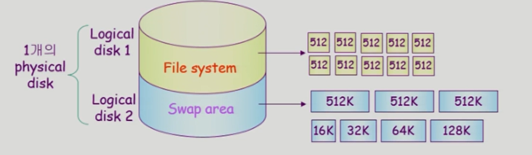

## RAID (Redundant Array of Independent Disks)

* 여러 개의 디스크를 묶어서 사용한다.

#### 사용 목적

##### 디스크 처리 속도 향상의 목적

* 여러 디스크에 block의 내용을 **분산 저장**하면 병렬적으로 읽어올 수 있다.(interleaving, striping)
* 한 군데에서 다 읽어오는 것보다 4군데에서 한꺼번에 가져오는 것이 더 속도 측면에서 빠르다.

##### 신뢰성(reliability) 향상의 목적

* 동일 정보를 여러 디스크에 **중복 저장**하여 하나의 디스크가 고장나더라도 다른 디스크에서 읽어올 수 있다. (Mirroring, shadowing)
* 단순한 중복 저장이 아니라 최소한의 중복으로 일부 디스크에 parity를 저장하여 공간 효율성을 높일 수 있다. 
  * parity는 축약 정보라고 생각하면 된다. (hash 함수를 사용해서 parity 정보를 저장하면 고장나더라도 복원할 수 있다.)

# + 파일 시스템, 저널링, 버퍼캐시 알고리즘

## UNIX 파일시스템

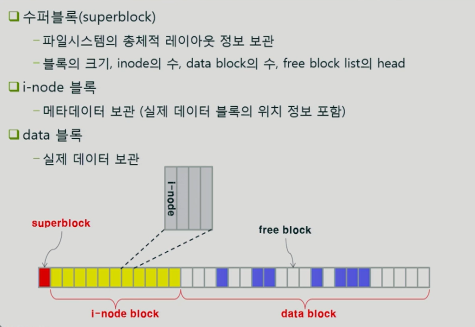

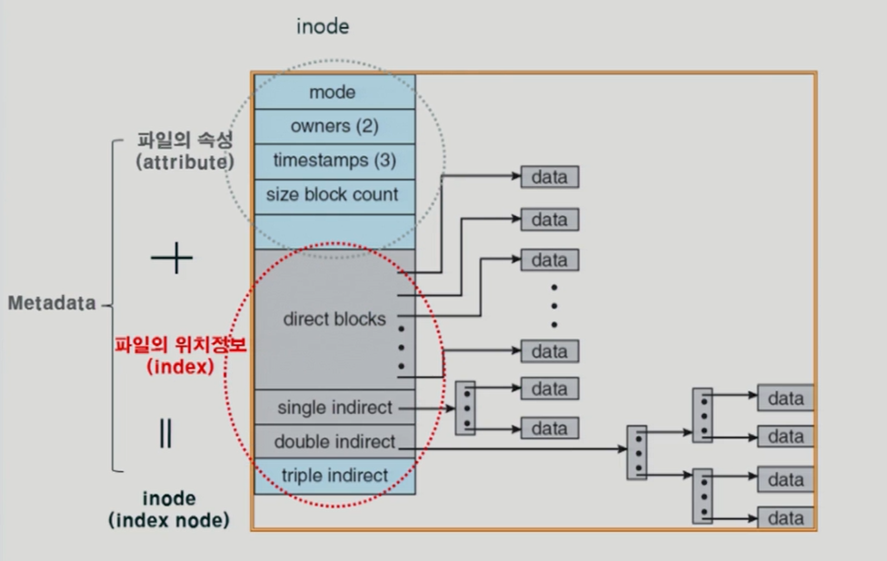

## Ext2 파일시스템

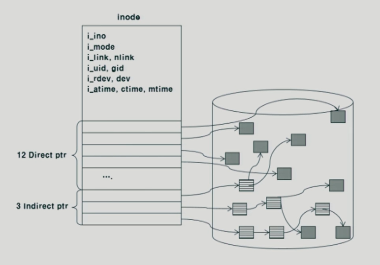

#### UNIX에 비해 개선된 점

##### 블록의 그룹화

* 메타데이터와 실제 데이터를 인접하게 배치하여 디스크 탐색 시간 감소한다.
* 보통 파일을 접근할 때 메타데이터 접근해서 위치를 파악하고 실제 데이터에 접근한다. 이때 메타 데이터와 실제 데이터는 기존 방식에서 거리가 있는데 메타 데이터와 실제 데이터를 그룹화함으로서 메타 데이터와 실제 데이터를 **가까이 위치시키는 방법**이다. (헤드의 이동을 줄인다.)

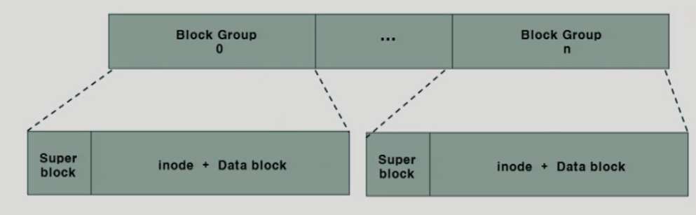

##### 수퍼블록의 중복저장

* 각 그룹마다 수퍼블록을 중복저장하여 디스크 오류에 대비할 수 도있다. (신뢰성 향상)

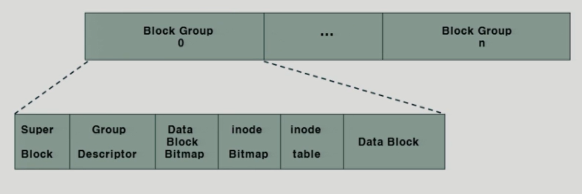

##### 수퍼블록(전체의 내용을 담고 있는 부분) :

* 아이노드 수, 가용 아이노드 수, 데이터 블록 수, 가용 데이터 블록 수
* 그룹 당 블록 수, 시간 정보

##### 그룹 디스크립터(Group descriptor)

* 그룹의 수퍼블록의 역할을 한다.

* 데이터 블록 비트맵의 시작위치, 아이노드 비트맵의 시작위치
* 첫번째 아이노드의 시작주소, 가용아이노드의 수

##### 데이터 블록 비트맵

* 사용중인 데이터블록과 빈 데이터 블록의 표시

##### 아이노드 비트맵

* 사용중인 아이노드와 빈 아이노드의 표시

##### 아이노드 테이블

* 실제 아이노드의 저장위치

## Ext4 파일시스템

* Ext2 + 저널링

갑작스러운 전원 공급이 중단되면 파일시스템 자체가 깨질 가능성이 있다. 즉, 파일 시스템의 일관성 훼손(inconsistency) 발생한다.

 파일 시스템의 내용을 작업하기 위해서는 메인 메모리의 버퍼캐시에 올려놓고 작업한다. 버퍼캐시는 휘발성이기 때문에 전원이 사라질 경우 내용이 사라질 수 있다. 보통 버퍼캐시에서 수정된 내용은 파일 시스템에 반영을 해줘야한다.

그런데 만약에 버퍼캐시에서 파일시스템에 반영을 하는 도중에 전원 공급이 중단되는 경우 버퍼캐시는 사라지게 되고 파일시스템에 의미 단위는 깨지게 된다.

이 문제를 해결하기 위해서 현대 파일시스템은 저널링 기능을 추가되었다.

### 저널링

 보통 버퍼캐시에 올라온 데이터가 수정이 되고 버퍼캐시에서 나갈 때 파일 시스템에 써준다. 하지만 저널링은 버퍼캐시에 올라온 데이터가 수정된 경우 주기적으로 저널영역이라는 별도의 구역에 저장해놓는다. 

저널 영역에 쓰는 중간에 크래쉬가 날 경우 온전하게 써진 것이 아니기 때문에 바로 삭제한다. 그리고 정상적으로 저장한 경우에는 정상적으로 저장했다는 마크를 가지고 있다. 

저널영역에서 파일시스템으로 저장하는 과정을 **checkpointing**이라고 하는데 만약 저널 영역에서 파일시스템으로 저장하는 과정에서 크러쉬가 나더라도 재부팅하면 저널영역에 정상적으로 저장되었다고 마크 찍힌 데이터가 남아있기 때문에 다시 파일시스템에 쓰면 된다.

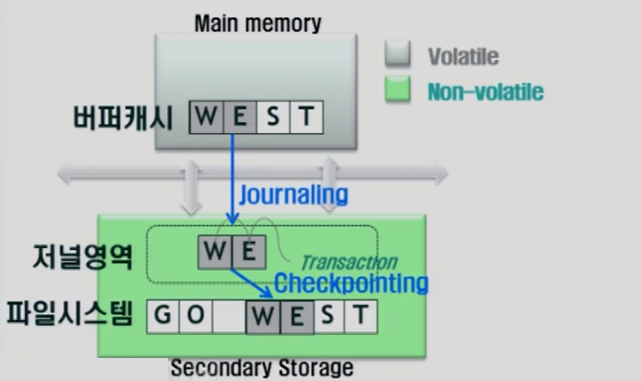

### 저널링의 두 가지 방법

#### 메타데이터만 저널링

* 파일을 수정하면 메타데이터도 수정이 된다.
* 메타데이터만 저널링하는 방법은 데이터는 원래 파일 시스템에 저장하고 메타데이터만 저널영역에 저장하는 방법이다. 저널영역에 저장된 메타데이터는 checkpointing 주기가 되면 다시 파일 시스템에 저장하게 된다.
* 이 방법의 장점은 :
  * 메타데이터는 파일시스템의 구조정보, 위치정보가 저장되어있어서 저널링하게 되면 크러쉬 발생시 파일시스템 자체가 깨지지는 않게 된다. 하지만 파일은 깨져 보일 수 있다. 즉, 일부 데이터 훼손 가능성이 있다.

#### 메타데이터와 일반데이터를 모두 저널링

* 저널링 주기가 도래하면 데이터와 메타데이터를 저널영역에 기록한다.
* 체크 포인팅 주기가 도래하면 데이터와 메타데이터를 파일 시스템에 반영한다. 
* 크러쉬 발생시 데이터 자체는 복구 보장이 된다. 예전 데이터 혹은 최신 데이터든 일관성있는 데이터가 보장이 됨을 의미한다.(최신 정보의 보장을 의미하는 것은 아니다.) 

## 파일시스템을 위한 버퍼캐시 알고리즘

### LRFU 알고리즘

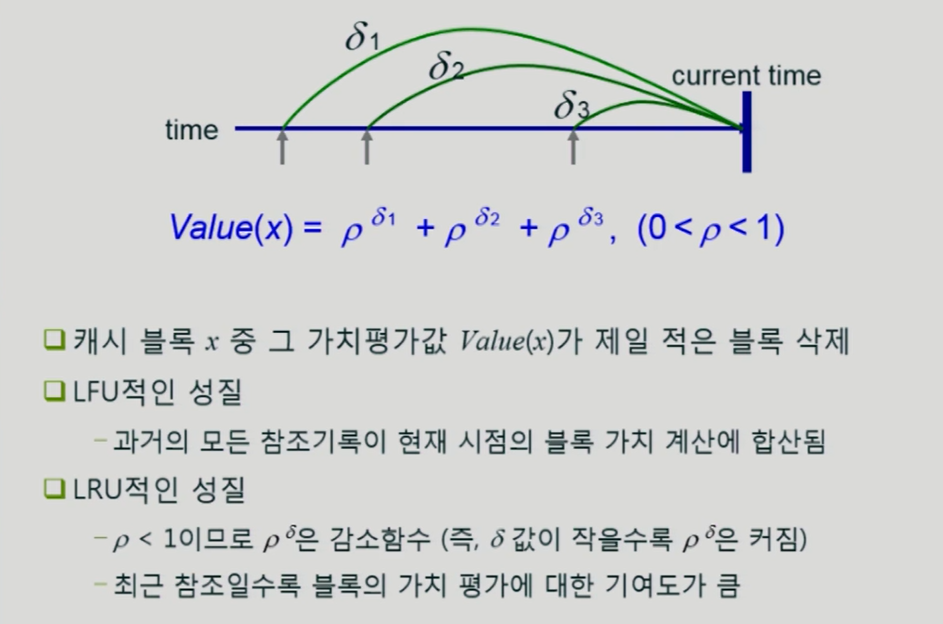

* 가치를 평가하는 식을 이용해서 결정한다. 
* 현재시점부터 사용된 타임을 지수로 사용하여 계산하는데 p자체가 1보다 작기 때문에 현재 시점부터 오랜 시간 전에 사용할 경우 즉, p의 지수가 클수록 p의 값은 작아진다.
* 사용된 횟수 p를 더하기 때문에 사용횟수가 많으면 가치가 높아진다. 
* 최근에 사용할 경우 기여도가 높아진다. 

#### 문제점

* Space overhead :
  * 현재 시점 전에 사용된 시점을 모두 기록하여 참조하기 때문에 기록하고 보관하는 것에 대한 오버헤드가 발생할 수 있다.  

* Time overhead : 
  * 버퍼 캐시가 n개의 경우 log n의 시간 내에 어느 것을 쫓아낼지를 결정해야하는데 버퍼에 저장된 모든 캐시에 대해 계산이 필요함으로 결정하는 데 시간이 오래걸릴 수 있다. 

#### 해결점

##### Space ovehead

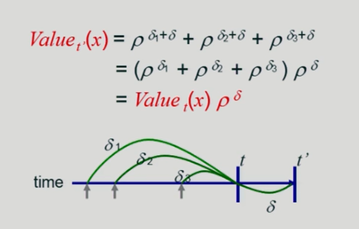

##### Time overhead

블록들이 재사용되지 않았을 경우 가치는 변화하지 않는다. -> heap을 이용해서 효율적으로 관리 가능할 수 있다.

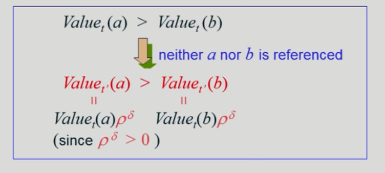

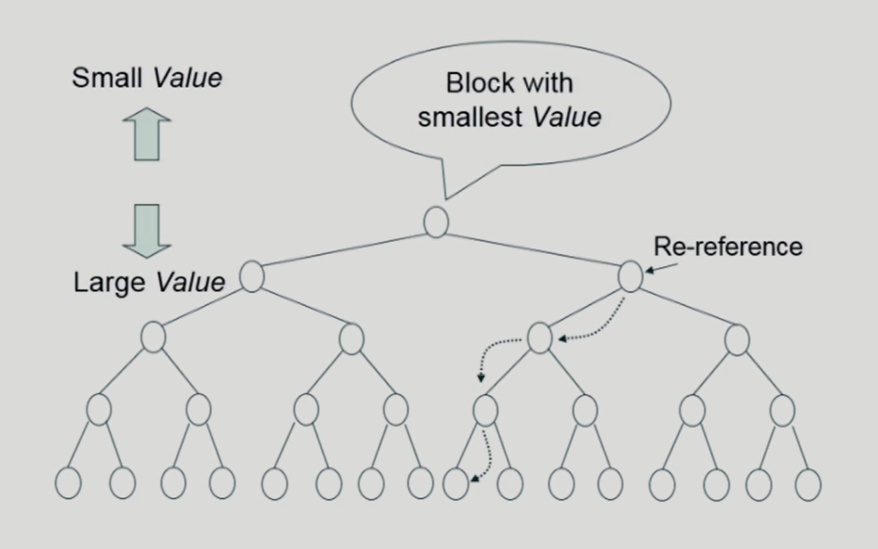

* 가장 위에 있는 블록이 가장 가치가 낮다.
* 만약 재사용될 경우 가치를 추가하고 밑에 자손들과 비교해서 자리를 이동한다. 

> 지금은 LRFU보다 성능이 좋은 알고리즘들이 더 많이 발견이 되었다.

