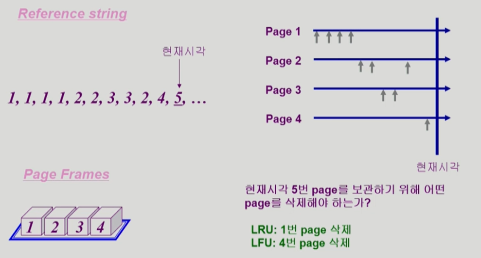

# 08. Virtual Memory

물리적인 메모리의 주소변환은 운영체제가 관여하지 않는다. 하지만 virtual memory는 운영체제가 관여한다.

### Demand Paging

* 요청이 있으면 그 페이지를 메모리에 올리겠다는 의미이다.
  * 디스크에서 물리적 메모리로 올리는 작업을 I/O 작업이라고 한다. 요청이 있을 때 메모리에 올리기 때문에 I/O 양이 감소하고 메모리의 사용량도 감소한다. 
  * 물리적인 메모리가 줄어들기 때문에 멀티 프로그래밍 환경에서 더 많은 프로그램, 더 많은 사용자가 동시에 메모리에 올릴 수 있기 때문에 더 효과적이다. 그리고 그로 인해 응답시간도 더 빨라진다.
    * 한정된 메모리에서 여러 프로그램이 사용되기 때문에 의미있는 정보가 메모리에 올라간다는 것은 응답시간이 더 빨라지는 것으로 볼 수 있다.
* 앞서 page table에서 Valid/Invalid bit의 의미는 valid의 경우 물리메모리에 올라갔음을 의미하고, invalid의 경우 backing storage 즉, swap 영역에 있거나 아예 사용이 되지 않음을 의미한다.
  * 요청한 페이지가 메모리에 없는 경우 = page fault이고 CPU는 자동적으로 OS에게 넘어가서 디스크에서 메모리에 올리는 작업이 일어난다.

#### Page Fault

* Invalid page에 접근하면 MMU가 trap을 발생시킨다.
* 커널 모드로 들어가서 page fault handler가 invoke되게 되고 아래의 순서로 page fault를 처리한다.
  1. 잘못된 요청이 아닌지? 
     * 프로세스가 사용하지 않는지 혹은 protection violation인지 혹은 잘못된 주소인지 확인
  2. 물리적 메모리에 빈 페이지를 만들어야 한다. 
  3. disk에서 memory로 읽어온다
     * disk I/O가 끝나기까지 프로세스는 CPU를 뺏김 (block)
     * disk read가 끝나면 page table entry에 기록하고 valid bit에 체크
     * ready queue에 프로세스를 다시 넣고 후에 dispatch한다
  4. 프로세스가 CPU를 잡고 다시 running
  5. 아까 중단했던 instruction을 재개한다.

#### Free frame() 이 없는 경우

##### Page replacement

* 어떤 frame을 빼앗아올지 결정해야한다. 
* 운영체제가 하는 일이다. 

##### replacement algorithm

* page fault rate을 최소화하는 것이 목표이다.

* victim이 결정되었을 때,
  * 만약 희생자가 write로 새로운 내용이 적힌 경우 디스크에 반영해야함
  * 만약 변경되지 않았다면 메모리에서 삭제하면 됨

### Algorithm

#### Optimal Algorithm

* 미래에 참조되는 페이지를 알고 있다고 가정하기 때문에 가정 최적화된 알고리즘이다. 
* 가장 먼 미래에 참조되는 page를 replace 시킨다.
* 하지만 미래를 알 수 없기 때문에 실제로 적용될 수 없다.
  * 다른 알고리즘 성능에 대한 upper bound를 제공
  * 즉, 다른 알고리즘의 성능을 평가할 때 참고할 수 있다.

#### FIFO (First In First Out) Algorithm

* FIFO : 먼저 들어온 것을 먼저 내쫓는다.
* FIFO Anomaly : frame 수가 늘어났는데 오히려 page fault가 늘어나는 현상을 말한다.

#### LRU (Least Recently Used) Algorithm

* 가장 오래 참조된 것을 먼저 지운다.

#### LFU (Least Frequently Used) Algorithm

* 참조 횟수가 가장 적은 페이지를 지움
* 최저 참조 횟수가 여러개 있는 경우 임의로 선정한다. 하지만 성능 향상을 위해 가장 오래 전 참조된 page를 지우게 구현할 수도 있다.
* LRU처럼 직전 참조 시점만 보는 것이 아니라 장기적 시간 규모를 보기 때문에 page의 인기도를 정확하게 반영할 수 있다.
* 하지만 **참조 시점의 최근성을 반영**하지 못하고 LRU보다 구현이 복잡한 단점을 가지고 있다.

* LRU의 경우, 링크드 리스트로 연결해서 최신의 참조된 경우 아래로 내린다. 비교할 필요가 없기 때문에 O(1)으로 처리 가능하다.
* LFU의 경우, 링크드 리스트로 구현하면 최악의 경우 O(n)이 될 수 있기 때문에 heap 구조를 사용하게 된다. 최악의 경우 O(log n) 이 수행된다.