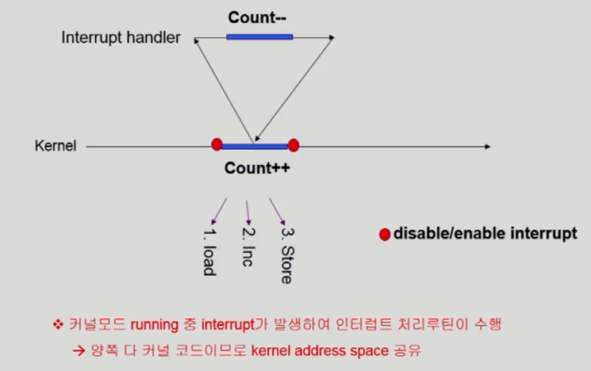
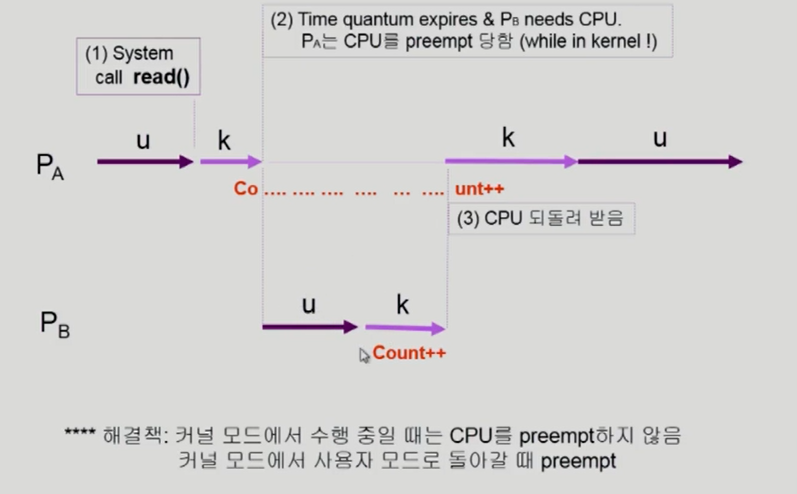
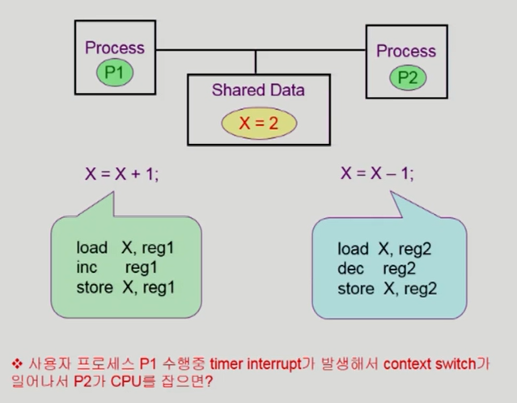
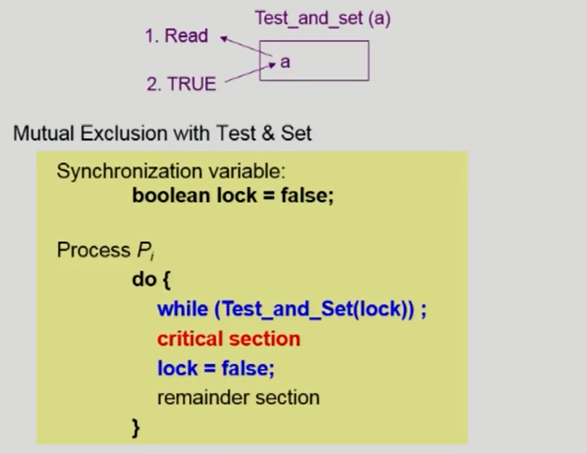

# 01. 운영체제 개요

> 운영체제 목적

* 컴퓨터 시스템을 편리하게 사용할 수 있는 환경을 제공
* 하드웨어 자원을 효율적으로 관리
  * CPU, 메모리, I/O 장치 등
  * 주어진 자원으로 최대한 성능을 내도록 -> 효율성
  * 특정 사용자/ 프로그램의 지나친 불이익이 발생하지 않도록 -> 형평성


> 운영체제 분류 - 처리 방식

* 일괄처리 batch processing
  * 작업 요청의 일정량 모아서 한꺼번에 처리
  * 작업이 완전 종료될 때까지 기다린다.

* 시분할(time sharing)
  * 범용화된 컴퓨터, 요즘 사용함
  * 여러 작업을 수행할 때 컴퓨터 처리 능력을 일정한 시간 단위로 분할하여 사용
  * 일괄 처리 시스템에 비해 짧은 응답시간을 가짐
  * interactive한 방식
* 실시간(realtime OS)
  * 우리가 사용하는 범용화된 컴퓨터에서 사용하는 것은 아님
  * 정해진 시간안에 어떤 일이 반드시 종료됨을 보장되어야 하는 실시간 시스템을 위한 OS
    * 시간을 어기면 큰일날 수 있는 것 -> 원자로, 미사일, 반도체 장비 등


> 운영체제 예

* 유닉스 UNIX
  * C언어로 작성
  * C언어는 다른 아키텍처에 호환이 되기 때문에 높은 이식성을 가지고 있음
  * 최소한의 커널 구조
  * 복잡한 시스템에 맞게 확장 용이
  * 프로그램 개발에 용이


> 운영체제의 구조

* CPU : 누구에게 CPU를 줄까?
* 메모리 관리 : 한정된 메모리를 어떻게 쪼개어 쓸까?
* 파일 관리 : 디스크에 파일을 어떻게 보관할까?
* 입출력 관리 : 각기 다른 입출력 장치와 컴퓨터 간에 어떻게 정보를 주고 받게 할까?
* 프로세스 관리 : 프로세스의 생성과 삭제, 자원 할당 및 반환, 프로세스 간 협력


# 02. 컴퓨터 시스템의 구조


* Os는 메모리에 상주하면서 실행되고 있다.

* device controller : I/O 장비를 관리하는 작은 CPU, disk를 읽거나 혹은 입출력 장비에 입력이 일어났을 때 interrupt 발생하여 CPU에게 알림

* local buffer : device controller가 사용하는 작업공간

* CPU

  * CPU가 운영체제 혹은 프로그램이 실행되고 있는지 구분할 필요가 있다. -> mode bit
    * 운영체제에 의해서 실행되고 있을 때, 미리 정해놓은 기계어가 있기 때문에 안전함
      * mode bit = 0
    * 사용자 프로그램에 의해서 실행되고 있을 때, 어떤 프로그램이 실행되고 있을 지 알 수 없기 때문에 관리가 필요함
      * mode bit = 1
      * 보안을 해칠 수 있는 명령어(특권 명령)는 사용할 수 없다.
  * Interrupt line
    * **권한이 없는 명령어를 수행(exception)하거나 interrupt가 발생하면 CPU가 사용자 모드에서 OS로 넘어가게 된다.**

  * registers : 연산의 input과 output을 저장하는 공간
    * PC(프로그램 카운터) : 다음 번에 실행할 프로그램의 주소를 가지고 있다.

* timer: 부가적인 하드웨어
  * 운영체제가 타이머 세팅 후 CPU를 넘겨줘서 시간이 흐른 뒤 다시 OS가 CPU를 점유함
  * CPU 독점을 막기 위해 부가적으로 도입된 하드웨어


> Flows

* 사용자 프로그램A가 CPU를 사용하는 중간에 timer에 의한 interrupt가 발생하여 OS로 CPU가 넘어감
* 사용자 프로그램A가 파일을 읽어와야 하는 경우 시스템 콜을 통해서 CPU를 OS에게 넘겨주고 OS는 CPU를 가지고 device controller에게 명령(특권 명령)시킨다.
  * 파일을 읽어오는 경우 -> 특권명령으로 분리 되어 있다. 
  * 이 경우 사용자 프로그램이 권한이 없기 때문에 **CPU를 OS에게 넘기게 되는데 이것을 시스템 콜**이라고 부른다.
  * 또한 시스템 콜은 interrupt를 사용한다. CPU가 넘어가는 방법은 interrupt를 통해서 넘어가야하기 때문에 사용자 프로그램은 OS에게 넘기기 위해서 interrupt line을 setting(system call)함. 
    * 그리고 이것을 **소프트웨어 인터럽트(Trap)라고 한다**
      * Exception
      * System call
    * 하드웨어 인터럽트(interrupt) : 하드웨어가 발생시킨 인터럽트


> 동기식 입출력과 비동기식 입출력


* 동기식 입출력 (Synchronous)
  * 결과가 나올 때까지 기다린다.
  * 방법
    * I/O가 끝날 때 까지 해당 프로그램에서 CPU를 빼앗아 다른 프로그램에게 CPU를 준다.
* 비동기식 입출력 (Asynchronous)
  * 결과 값과 무관한 일을 하고 있음


> DMA (Direct Memory Access)

* 빠른 입출력 장치를 메모리에 올리기 위해 사용
* **CPU의 중재 없이 device controller가 device의 buffer storage의 내용을 메모리에 block 단위로 직접 전송**
* 바이트 단위가 아니라 block 단위로 인터럽트 발생
* 메모리는 CPU만 접근할 수 있다.
  * IO 장치의 입출력이 끝나면 인터럽트를 통해서 알릴 수는 있지만 직접 메모리에 입출력 buffer의 내용을 옮길 수 없다.
  * CPU가 옮겨야 하는데 이 과정이 자주 일어나게 되면 효율성이 떨어지므로 CPU 외에 메모리에 접근할 수 있는 장치를 두게 되었고 그것이 바로 DMA이다.
  *  그래서 device controller가 interrupt를 거는 것이 아니라 DMA를 통해 디바이스의 내용을 메모리에 복사하고 CPU에게 interrupt를 걸어서 작업이 끝났임을 알림


> 프로그램의 실행


* 실행파일을 실행하면 physical memory에 프로세스가 올라가게 된다.

* 그전에 자기만의 메모리 공간을 가지게 된다. (0부터 몇번까지)
  * 그렇기 때문에 
  * 당장 필요한 부분은 물리적 메모리에 올라가고 그렇지 않은 부분은 swap area에 들어간다. 

* 커널도 일종의 프로그램이기 때문에 stack, data, code 공간을 가지게 된다. 

  > 커널(OS)의 주소 공간 내용

  

  * code
    * 시스템 콜, 인터럽트 처리 코드
    * 자원 관리를 위한 코드
    * 편리한 서비스 제공을 위한 코드
  * data
    * 모든 하드웨어, 프로세스를 관리하기 위한 자료구조를 가지고 있다.
      * 프로세스 관리 자료구조 : PCB
  * stack
    * 각 프로세스 마다 별도로 스택을 두고 있다.

​	

# 03. 프로세스

## # 3-1 프로세스

프로세스 : 실행중인 프로그램

프로세스 문맥

* CPU 수행 상태를 나타내는 하드웨어 문맥
  * Program Counter
  * 각종 register
* 프로세스의 주소 공간
  * code, data, stack
* 프로세스 관련 커널 자료구조
  * PCB(Process Control Block)
  * Kernel stack


> 프로세스의 상태


* Running
  * CPU를 잡고 instruction을 수행중인 상태
  * user mode : 사용자 프로세스 A의 직접 코드를 실행
  * monitor mode : System call 등을 통해 kernel code를 수행중이지만 A프로세스는 여전히 Running 상태로 간주, 그대신 monitor mode라고 한다.
    * 여기서 monitor mode의 Running이 커널의 상태를 표시하는 것은 아니다.
* Ready
  * CPU를 기다리고 상태( 메모리 등 다른 조건을 모두 만족하고)
* Blocked (Wait, Sleep)
  * CPU를 주어도 당장 instruction을 수행할 수 없는 상태
    * 공유데이터를 기다리는 경우
  * Process 자신이 요청한 event(예 : I/O)가 즉시 만족되지 않아 기다리는 상태
    * 디스크에서 파일을 읽어와야하는 경우
* Suspended (Stopped)
  * 외부적인 이유로 프로세스의 수행이 정지된 상태
    * 메모리의 경합이 심해서 프로세스를 쫓아내는 경우(중기 스케줄러에 의해)
    * 유저가 강제로 정지시키는 경우(break key)
  * 프로세스는 통째로 디스크에 swap out 됨

+++ Blocked : 자신이 요청한 event가 만족되면 Ready

+++ Suspended : 외부에서 resume해 주어야 Active


### 추가 질문 !!

Q.  사용자 프로세스 A가 실행하다가 도중에 (사용자 프로그램 B가 신청한) 디스크 컨드롤러가 인터럽트를 발생시켜서 CPU가 커널로 넘어간 경우, A 프로세스의 상태는 무엇인가?

* 정답 : 사용자 프로세스 A가 Running 하고 있다고 간주
  * 직전에 돌고 있던 프로세스가 running하고 있다고 간주


Q. I/O 요청을 읽어오는 과정은 하드웨어 인터럽트인가 ? 소프트웨어 인터럽트인가? 

* **둘 다 들어 있다.**
* 처음 시작할 때는 사용자 프로그램이 **시스템 콜**을 요청해 OS에게 CPU를 넘겨주고 CPU는 device controller를 통해서 요청하게 됨. 이 과정은 **소프트웨어 인터럽트**이다
* 하지만 device controller가 모든 일을 완성한 뒤에는 device controller가 interrupt line을 설정하기 때문에 **하드웨어 인터럽트**라고 할 수 있다. 

=========================================================


> 문맥 교환 (Context Switch)

CPU를 한 프로세스에서 다른 프로세스로 넘겨는 과정

​	(사용자 프로세스 A로부터 B로 넘어갈 때)

​	(**사용자 프로세스 A에서 커널로 넘어가는 과정은 문맥교환이라고 하지 않는다.**)

​	

* 1번의 경우에도 일부 PCB를 저장해야함. 왜냐하면 커널도 CPU를 써야하기 때문에 PC 값등을 저장하지 않으면 다시 프로세스로 돌아갈 때 어디서 해야하는 지 알 수 없음

CPU는 다른 프로세스로 넘어갈 때,

* 운영체제는 프로세스 상태를 그 프로세스의 PCB에 저장한다. 
* 운영체제는 새로게 얻은 프로세스의 상태를 PCB에서 읽어온다.
* PCB는 커널의 data에 저장되어 있음.


> ### 스케쥴러(Scheduler)

#### Long-term scheduler

* 메모리를 주는 문제와 관련
* 프로세스가 new에서 ready 상태로 넘어가기 전에 admitted해주는 과정을 long term 스케쥴러에서 처리
  * admitted 메모리에 들어오도록 허락해주는 것
  * 요즘 많이 사용하는 일반적인 운영체제는 장기 스케줄러가 없다. 
    * time sharing system에는 보통 장기 스케쥴러가 없이 무조건 ready부터 시작됨
      * 장기 스케쥴러가 없기 때문에 시작된 프로그램은 메모리에 들어오게 된다 이것을 관리하기 위해 중기 스케줄러를 둔다.


#### Short-term scheduler

* CPU 를 누구를 줄 지 결정

* 자주 호출되기 때문에 충분히 빨라야한다.


#### Medium-term Scheduler(Swapper)

* 여유 공간 마련을 위해 프로세스를 통째로 메모리에서 디스크로 쫓아냄
* 프로세스에게서 memory를 뺏는 문제 ()


# 3-2 스레드

프로세스 중에서 CPU 수행 단위를 스레드라고 한다.

* 웹 브라우저를 각각 사이트를 띄었을 때 똑같은 프로그램이기 때문에 code는 같을 수 있다. 단, code에서 어느 부분을 실행하는가만 다르다. 그렇기 때문에 프로세스를 여러개 이것은 비효율적임.
  * 그러나 크롬의 경우, 웹 브라우저를 각각 사이트를 스레드로 사용하게 되면 보안성의 문제가 발생할 수 있기 때문에 창을 따로하면 각자의 프로세스로 해둠. 

* 스레드는 하나의 프로세스에서 stack의 공간만 별도로 갖도록, 그리고 PCB에서 PC값만 스레드별로 관리하면 된다.
  * context switch보다 CPU가 스레드 1에서 2로 넘어가는 것은효율적으로 수행가능(값비싼 오버헤드가 발생하지 않는다.) 

* Thread 구성
  * Program counter
  * register set
  * stack space
* Thread가 동료 thread와 공유하는 부분(=task)
  * code section
  * data section
  * OS resources


> 스레드의 장점

* 프로세스의 경우 I/O 작업을 하게 될 경우 CPU를 빼앗기게 된다.
* 스레드의 경우 I/O 작업
  * 다중 스레드로 구성된 태스크 구조에서는 하나의 서버 스레드가 blocked 상태인 동안에도 동일한 태스크 내의 다른 스레드가 실행되어 빠른 처리를 할 수 있다.
  * 예 : http 문서를 보여주는 과정에서 text 외의 이미지가 있을 경우, 네트워크를 통해 이미지를 읽어오는 I/O과정에서 프로세스를 Blocked하지 않고 다른 스레드는 text를 읽어 표시해주면 응답성이 빨리짐

* 장점 :

  * 

  * 마지막의 경우, CPU가 여러 개 있는 경우 행렬 곱셈시 병렬적으로 처리가능


# 04. 프로세스 관리

### # 프로세스 생성

* 부모 프로세스가 자식 프로세스를 생성
  * 복제 생성하고, 시스템 콜을 통해 OS에 요청해 만듦 (e.g : fork)
  *  부모와 자식는 별개의 프로세스이기 때문에 각자 수행되게 된다.
  * 자식은 부모의 공간을 복사하기 때문에 stack의 내용뿐만 아니라 어디를 수행하고 있는지 까지 복사하게 된다. 


> 프로세스 종료

* 프로세스가 마지막 명령을 수행 후 종료(exit)하게 된다
  * 프로세스 세계에서는 부모와 자식 중 자식이 먼저 죽고 부모가 뒤처리를 하게 된다.
    * 자식이 부모를 output data를 보냄
    * 프로세스의 각종 자원들이 운영체제에게 반납된다.
* 부모 프로세스가 자식의 수행을 종료시킴(abort)
  * 자식이 할당 자원의 한계치를 넘어선 경우
  * 자식에게 할당된 태스크가 더 이상 필요하지 않은 경우
  * 부모가 종료하는 경우
    * 보통 자식이 먼저 죽지만, 부모가 종료하는 경우에는 자식을 먼저 죽이고 죽는다. (단계적인 종료)


### # 시스템 콜

#### fork() 시스템 콜


#### exec() 시스템 콜

* 프로그램을 새로운 것으로 덮어쓰우게 된다. 그렇기 때문에 밑에 쓰여있는 기존의 코드들은 무시됨.
  * exec 으로 불러온 프로그램은 처음부터 시작
  * 다시 돌아올 수 없음


#### wait() 시스템 콜

* 자식을 만들고 나서 부모가 wait할 경우 자식 프로세스가 끝날 때까지 blocked(sleep)하고 있다. (자식을 먼저 실행할 수 있도록 제어 흐름 가능)
* 사용하는 이유 : 리눅스에서 커멘드를 실행할 때 vi 로 파일 편집시, 편집이 종료될 때까지 부모 프로세스 사용 불가(또 다른 커멘드를 작성하지 못하도록)


#### exit() 시스템 콜

* 명시하지 않더라도 프로세스 종료시 자동 실행
* 모든 자원을 반납하고, 부모 프로세스에게 알림


### # 프로세스간 협력

프로세스는 각자의 주소공간을 가지고 수행됨으로 원칙적으로 하나의 프로세스는 다른 프로세스의 수행에 영향을 미치지 못한다.

* 프로세스 간 협럭 매커니즘(**IPC : Interprocess Communication**)

  * 메세지를 전달하는 방법

    * message passing : **커널을 통해** 메세지 전달

    

  * 주소 공간을 공유하는 방법

    * shared memory : 서론 다른 프로세스 간에도 일부 주소 공간을 공유하게 하는 shared memory 매커니즘
    * 운영체제에게 system call을 통해 공유할 메모리 공간을 지정


# 05. CPU 스케쥴링


> CPU Scheduler & Dispatcher

* CPU Scheduler
  * Ready 상태의 프로세스 중 CPU를 줄 프로세스 선택
* Dispatcher
  * 실제로 CPU 제어권을 스케쥴러에서 결정된 프로세스에게 넘기는 역할
  * context switch이라고 한다.
* 상태 변화
  * Running -> Blocked : I/O 요청하는 시스템 콜 (자진 반납 : nonpreemptive)
  * Running --> Ready : timer interrupt에 의한 변화 (강제 반납 : preemptive)
  * Blocked --> Ready : I/O 완료 후 인터럽트 (강제 반납 : preemptive)
  * Terminate (자진 반납 : nonpreemptive)


> Scheduling Criteria

* CPU utillzation (이용률)
* Throughput (처리량)
  * 단위 시간당 처리한 양
* Turnaround time (소요시간, 반환시간)
  * 사용한 시간 + 기다린 시간
* Waiting time (대기시간)
  * 기다린 시간의 합
* Response time (응답시간)
  * CPU 제어권을 처음 얻게 된 시간


### # CPU 스케쥴링 종류

**FCFS (First-Come First Served)**

* convoy effect : 앞에 프로세스가 너무 긴 시간을 차지 하게 되면 나머지의 대기시간도 그 만큼 길어진다. 


**SJF (Shortest Job First)**

* SJF is optimal : 주어진 프로세스에 대해 평균 대기 시간이 최소함을 보장한다.
* 두가지 방식
  * Nonpreemptive
    * 일단 CPU를 잡으면, CPU burst가 완료될 때까지 CPU를 선점 당하지 않음
  * Preemptive
    * 현재 수행중인 프로세스의 남은 burst time보다 더 짧은 프로세스가 도착하면 CPU를 빼앗길 수 있다. 
    * 이 방법을 Shortest Remaining Time First (SRTF)라고 한다.
* 치명적 단점
  * Starvation : 긴 시간을 가진 프로세스는 영원히 CPU를 못 잡을 수 있다.
  * CPU burst time이 짧은 job이 무엇인지 예측만 가능하다. 
    * 과거의 CPU burst time을 이용해서 추정 (exponential averaging)
* 해결 : Aging


**Priority Scheduling**

* 우선 순위가 높을 수록 먼저 부여한다. (수가 작을 수록 우선순위가 높음)
* 두가지 방식
  * Nonpreemptive
    * 일단 CPU를 잡으면, CPU burst가 완료될 때까지 CPU를 선점 당하지 않음
  * Preemptive
    * 우선순위가 더 높은 CPU가 올 경우 넘겨준다.
* SJF는 일종의 Priority Scheduling 이다.
* 문제점 : Starvation
* 해결 : Aging - 시간이 흐름에 따라 자동적으로 우선순위를 높여준다.


**Round Robin (RR)**

* 각 프로세스는 동일한 크기의 할당 시간(time quantum)을 가짐 (일반적으로 10-100 milliseconds)
* 할당 시간이 지나면 프로세스는 선점당하고 ready queue의 제일 뒤에서 줄을 선다.
* 성능
  * 할당 시간이 길면, FCFS와 같다
  * 할당 시간이 짧으면, context swiching 오버헤드가 커진다

* 장점
  * SJF 보다는 average turnaround time이 길지만 response time은 더 짧다.
  * resoponse time은 interactive한 jobs에서 중요한 역할을 수행함
  * CPU time burst가 다 다를때 효율적이다. (homogenous보다 hetergenous할 때 사용)
  * 기다리는 시간이 자신이 사용하는 CPU burst time가 비례하게 된다


**Multilevel Queue**

* Ready queue를 여러 개로 분할
  * foreground (interactive)
    * RR 스케쥴링 알고리즘
  * background (batch - no human interaction)
    * 인간의 작업없이 일괄적으로 쓰는 job
    * FCFS : 긴 작업이기 때문에 context swtich가 일어나는 것이 비효율적이므로 FCFS사용
* 큐에 대한 스케쥴링
  * Fixed priority scheduling
    * foreground의 job이 다 처리된 후 background job 수행
    * starvation
  * Time slice
    * 각 큐에 CPU time을 적절한 비율로 할당
    * foreground 80%, background 20%


**Multilevel Feedback Queue**

* 프로세스가 다른 큐로 이동이 가능
  * 맨 위의 큐가 우선순위가 가장 높다
* 에이징(aging) 같은 방식으로 구현할 수 있다.
* Multilevel feedback queue scheduler를 정의하는 파라미터들
  * Queue의 수
  * 각 큐의 scheduling algorithm
  * Process를 상위 큐로 보내는 기준
  * Process를 하위 큐로 내쫓는 기준
  * 프로세스가 CPU 서비스를 받으러 할 때 들어갈 큐를 결정하는 기준

* 대표적인 구현의 예
  * Three queues
    * Q0 : time quantum 8 milliseconds
    * Q1 : time quantum 16 milliseconds
    * Q3 : FCFS
  * Scheduling
    * 새로운 job이 Q0으로 들어간다
    * CPU를 잡아서 할당 시간 8 milliseconds 수행된다
    * 8 milliseconds 동안 일을 다 끝내지 못했을 경우 Q1로 내려간다
    * Q1에서 줄서서 기다리다가 CPU를 잡아서 16 ms 동안 수행한다
    * 16ms 동안 끝내지 못했을 경우 Q2로 내려간다.


**Multiple-Processor Scheduling**

* CPU가 여러개 있는 경우의 스케줄링
* Homogeneous Processor (역량이 똑같은 CPUs)
  * Queue에 한 줄로 세워서 각 프로세서가 알아서 꺼내가게 할 수 있다.
  * 만약 특정 프로세서에서 수행되어야하는 프로세스가 있는 경우에는 문제가 복잡해짐
* load sharing
  * 여러 CPU가 골고루 일하도록 / 일부 프로세서에 job이 몰리지 않도록 부하를 적절히 공유하는 매커니즘
* Symmetric Multiprocessing (SMP)
  * 대등한 CPU
  * 각 프로세스가 각자 알아서 스케줄링 결정
* Asymmetric Multiprocessing
  * 하나의 프로세서가 시스템 데이터의 접근과 공유를 책임지고 나머지 프로세서는 거기에 따름


**Real Time Scheduling**

* dead line 내에서 처리되어야하는 작업들을 처리
  * hard real time system
    * 정해진 시간 안에 반드시 끝내도록 스케줄링 해야 함
  * soft real time system
    * 일반 프로세스에 비해 높은 우선순위를 갖도록 해야 함


# 06. Process Synchronization

* Race Condition : 운영체제 안의 어떤 값을 변경하는 과정에서 발생 가능

  * 예 : 사용자 프로그램 A가 자신이 건드릴 수 없는 데이터를 System call을 이용해 불러오고 변경하는 과정에서 time out으로 인해 context switching이 발생 

    사용자 프로그램 B도 자신이 건드릴 수 없는 데이터이자 A가 변경하려고 했던 똑같은 데이터를 System call을 이용해 불러오고 변경하여 저장한 경우

    다시 time out으로 CPU 제어권이 사용자 프로그램 A에게 넘어가도 A는 이미 해당 데이터를 불러왔기 때문에 변경 전 데이터를 수정하게 된다. 그 결과 원하는 결과가 저장되지 않는 Race Condition이 발생한다.

* OS에서 race condition이 언제 발생하는가?

  1. kenel 수행 중 인터럽트 발생시

  2. 프로세스가 시스템 콜을 사용하여 kernel mode로 수행중인데 context switch가 발생하는 경우

  3. Multiprocessor에서 shared memory 내의 kernel data


### # 1. kenel 수행 중 인터럽트 발생시

* 인터럽트가 발생하면, 커널은 인터럽트 처리 루틴으로 넘어가게 된다.




### # 2. 프로세스가 System call을 사용하여 kernel mode로 수행중인데 context switch가 발생하는 경우




### #3. Multiprocessor에서 shared memory 내의 kernel data

* Multiprocessor의 경우 interrupt enable/disable로 해결되지 않는다.

  * 하나의 CPU의 interrupt를 diable했다고 다른 CPU에서 데이터를 읽어올 수 없는 것은 아님. 즉, 다른 해결 방법이 필요하다.

* 해결 방법

  1. 한번에 하나의 CPU만이 커널에 들어갈 수 있게 하는 방법

  2. 커널 내부에 있는 각 공유 데이터에 접근할 때마다 **그 데이터에 대한 lock/unlock**을 하는 방법


### # Process Synchronizaion 문제

* 공유 데이터의 동시 접근은 데이터의 불일치 문제를 발생시킨다.
* 일관성 유지를 위해서는 협력 프로세스(cooperating process)간의 실행 순서(orderly execution)을 정해주는 매커니즘이 필요


**Race Condition**

* 여러 프로세스들이 동시에 공유 데이터를 접근하는 상황에서 데이터의 최종 연산 결과는 마지막 데이터를 다룬 프로세스에 따라 달라진다.



* race condition을 막기 위해서는 concurrent process는 동기화(Synchronizaion) 되어야한다.


### # **The Critical section problem**

* 각 프로세스의 code segment에는 공유 데이터를 접근하는 코드인 critical section이 존재


## entry section에 들어갈 알고리즘

#### Algorithm 1

**변수**

​	int turn = 0; // 초기값 0

``` c언어
do {

	while(turn != 0);
	critical section
	turn = 1;
	남은 부분
	
} while (1);
```

* mutual exclusion 만족하지만, progress requirement 만족하지 않음


**문제점**

* 과잉양보 : 반드시 한번씩 교대로 들어가야만 한다. 상대방이 turn 값을 내 값으로 변경해줘야 내가 들어갈 수 있기 때문에 특정 프로세스가 번번히 들어가야하는 경우에는 비효율적


> 프로그램적 해결법의 충족조건

1. Mutual Exclusion (상호 배제)
   * 프로세스 Pi가 critical section 부분을 수행 중이면 다른 모든 프로세스들은 그들의 critical section에 들어가면 안된다
2. Progress (진행)
   * 아무도 critical seciton에 있지 않은 상태에서 CS에 들어가고자 하는 프로세스가 있으면 들어갈 수 있어야 한다.
3. Bounded Waiting (유한 대기)
   * 프로세스가 critical section에 들어가려고 요청한 후부터 그 요청이 허용될 때까지 다른 프로세스들이 critical section에 들어가는 횟수에 한계가 있어야 한다. 
   * starvation을 막기 위한 조건


### Algorithm 2 

**변수**

​	boolean flag[n]; // 초기값 모두 false

​	critical section에 들어가면 flag는 true로 변경


* mutual exclusion 만족하지만, progress requirement 만족하지 않음


**문제점**

* flag만 변경한 뒤 아직 critical section에 들어가지 않은 상황이 발생할 수 있다. 즉, 끊임 없이 양보하는 상황이 발생


### Algorithm 3 (peterson's Algorithm)


**문제점**

* Busy waiting (= spin lock) : 비효율적이다. while문이 계속 돌기 때문에,,,


## #Critical section hardware

* 하드웨어 적으로 Test&modify를 atomic하게 수행한다면 앞의 문제는 간단히 해결할 수 있다.




### Semaphores

* 추상 자료형

* Semaphore S

  * integer variable
  * 연산
    * P(S) : 자원을 획득하는 과정
    * V(S) : 자원을 반납하는 과정

  

* Busy Wait

  

* Block & Wakeup(=sleep lock) 

  * while문을 돌지 않고 CPU를 아예 반납하고 blocked 상태에 돌아가고 mutex의 값이 생길때 wake up하는 방식으로 변환하면 busy wait가 발생하지 않음

  

  

  * V(S)에서 S의 값을 1 증가시킨 값이 0 혹은 음수라는 이야기는 아직 sleep된 프로세스가 있음을 의미, 반대로 양수라는 이야기는 아무도 critical section에 들어가고자 하지 않음을 의미한다. 


> 어느 것이 더 나은 방법인가?

* Critical section의 길이가 긴 경우 Block/Wake up이 적당
* Critical section의 길이가 매우 짧은 경우 Block/Wakeup 오버헤드가 busy wait 방식의 오버헤드보다 더 커질 수 있다.
* 일반적으로 Block/Wakeup 방식이 더 좋다.


> Two Type Of Semaphores

* Counting Semaphore
  * 도메인이 0 이상인 임의의 정수값
  * 주로 resource counting에 사용
* Binary Semaphore(= mutex)
  * 0 또는 1 값만 가질 수 있는 세마포
  * 주로 mutual exclusion (lock/ unlock)에 사용
