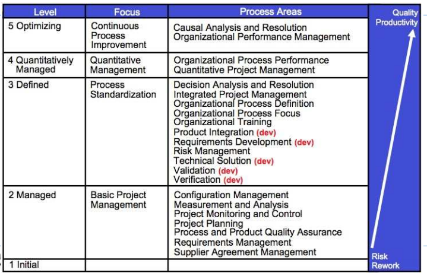

# Ch 0 : 융합소프트 종합설계

* 성공하는 프로젝트는 14% 정도,
* 대규모 프로젝트의 성공율은 단지 6%

> 소프트웨어 프로젝트는 본질적으로 어렵다.

* Software complexity (복잡성)
* Software conformity (적합성)
* Software changeability (변화성)
* Software invisibility (투명성)
*  And, Team-Oriented, Intellect-Intensive work (팀 중심적인 집약적인 작업)

해당 과목은 산업표준인 **CMMI 프로세스 모델에서 제시하는 프로젝트 관리 기본**에 대한 지식을 기반으로 소프트웨어 프로젝트를 계획, 관리하는데 중요한 개념을 이해하고 실무에 어떻게 활용할지 모의 프로젝트를 통해 경험한다.

# Ch 1 : Software Quality (소프트웨어 품질)

> 소프트웨어는 아래를 포함한다.

* 실행했을 때 desired features, function, performance를 제공하는 지시서 

* 프로그램이 적절하게 저장되고 조작될 수 있도록 하는 자료 구조
* 프로그램 운영 및 이용에 관한 문서

> Quality

* 시스템이 다양한 이해관계자의 **명시적/암묵적 필요를 충족**하여 가치를 제공할 수 있는 정도
* 제품/ 서비스 등이 사용자의 필요, 기대사항, 요구사항을 충족할 수 있는 능력

> Software Qulaity

* 소프트웨어 제품이 명시된 조건하에서 사용될 때 명시적/암묵적 필요를 만족시키는 능력

> Benefit of standards

* 표준은 합의에 의해 수립되고 공인 기관의 승인을 받은 문서이다. 

* 표준을 따를 경우

  * 효율성 향상 및 비용 절감
  * 제품 안정성 강화 , 위험 감소
  * 시장 접근 용이
  * 품질 및 최 소 준수로 인한 고객 신뢰 증대 ... etc

  

### # Product Quality Model

* **Compatibility**
  * Co-existence (공존성) : 여러가지 앱이 환경을 공유하는데 있어서 서로 방해하면 안된다. 서로 공존할 수 있음을 의미
  * Interoperability(상호운용성) : 서로 상호 인터페이스 되어야 한다. 예를 들어, 사진과 카카오 etc
* **Usability**
  * Appropriateness recognizability (적절성 식별력) : 어떤 기능인지 인지할 수 있는가? 내가하고 싶은 기능을 바로 실행할 수 있는가?
  * User error protection (사용자 에러 방지) : 사용자가 고민하지 않아도 틀리지 않게 하는 것을 의미한다. 예를 들어, 연도를 넣어야하는데 문자를 넣지 못하게 막거나 업무 플로우적으로 헷갈리지 않게 만듦으로 사용자가 에러를 내지 않게하는 것
  * Accessibility (접근성) : 신체적으로 정신적으로 문제가 있는 사람도 지장없도록 (색약 , 청각 서비스 등)

* **Reliability**
  * Maturity (성숙도) : 결함나는 정도
  * Availability (가용성) : 운영단계에서 중요, 비지니스 측면에서 중요. 예를들면 어떤 은행은 밤에도 송금 가능하지만 어떤 은행은 그렇지 않다.
  * Fault tolerance (장애 허용성) : 하나의 컴포넌트가 하나 오류가 나더라도 전체적으로 실패하지 않도록 설정하는 것 예를 들어, 비행기 오류가 날 경우 그 전에 있는 기능을 사용해 큰 사고를 막는다.
  * Recoverability (회복성) : 복구성을 의미, 예를 들어, 파워포인트가 갑자기 꺼지고 다시 키면 내가 썻던 내용이 불러와 짐

### # Data Quality Model

* Inherent data quality와 Systme dependent data quality가 있다.
  

### # Quality in User Model

* 사용 품질 :  context of user - 어떤 유저들이 어떤 task에 도움이 되고 어떤 환경에서 사용하는지를 고려
* **Effectiveness(효과성)**
  * 사용자가 특정 목표를 달성하는 정확성 및 완전성
* **Efficiency(효율성)**
  * 사용자가 목표를 달성하는 정확성과 완전성에 관련된 지출 자원
* **Satisfaction(만족도)**
  * 유용성 : 실용적 목표의 달성에 만족하는 정도
  * 신뢰 : 사용자와 이해관계자가 시스템이 의도한대로 작동할 것이라고 확신하는 정도 
  * 즐거움 : 개인적 욕구를 충족함으로써 얻는 쾌락 
  * 편안함 : 물리적 편안함에 만족하는 정도
* **Freedom from risk(위험으로부터 자유)**
  * 경제적 위험완화 : 제품 또는 시스템이 의도된 맥락에서 재무 상태, 효율적인 운영 등에 대한 잠재적 위험을 완화하는 정도
  * 건강/안전 위험완화 : 의도된 사용 맥락에서 잠재적 위험을 완화하는 정도
  * 환경적 위험완화 : 의도된 사용 맥락에서 환경의 잠재적 위험을 완화하는 정도  
* **Context coverage**
  * 컨텍스트 완정성 : 모든 지정된 맥락에서 효과, 효율성, 위험 배제 등으로 시스템을 사용할 수 있는 정도
  * 유연성 : 요구조건을 명시된 것을 넘어서 효과, 효율, 만족 등 사용할 수 있는 정도

# # Ch 2 : Software Quality and Process Quality

* 제품의 품질은 Process Quality로부터 나온다.

### # Capability Maturity Model Integration (CMMI)

: 고객 및 최종 사용자의 요구 충족을 위한 양질의 제품 및 서비스 개발 활동에 초점을 맞춘 모범 사례 모음

* Level 2 "Managed" 
  * 요구사항 관리 
  * 프로젝트 계획 수립
  * 프로젝트 추적, 통제(이슈관리)
  * 형상관리
  * 객관적 품질보증 활동
  * 측정 및 분석활동
  * 아웃소싱 관리
* Level 3 "Defined"
  * 요구사항 추출/ 명세 활동
  * 설계 활동
  * Product Integration : 구현, 통합, 시험 활동
  * Verification
  * Validation
  * Integrated Project Management
  * 리스크 관리
  * 체계적인 의사결정
  * 조직 차원 프로세스 개선 / 조직 차원 프로세서 정의 / 조직차원의 교육

#### Requirements Development

* 품질요구사항 : 잘 /빨리 /편리하게 - 아키텍쳐에 영향미친다. 묵시적, 명시적, 인지하지 못한것까지 사용자의 필요성과 기대를 생각.!!
* goal 1 : develop 고객 요구사항 

* goal 2 : develop 제품 요구사항

* goal 3 : 요구사항 분석 및 입증

  * 1.1 니즈 추출 -> 1.2 stakeholder's needs를 고객 요구사항으로 옮김 
  * 2.1 제품, 제품 컴포넌트 요구사항을 establish 함 -> 2.2 제품 컴포넌트 요구사항에 할당 -> 2.3 Interface 요구사항 identify함
  * 3.1 operational 컨셉과 시나리오 설립함 -> 3.2 요구된 기능적, 품질적 속성 정의 설립 -> 3.3 요구사항 분석 -> 3.4 balance를 만족시키위 해서 요구사항 분석 -> 3.5 validate 요구사항  

  

#### Requirement Management

* goal 1 : 요구사항 관리
  * 1.1 요구사항 이해 -> 1.2 요구사항 이행 -> 1.3 요구사항 변화 관리 -> 1.4 요구사항의 추적이 양방향 가능하도록 -> 1.5 요구사항과 프로젝트 일에 사이에 정렬한다 

  

#### Project Planning

* goal 1 : Establish Esitmates

* goal 2 : develop 프로젝트 계획 

* goal 3 : Obtain commitment to the plan

  * 1.1 프로젝트의 범위 설정(WBS) -> 1.2 task 속성과 제품 산출물 견적 설립 -> 1.3 프로젝트 라이프사이클 phase 정의 -> 1.4 effort와 cost 견적 산출 
  * 2.1 예산과 계획 설립 -> 2.2 프로젝트 risk 확인 -> 2.3 plan data management -> 2.4 프로젝트 자원 계획 -> 2.5 필요한 지식과 스킬 계획 -> 2.6 plan stakeholder involvement -> 2.7 프로젝트 계획 설립
  * 3.1 프로젝트에 영향미치는 계획 리뷰 -> 3.2 work 와 자원 level의 합의 -> 3.3  obtain plan commitment

  

#### Project Monitoring and Control

* goal 1 : 계획 대비 프로젝트 모니터링

* goal 2 : manage corrective action to closure

  * 1.1 Monitor project planning parameteres -> 1.2  commitments 모니터 -> 1.3 프로젝트 리스크 모니터 -> 1.4 데이터 관리 모니터 -> 1.5 stackholder Involvement 모니터 -> 1.6 경과 리뷰 실행  -> 1.7 마일스톤 리뷰 실행
  * 2.1 이슈 분석 -> 2.2 시정 행위 실행 -> 2.3 시정 행위 관리 

  

#### Configuration Management

* goal 1 : 베이스라인 설립

* goal 2 : 변화를 track하고 control

* goal 3 : 통합 설립

  * 1.1 Identify configuration items -> 1.2 configuration 매니지먼트 시스템 설립 -> 1.3 베이스라인 생성 혹 출시
  * 2.1 변화 요청 추적 -> 2.2 configuration items 조절
  * 3.1 configuration 매니지먼트 기록 설립 -> configuration 감사 실행

  

#### Process and Product Quality Assurance

* goal 1 : 프로세스와 제품을 객관적 평가

* goal 2 : 객관적 insight 제공

  * 1.1 객관적인 프로세스 평가 -> 1.2 제품과 서비스의 객관적 평가
  * 2.1 규정 불이행 이슈에 대한 커뮤니케이션과 해결 -> 2.2 기록

  

#### Measurement and Analysis

* goal 1 : align measurement 와 활동 분석

* goal 2 : measurement 결과 제공

  * 1.1 measurement 목적 설립 -> 1.2 measures 세분화 -> 1.3 데이터 콜랙션과 보롼 절차 세분화 -> 1.4 analysis procedures 세분화
  * 2.1 measurement data 획득 -> 2.2 measurement data 분석 -> 2.3 데이터 및 결과 저장 -> 2.4 결과 토론

  

# Ch 3 : Requirements Development

* 목적 : 고객, 제품, 제품구성요소 요구사항을 추출하고 분석하고 establish함
* 

> Goal 1 : Develop Customer Requirments

* 우선순위 고객요구사항을 위해서 이해관계자의 니즈, 기대, 제약, 인터페이스, 운영개념 및 제품 개념이 분석, 합의, 정제, 설명되어진다. 

  * 1.1 제품의 라이프사이클에 대한 고객 니즈, 기대, 제약, 인터페이스를 추출
  * 1.2 이해관계자의 니즈. 인터페이스, 제약, 기대를 우선적인 고객 요구사항으로 변화

  

> Goal 2 : Develop Product Requirements

* 설계 결정에 사용되어 질 수 있는 기술적인 요구사항 표현이다. 
  * 2.1 고객요구사항에 기초된 제품과 제품 구성요소 요구사항을 설립하고 유지
  * 2.2 제품 구성요소에 대한 요구사항을 할당
  * 2.3 인터페이스 요구사항을 식별

> Analyze and Validate Requirements

* 최종 사용자의 의도된 환경을 고려해서 요구사항을 분석하고 확인한다.
  * 3.1 운영 개념 및 관련 시나리오 수립 및 유지
  * 3.2 요구되는 기능과 품질 특성의 정의를 수립하고 유지
  * 3.3 요구사항의 필요충분성을 확인
  * 3.4 이해관계자의 요구와 제약의 균형을 맞추기 위해 요구사항 분석
  * 3.5 최종 사용자의 환경에 의도대로 작동되는지 요구사항 검증

> StakeHolders (이해관계자)

* 사업 결과에 영향을 받거나 책임을 지는 집단 또는 개인
  * Customers : 제품 승인 및 결제 승인 책임이 있음
  * End users(최종사용자) : 궁극적으로 제품을 사용하거나 서비스의 혜택을 받는 사람(실제사용자)
  * Suppliers
  * Maintainers
  * Operators
  * Developers
  * Regulatory bodies, etc

* 고객의 니즈를 끌어낼 수 있는 기술의 예 : 기존 제품, 환경, 워크 플로우 패턴 관찰, 시장 조사, 브레인 스토핑, 사용자 사례 , 프로토 타입 및 모델 등

> System Context Diagram

> Needs, Constraints, External Interfaces

* 현재 존재하는 시스템을 전면 재구축한다면,,,?
* 기능 요구사항 , 품질 속성 요구사항(비기능적 요구사항)
* 제약조건 : 법적, 기술, 설계 제약, 운영
* 외부 인터페이스 : 사용자, 조직, 시스템 

>Product Lifecycle

* 제품 또는 서비스를 구상할 때 부터 더이상 사용할 수 없때까지의 기간
* 제품 라이프 사이클은 : 개념 및 비전, 실현 가능성, 설계/ 개발, 생산, 중단

> Types of User

* 제품 품질, 사용 품질의 사용자 니즈 예시

  

1. Primary user : 주 목적을 달성하기 위해서 시스템과 상호작용하는 사람
2. Secondary user :
   * content provider, system manager/administrator, security manager
   * maintainer, analyzer, porter, installer
3. Indirect user : output은 받지만 시스템과는 상호작용하지 않는 사람

> Requirements Prioritization

*  MosCow Prioritization : Must / Should / Could / Will

> Requirements Review

* 완료 , 수정(틀리지 않음), 일관성(불일치 없음), 모호하지 않음

> 요구사항 분석 관련 활동 / 산출물 예시

# # Ch 3-1 : Usecase Modeling

> Use Case (description, story가 중요!!)

* 목표를 성취하기 위해 시스템과 **Actor**사이의 대화를 묘사한다. 
* Usecase는 목표를 달성하기 위해 시스템을 사용하는 Actor의 성공, 실패 시나리오 모음
* 각 인스턴스는 특정 행위자에서 관측 가능한 값의 결과를 제공하는 일련의 작업의 집합이다.  

> Actor

* 시스템과 인터페이스하는 모든 것
* 각 actor는 특정 role을 정의한다.
* 외부 시스템

> Writing UseCases

* 시스템을 사용한 사례
* 요구사항 이해 및 설명 용이
* 다양한 이해관계자 목표 달성을 지원
* Usecase는 단순 기능 목록이 아니라 사용자에게 가치를 제공하거나 목표를 달성할 수 있는지 에 대한 내용
* 기능성에 초점, 하지만 기능적, 품질 요구사항을 발견하는 유능한 도구

> Process

1. 시스템 바운더리 설정
2. primary actor 식별
3. 각 primary actor별 목표 식별
4. user의 목표를 만족하는 use case 식별
5. use case별, 시나리오와 supporting sections 작성 
   * stakeholder : 시스템과 관련된 모든 사람들, 요구사항을 추출하기 위해 필요한 사람들
   * primary actor : interaction **시작**하는 Actor, 시스템의 존재 이유
   * supporting actor : 우리 시스템에게 서비스를 제공해주는 것
     * 예를 들면, 결제서비스 - 서비스를 제공해주는 액터
     * 혹은 주기적으로 일어나는 timer도 이에 속한다. 
   * Actor는 Stakeholder보다 더 작은 범위로 실제 interaction하는 사람이다.

> System Boundary and Actor

* System Boundary : 

  * 시스템 내부에는 어떤 것이 있을 지?
  * 시스템 외부에는 어떤 것이 있을지? -> 시스템이 어떤 것과 interfacing 할 것인지 고민해야 함

  

* Actor : 시스템과 interaction하는 외부 객체이다

* Primary actor 와 use 목표는 **시스템 바운더리에 의존**한다.

> Identifying Actors

* 시스템을 사용하는 사람은 **누구**인가?
* 이 시스템을 사용하는 **다른 시스템**은 무엇인가?
* 누가 시스템으로부터 정보를 얻는가?
* 현재 어떤 일이 발생하는가? 

> Usecase Diagram

* 시나리오 : actor와 시스템 사이의 순차적인 행위와 상호작용이다.  
  * Main **Success** scenario (Basic Flow)
  * Alternative scenarios (Extensions)
* Usecase는 다이어그램이 아니라 **text documents** 이다.
  * usecase modeling은 다이어그램을 그리는 것이 아닌 **작성 작업**이다.

> UseCase Description

* Use Case Name 

  * Actor Goal list로부터 각 actor goal에 대한 usecase 정의
  * Use Case UC1 : Process Sale

* Primary Actor 

  * 목표를 달성하기 위해 시스템 서비스를 부르는 actor
  * Primary Actor : Cashier

* Stakeholder and Interests

  * Use case는 이해관계자들의 이익을 만족시킬 수 있는 것과 관련된 모든 행위만을 포착한다.
  * Cashier - 정확하고 빠르고, 지불 오류 없길 원함 
  * Salesperson - 판매 수수료가 update되길 원함 

* Precondition

  * 유스케이스 시나리오를 시작하기 전에 반드시 해야하는 상태
  * 사전 조건은 항상 true라고 가정한다. 
  * Preconditions - 캐셔는 확인되고 인증되어야 함

* Postcondition

  * 유스케이스를 성공적으로 완료 후 반드시 되어있어야 하는 상태
  * **모든 이해관계자들의 needs를 충족시켜야 한다.**
  * Success guarantee : 세금 정확히 계산되어야 하고, 잔액과 재고는 update되어야 함.. etc

* Main Success Scenario (or Basic Flow)

  * 성공적인 프로세스 시나리오
  * 이해관계자들의 이익을 만족시키는 전형적인 시나리오

* Extensions (or Alternative Flows)

  * 실패했을 경우, 에러났을 경우 대안적인 프로세스
  * 조건과 handling을 자세히 명시해야한다.
  * 예외적인 사항이 끝나면, **반드시 basic flow와 합쳐져야 한다.**

  

  * Alternative Flows를 찾는 법 :

    * 다른 조치 가능성 , 잘못될 수 있는 가능성, 언제든지 발생할 수 있는 것

    

    

* Special requirements

  * 비기능적인 요구사항, 품질 요구사항 , 설계 제약

  

> Advanced Use Case Modeling

* Include Relationship

  * 몇 가지 use case에서 공통적으로 발생하는 행동
  * include 관계시 항상 일어나게 된다. 

  

* Extend Relationship

  * 조건부 확장 제공 (추가하는 메커니즘)
  * 일부 조건에 의해서 촉발 될 수 있다.

  

# # Ch 4 : Software Process & Sw Development Approach

### * Software process

* 소프트웨어 시스템을 개발하는 데 필요한 일련의 구조화된 작업
  * Specification : 시스템을 무엇을 해야하는지 정의
  * Design and Implementation : 시스템 구성 정의 및 시스템 구현
  * Validation : 고객이 원하는 것을 수행하는지 체크
  * Evolution : 변화하는 고객의 요구에 따라 시스템을 변경
* 소프트웨어 프로세스 모델은 프로세스의 추상적 표현

> Specification

* 어떤 서비스가 필요한지 그리고 시스템 운영 및 개발의 제약을 결정하는 프로세스
  * 요구사항 도출 및 분석 : 시스템 이해관계자는 시스템에 무엇을 요구하는가?
  * 요구사항 specification : 요구사항 세부 정의
  * 요구사항 검증 : 요구사항 타당성 확인

> Design and implementation

* 시스템 specification을 실행가능한 시스템으로 변환하는 프로세스
  * software design : specification을 실현하는 소프트웨어 구조 설계
  * implementation : 구조를 실행가능한 프로그램으로 변환
    * 프로그래밍 : 표준 프로세스가 없는 개별 활동
    * 디버깅 : 프로그램 결함을 찾아내고, 결합 수정하는 활동
  * 설계와 구현활동은 서로 관련되어 있고, interleaved 활동이다.

> Validation

* verification and validation (v&v)은 시스템이 사양을 준수하고 시스템 고객의 요구사항을 충족한다는 것을 보여준다

  * verification : 제품 right 구축
  * validation : 올바른 제품 구축

* 프로세스 및 시스템 **테스트** 확인 및 검토를 포함 

* Testing stages

  * Component testing : 
    * 개별 구성요소는 독립적으로 시험한다.
    * 구성요소는 function, obeject 이다.
  * System testing
    * 시스템 전체를 테스트
    * emergent 속성 테스트가 특히 중요하다.
  * Customer testing / Acceptance testing 
    * 고객, 사용자별 전체 시스템 테스트
    * 시스템이 승인되기 전 최종단계
    * 소프트웨어 제품이 고객의 요구를 얼마나 잘 충족하는지 보여준다

  

> Evolution 

* 소프트웨어는 본질적으로 유연하고 변경될 수 있다.
* 비지니스의 환경 변화에 따라 요구사항 변경되고, 비지니스를 지원하는 소프트웨어도 변화해야 한다.

> Process activities

* 실제 소프트웨어 프로세스는 소프트웨어 시스템 테스트, 구현, 명세, 설계의 전반적 목표를 가진 기술, 협업, 관리 활동의 연속이다
*  specification, development, validation and evolution 의 4가지 기본 프로세스 활동은 개발 프로세스마다 다르다.
  * 예를들어,  waterfall은 순서대로 구성되어 있다.

### * Software Development Approaches

 

> plan driven software development : 

* **상세하게 계획**되는 접근방식이다.
* 대규모 소프트웨어 개발 프로젝트 관리의 '전통적인' 방법이다.
* 개발해야하는 scope 명확하기 때문에 프로젝트 manage 할 수 있다. (상세하게 계획을 세우기 위해서는 전체를 알면 된다)
* 명확한 scope으로 요구사항 변경을 줄이고, 변경이 많으면 요구사항 분석이 잘못되었다고 판단한다. 그 다음 단계로 좋은 input을 주기 위해 예측가능하고 반복가능 문서화가 중요하다.
* 장점 : 조기 계획을 통해 조직적 문제(직원 가용성, 프로젝트 등)을 면밀히 고려할 수 있으며, 프로젝트 시작전에 잠재적인 문제와 의존성을 발견할 수 있다.
* 단점 :  초기의 결정은 소프트웨어가 개발되고 사용될 환경의 변화 때문에 수정되어야 한다.  

* **Waterfall software Lifecycle**

  

  * waterfall model의 phase
    * Requirements analysis and definition
    * System and software design
    * Implementation and unit testing
    * Integration and system testing
    * Operation and maintenance
  * waterfall의 주 단점은 **변화의 적응**이 어렵다는 것이다. 왜냐하면 워터풀의 phase는 하나의 phase가 완료된 후 그 다음 단계로 넘어가기 때문이다.
  * 보통 **대규모 프로젝트**에 주로 사용된다.

> Agile Software development

* 소프트웨어가 개발되고 고객에게 **점진적**으로 제공하는 **반복적인 접근 방식**이다.
* 기능의 추가는 사전에 계획되지 않고 **개발 중**에 결정된다.
* increment의 결정은 고객 우선순위, 진행 상황에 의존한다.
* scope 어떻게 될지는 알 수 없기 때문에 개발주기가 짧고 고객의 피드백에 대응한다.  
* 고객 우선순위 및 요구사항 변경되므로, 이러한 변경 사항을 수용할 수 있는 유연한 계획을 수립하는 것이 타당하다.
  * **Individuals and interactions** over processes and tools
  * **Working software** over comprehensive documentation
  * **Customer collaboration** over contract negotiation
  * **Responding to change** over following a plan

* **Agile Project Management**
  * **Timebox management technique**
    * 타임박스는 주어진 리소스로 잘 정의된 결과물을 생산해야하는 제한된 기간이다.
    * 상품의 scope는 프로젝트 관리의 변수이지만 품질은 변수가 아니다.
  * **Rolling wave planning**
    * 
  * **Pull system, not Push system**
    * 

* **Agile Method**
  * eXtreme Programming
  * Scrum
  * Lean Software Development
  * DevOps

> Reducing the costs of rework

* change anticipation : 중요 재작업이 필요하기 전에 변경 가능을 예측하는 활동
  * 프로토타입 시스템은 시스템의 몇 가지 주요 기능을 고객에게 보여주기 위해 개발될 수 있음
* Change tolerance : 비교적 저렴한 비용으로 변경사항을 수용할 수 있도록 설계

> Coping with changing requirements

* System prototyping : 시스템 버전 또는 일부가 신속하게 개발되어 고객 요구사항과 설계 결정의 실현 가능성을 확인 -> 변화 예측 지원
* Incremental delivery : 고객의 comment와 실험을 위해 전달되어지는 것. -> **변경 회피와 변경 허용을 지원**

> Benefits of prototyping

* 시스템 사용성 향상
* 사용자 실제 요구에 근접
* 설계 품질 향상
* 개발 effort 감소

> Prototype development

* 신속한 프로토타이핑 언어 혹은 도구를 기반으로 한다.
* 기능성 제외한다.
  * 잘 이해되지 않은 제품 영역에 초점을 맞춘다.
  * 에러 체크와 복구가 포함되어 있지 않다.
  * 안전성 보안성과 같은 비기능적 요구사항보다 기능적 요구사항에 집중
* 프로토타입은 생산 시스템에 좋은 기초가 아니므로 개발 후 폐기한다.
  * 프로토타입은 일반적으로 문서화되지 않은 상태
  * 급격한 변화를 통해 저하된다
  * 일반적인 조직 품질 표준에 충족하지 못할 것이다.

> Incremental development

* incremental delivery
  * 요구된 기능의 일부를 점진적으로 delivery한다.
  * 사용자 요구사항에 우선순위를 매기고 높은 우선 순위는 초기 increment에 포함된다.
  *  요구사항은 계속 발전할 수 있다.
  * 소프트웨어 실용화에 대한 현실적 평가 가능
* Incremental development
  * 다음 increment 개발 진행 전 각 increment를 평가하고 시스템을 점진적으로 개발한다.
  * 고객/ 사용자 프록시에 의해 평가됨
* 장점 : 
  * 주 시스템 기능을 일찍 사용할 수 있다.
  * 초기의 increments는 후 increment에 대한 요구사항을 도출하는데 도움을 주는 프로토타입이 될 수 있다.
  * 전체 프로젝트 실패 위험이 감소
  * 최우선되는 시스템의 서비스는 가장 많은 테스트를 받게 된다.
* 단점 : 
  * 대부분의 시스템은 시스템의 다른 부분의 기능에 의존한다.
    * 요구사항이 상세하게 정의되지 않아 **공동 기능에 대한 식별**이 어려울수 있다.
  * Incremental development는 사양이 소프트웨어와 함께 개발되는 데 이것은 이미 조달된 시스템의 모델과 충돌할 수 있다. 
  * 점진적인 delivery로 개발 복잡성 증가
    * 새로운 출시를 개발하는 동안 이미 출시된 제품에 대한 유지 보수 노력이 필요하다.
    *  릴리스된 부분에 대한 모든 수정사항 및 업데이트는 현재 개발과 통합되어야 한다.

> Plan-driven vs Agile

* 개발 방법을 선택하기 위해서는 프로젝트의 규모, 요구사항 모호성, 조직문화 등등을 고려해야한다.

  

> Staged Delivery

* delivery가 있기 때문에 waterfall은 아님

> Industrial Case

# # Ch 5-1 : Project Planning - estimation

* 목적 : 활동을 정의하는 계획을 수립하고 유지
  * 프로젝트 계획 개발
  * 이해관계자와 상호작용
  * 계획에 대한 commitment 획득
  * 계획유지
* 계획은 작업의 *속성 추정, 필요한 자원 결정, 약속 협상, 일정, 프로젝트 위험 식별 및 분석*이 포함된다.
* 계획은 일반적으로 프로젝트가 진행됨에 따라서 부정확한 추정치, 수정 조치 등으로 수정된다.

> 구현 단계 - 소프트웨어 개발

* 구현 단계는 소프트웨어를 개발하는 단계로 개발을 위한 요구사항 분석에서부터 설계 및 구현을 거쳐 테스트에 이르는 전 과정을 포함한다.

* 소프트웨어 개발의 단계는 ISO/IEC 12207의 13개 개발 공정을 참조하여 **분석, 설계, 구현, 시험**의 4단계로 구분된다.

  

> 소프트웨어 개발비 산정

* 소프트웨어 개발 규모를 기능점수**(FP : Function Point)**로 측정하고, 기능점수당 단가를 곱하여 비용을 산출
  * 기능점수의 방식의 적용이 어려운 경우, 해당 사업의 과업내용, 특징 등을 고려하여 발주자의 판단에 의해 투입 공수에 의한 방식을 적용할수 있다.
    * 홈페이지 디자인, 웹 접근성 등 콘텐츠 관련 사업
    * R&D 성격의 소프트웨어 개발 사업
    * 사용자에게 식별되는 기능 규모에 비해 내부 처리 복잡도가 너무 높아 FP의 방식이 불합리한 사업
    * 데이터 튜닝 및 최적화, 테스트 등 FP산정이 불가능한 경우
    * 소프트웨어 개발 관련 예산이 5천만원 미만인 사업

### * 기능 점수 방법 (Function Point)

* 사용자 관점에서 사용자가 요구하고 사용자에게 인도되는 기능을 정량적으로 산정하는 소프트웨어 측정방법

  * 사용자가 **어떠한 기능을 요구**했는지?

* 소프트웨어 개발, 유지관리 및 운영을 위한 비용과 자원 소요를 산정하는데 가장 중요한 요소이다.

* 기능 점수란 ?

  * 사용자 관점에서 측정된 소프트웨어의 기능의 양(규모)

  * 소프트웨어 기능은 사용자 관점에서 갖는 논리적 의미에 따라 2가지로 구분된다.

    

* 장점 : 

  * 소프트웨어 개발 및 유지관리의 업무량을 조직, 구현 기술, 적용 방법론 등과 무관하게 **일관된 측정 가능**
  * 개발 이전에 **업무량 측정 가능**
  * 개발은 물론 기획, 운영 등 **전 수명주기**에 걸쳐서 측정 가능

* 

* 보정 계수
  * FP 규모 : 규모가 생산성에 미치는 영향
  * 연계복잡성 수준 : 대상 어플리케이션의 연계기관 수
  * 성능요구 수준 : 응답시간 또는 처리율에 대한 사용자 요구
  * 다중사이트 운영 : 다중사이트 운영여부와 플랫폼의 상이한 정도
  * 보안성 수준 : 시큐어 코딩, 웹 취약 점검, 암호화 점검, 개인정보보호 등

### * Project planning : Goal 1 - Establish Estimates

* 1.1 **scope** 추정 : WBS로 산정 가능
  * WBS 개발 -> 작업패키지 상세 정의 -> 외부에서 획득할 제품 식별 -> 재사용할 작업물 확인

* 1.2 작업 제품과 task 특성 추정 : size, 복잡도
  * 기술적 접근방식 결정 -> 사용할 작업물 및 작업 속성 결정 , **크기와 복잡성**은 **검증된 모델 또는 과거 데이터에 기초**, **속성 결정**은 속성과 제품 특성의 **관계에 대한 이해**가 증가함에 따라 진화한다.-> 작업물 및 작업 속성 추정
  * size : 노력, 비용 및 일정을 추정하는데 사용되는 주요 입력값이다. 상대적 어려움, 복잡성은 각 크기 속성에 맞춰 할당되어야 한다.
* 1.3 프로젝트 **라이프사이클 단계** 정의
  * 단계별로 활동의 상호의존성 및 순서를 다루기 위해 하나 이상의 개발 모델 선정과 개선을 포함한다.
* 1.4 프로젝트의 **effort와 cost** 추정
  * 제품 및 작업 속성을 effort와 cost의 추정치로 변환하는 데 사용할 모델 또는 과거 데이터 수집
  * **인프라 요구사항 지원**을 포함한다
  * 모델, 과거 데이터 또는 그 둘의 조합을 사용해 추정한다.

> Work Breakdown Structure (WBS)

* WBS는 프로젝트와 함께 진화한다. top level의 WBS는 초기 추정을 구조화하는 역할을 한다.
* 모든 계획 작업의 기초이고, 프로젝트 전체 범위를 구성하고 정의함.
* WBS는 전반적 프로젝트를 **상호 연결된 관리가능한 단위**으로 바꾼다. **계측정 분해**
  * 해야할 일을 다 담고 있다. 예 : 누가 언제 결과물을 무엇을 낼 것인가
* WBS는 **제품, work product 또는 테스크 지향적 구조**. 작업패키지로 불리며 관리될 작업의 논리적 단위로 식별하고 구성하기 위한 체계를 제공한다. 
  * work package는 말단(가장 낮은 수준에서 정의된 작업)이다. output 과 담당자를 지정해야된다.
* **노력, 계획 및 책임**을 할당하기 위한 메커니즘 제공하고 수행된 작업의 계획, 구성 및 관리를 위한 기본 프레임워크로 사용된다.
* WBS의 맥락에서 work라는 것은 활동 자체가 아닌 활동의 결과물을 말한다. 즉, 반드시 결과물이 있어야 한다.
* WBS 구조는 다양한 접근방식을 통해 만들어질 수 있다.
  * 하향식 접근 방식 - 조직별 지침 및 WBS 템플릿 사용
  * 상향식 접근 방식 - 하위 구성 요소 통합시 사용
* WBS 구조는 여러가지 form으로 제시될 수 있다. 
  * 2단계 - 프로젝트 수명 주기 단계 / 3단계 - 제품 및 프로젝트 결과물
  * 2단계 - 주요 결과물 

> Create WBS in PMBOK(Project Management Body of Knowledge)

* Create WBS는 프로젝트 결과물과 작업을 더 작고 관리하기 쉬운 구성요소로 나누는 프로세스이다.
* Input, output 등 무엇이 전달되어야 하는지 구조화된 비전을 제공한다. 

> Decomposition

* 프로젝트 범위와 결과물을 더 작고 관리하기 쉬운 부분으로 나누고 세분화하는 데 사용하는 기술이다. 
* 분해의 level은 프로젝트를 효과적으로 관리하는 데 필요한 control의 정도에 따라 결정된다. 작업패키지의 세부 level은 사이즈와 복잡성에 따라 다르다.

> Expert judgement

* 효과적인 WBS를 만들기 위해 프로젝트 결과물을 더 작은 부품으로 분해하는 데 필요한 정보를 분석하는 데 사용
* 전문가의 판단은 공통 자료를 효과적으로 분해하는 방법에 대한 지침을 제공하는 템플릿 형태로 나타날 수 있다. 

# # Ch 5-2 : Project Planning - establish project plan

### * Project planning : Goal 2 - Develop project plan

* 2.1 **예산 및 계획 수립**

  * major milestone 식별 -> 계획 예측 식별(특정 활동의 duration) -> 제약 식별 -> task 의존도 확인 -> 예산과 일정 예측 및 유지 -> corrective action 기준 설립

  * task 의존도 확인 : 선행되는 작업이 있을 수 있기 때문이다. 기술적, CPM, PERT etc

  * 예산과 일정을 예측 : 예상치 못한 일이 생길 수 있기 때문이다.

  * corrective action 기준 : 프로젝트 계획에서 중요한 편차를 구성하는 기준을 설정한다. 언제 시정 조치를 취하는지 결정하기 위해 이슈와 문제를 측정하는 근거가 필요하다. 

    * 예, plan으로부터 큰 차이가 발생 때 어떻게 할 것인지 ? 예를 들어, 10프로 되면 노란불이고 20프로 빨간불이다 등의 기준

      

> Milestone

* 이해 관계자 요건을 얼마나 잘 충족하고 있는지를 파악하기 위해 상태를 철저히 검

  토하는 사전에 계획된 시점이다.

* milestone은 event 기반 혹은 캘린더 기반이다.

  

> PERT (Program Evaluation and Review Technique)

* 각 과제를 완료하는데 필요한 시간을 분석하고 전체 프로젝트를 완료하는데 필요한 최소시간을 파악하는 방법이다

  

> CPM (Critical path Method)

* CPM은 계획된 활동들이 가장 긴 path를 말한다.
* CPM 경로에서 발생하는 모든 문제는 프로젝트 진행 일정이 지연 될 수 있기 때문에 중요하다.  즉, CPM의 일정 하나라도 삐긋할 경우, 전체 일정이 늘어날 가능성이 있다. 이것은 비지니스적으로 중요함을 의미하는 것은 아니다.

* 2.2 **프로젝트 위험** 분석 및 식별
  * risk 식별(작업 effort와 계획에 부정적 영향을 미칠 수 있는 잠재적 위험, 문제, 취약성 등) -> 위험 문서화 -> 완정성과 정확성 검토 및 이해관계자와 합의 -> 리스크 수정
  * risk 식별 기술 :  Risk taxonomies, Checklist, Structured interviews, Brainstorming, Risk Assessment etc
  * 위험 문서화 : 위험, 위험 영향 및 발생 가능성, 우선순위
* 2.3 Project Data 관리 계획
  * 데이터의 보완과 개인정보 보호를 보장하기 위해 요구사항과 절차를 수립 -> 데이터를 보관하고 보관된 데이터를 액세스하는 메커니즘 확립 -> 식별, 수집, 배포할 프로젝트 데이터 결정 -> 이해관계자에게 자료 접근 및 배포에 대한 요구사항 결정 -> 프로젝트 데이터가 제어되도록 보장하는 메커니즘 확립
  * 데이터 : 모든 영역(관리, 엔지니어링, 구성 관리 등)에서 프로젝트를 지원하는데 필요한 문서 양식
    * 데이터는 보고서, 매뉴얼, 차트 등 모든 형식을 취할 수 있다.
    * 데이터는 모든 매체(인쇄, 사진, 전자 등)에 존재할 수 있다.
    * 제공 가능 (예 : 프로젝트의 계약 자료 요건)
    * 제공 불가능 (예 : 비공식 데이터 등)
  * 데이터 요구사항 설정
    * 균일한 컨텐츠 및 형식 요구사항을 통해 컨텐츠를 쉽게 이해하고 리소스를 일관되게 관리할 수 있음
  * 데이터를 수집하는 이유는 **명확해야 한다**. 데이터는 비용이 많이 들고, 필요할 때만 수집해야 함.
* 2.4 Project's Resources 계획
  * 프로세스 요구사항 결정 -> 커뮤니케이션 요구사항 결정(고객, 이해관계자 등과 협력) -> 인력 요구사항 결정 -> 설비, 장비, 구성 요구사항 결정 -> 다른 지속적인 리소스 요구사항 결정
    * 인력 요구사항은 프로젝트 요구사항을 task, role 및 책임으로 분해하는 것에 따라 달라짐
    * 설비, 장비, component 요구사항 결정 : 프로젝트 목표를 달성하기 위해 고유 자산이 필요하고 그런 자산을 적시에 결정하고 취득하는 것이 프로젝트 성공에 매우 중요하다. 리드 타임 항목을 조기에 파악하는 것이 좋다.
    * 지속적인 리소스 : 소모품, 지적 재산권, 운송 등
  * 프로젝트 자원(노동, 장비 등)과 프로젝트 활동 수행에 필요한 수량을 정의하고 WBS 확장할 수 있도록 추가 정보를 제공
  * top level WBS는 top level이 작업패키지로 분해됨으로서 확장된다.
  * 작업패키지는 별도 할당, 수행, 추적이 되는 단일 작업 단위이다. 
  * WBS는 추적이 가능하도록 고유 식별자가 할당되어야한다. 
  * 각 작업패키지에 대한 작업 설명을 하는 사전이 work breakdown structure에 포함되어야 한다. 
* 2.5 필요한 지식과 기술 계획
  * 필요한 지식과 기술 파악 -> 사용가능한 지식과 기술 평가 -> 지식과 기술을 제공하기 위한 매커니즘 선택(사내교육, 신규채용 등) -> 선정된 메커니즘을 프로젝트 계획에 통합
  * 프로젝트 직원을 교육하고 외부 소스로부터 지식을 습득하는 것이 포함
  * 인력 요구사항은 사용할 수 있는 지식과 기술에 따라 다르다.
* 2.6 Plan stakeholder Involvement
* 2.7 Estalish the Project Plan

### * Project planning : Goal 3 - Obtain Commitmentto the Plan

* 3.1 프로젝트에 영향미치는 계획 리뷰
  * 프로젝트에 영향 미치는 모든 계획의 범위, 목표, 역할 및 관계 등이 공통적 이해를 갖고 있는지 리뷰해야한다.
* 3.2 Work와 Resource level 합의
  * 가용 리소스와 예상 리소스를 조정하도록 계획 조정
  * 실현 가능한 프로젝트 수립을 위해 이해관계자의 commitment를 획득하고 추정과 가용 자원 사이의 차이를 조정해야한다.
  * 조정은 요구사항을 수정하거나 지연, 혹은 더 많은 자원 협상, 아웃소싱 등 프로젝트 또는 일정에 영향 미치는 계획을 수정함으로써 이루어진다.
* 3.3 Obtain Plan Commitment
  * 계획 실행 및 지원을 담당하는 이해 관계자들에게 약속을 받는다.
  * Obtaining commitment는 프로젝트 외부, 내부 이해관계자의 상호작용을 포함

# # Ch 6 : Proejct Monitoring and Control

> PMBOK(Project Management Body of Knowledge)

* 국제 프로젝트관리협회인 PMI에서 발행 및 배포한 프로젝트 관리에 대한 지식체계의 지침서
* 10개의 지식영역으로 구성됨
  * 통합관리 
  * 범위관리
  * 시간관리
  * 원가관리
  * 품질관리
  * 인적자원 관리
  * 의사소통 관리
  * 위험관리
  * 조달관리
  * 이해관계자 관리

### * Project Monitoring and Control

* 목적 : 프로젝트 진행 상황을 이해를 제공한다. 그래서 프로젝트 수행이 계획에서 벗어날 때 **적절한 시정 조치**를 취할 수 있다.
* 프로젝트의 문서화된 계획은 활동을 모니터링하고, 상태로 이야기하고, 시정 조치를 취하는 것의 기초가 된다.
* 진행은 계획과 실제 진행 사항을 비교하는 것이다. 
* 진행사항을 적절히 파악하면 가시성이 높아지고, 시기적절한 시정 조치를 취할 수 있다.
* contorl은 예상과 실제의 gap이 발생했을 때 조치를 취해서 문제가 생기지 않도록 하는 것을 의미한다.
* 실제 성과를 계획된 성능과 비교하고, 그 차이를 분석하여 트랜드를 심사하고 프로세스 개선에 영향을 준다. 혹은 다른 대안은 없는지 평가해서 적절한 corrective action을 제안하는 것이다. 즉, 시정 조치를 하는 것이 controll이다.

### * Goal 1 : 계획 대비 프로젝트 모니터링

* 1.1 계획 대비 프로젝트 계획 파라미터의 실제값 모니터링
  * 규모, 노력, 일정, 리소스 등에 대한 추정치와 비교하여 실제 결과 추적
* 1.2 프로젝트 계획에 식별된 commitments와 실제 commitment 모니터링
* 1.3 프로젝트 계획에 식별된 리스크와 실제 리스크 모니터링
* 1.4 프로젝트 계획 대비 데이터 관리 모니터링
* 1.5 프로젝트 계획 대비 이해관계자 Involvement 모니터링
* 1.6 progress 리뷰 실행
* 1.7 마일스톤 리뷰 실행
  * 프로젝트 마일스톤(이정표)에서 프로젝트 결과 및 성과 리뷰

### * Goal 2 : 시정 조치 관리

* 2.1 문제 수집 및 분석 그리고 시정 조치의 필요성 결정
* 2.2 식별된 문제에 대한 시정조치 취하기
* 2.3 완료될때까지 시정조치 관리
  * 완료된 시정조치 모니터링 하교 효과성을 분석한다.

> Corrective Actions

* 일정 지연시 조치활동
  * Fast Tracking : 순차적으로 계획한 활동을 병렬로 수행하여 전체 기간 단축
  * Crashing : 추가 자원을 투입해서 특정 활동 기간 단축
* **보통 이 두가지는 CPM에서 취하는 조치 활동이다.**

> Risk vs Issue 

* Risk에서 중요한 것은 : **가능성과 impact** 중요. 그것을 기준으로 우선순위 설정하고 stakeholder와 review하고 계속 모니터링한다.

​	

* 리스크 접근 방안
  * 회피 : 리스크 영향이 큰 경우, 프로젝트 계획 변경 등을 통해 발생 가능성 자체를 없애는 것. 예 : 자원과 시간 추가 확보
  * 완화 : 리스크를 수용 가능한 수준까지 완화시킴. 예 : 시간과 자원 추가 투입으로 발생 확률 완화, 하위 시스템의 반복적 설계로 영향 완화
  * 수용 : 리스크를 수용하는 것을 의미한다. 하지만 리스크 자체를 관리하지 않는다는 의미는 아니다. 예 : Contingency plan 수립하는 적극적 수용과 현실화 되었을 경우 대처하는 소극적 대응이 있다.
  * 전가 : 제 3자에게 리스크 대응에 대한 책임과 초래하는 결과를 넘김 예 : 보험, 아웃소싱 등

> 프로젝트 진척율

* 진철율 산정시 어려움 :
  * 모든 태스크의 식별하기 어렵다.
  * task 별 비중이 다르다.
  * 실질적인 진척율인지가 판단이 어렵다
  * 90% 신드롬
* 가중치 부여
  * 상위레벨에 가중치 부여, 하위는 필요시 부여
  * 최하위 task부터 가충치 부여하여 sum up도 가능하지만 모든 task가 식별되어야 한다.
* 진척율 산정
  * 0/100 : task가 종료되어야 100이다
  * 50/50 : 시작하면 50

> effort와 duration

* effort : 작업을 완료하는 데 필요한 작업 단위 수. effort가 10일 경우, 사람이 수가 증가면 하루 안에 끝낼 수 있다.
* duration : 할당된 리소스로 활동을 완료하는 데 걸린 전체 기간. 작업이 시작된 날로부터 끝나는 날로, 휴일, 휴무를 포함하지 않는다. 그러나 effort가 1000일 경우, 아무리 사람을 늘린다고 해도 duration이 하루로 줄 수는 없다. 
* 예를 들어 하루 effort가 3 hours이고 duration이 10일이라면, 총 30시간이 필요함

> Progress Review와 Milestone Review

* 전자는 이해관계자에게 *지속적으로 알리기 위한 검토*이다. 이 검토는 비공식적일 수 있으며 프로젝트 계획서에 명시적으로 명시되지 않을 수 있다.
* 마일스톤 리뷰는 프로젝트 계획에 포함되며 공식적인 검토이다. 이것은 이해관계자의 요구사항이 얼마나 잘 충족되는지를 파악하기 위해 철저히 수행하는 사전에 계획된 시점이다.
* 이 둘은 별도로 할 필요 없이 한번에 할 수 있다. 그러므로 프로젝트에 따라 프로젝트의 시작과 종료는 마일스톤 검토에 포함될 수 있다. *그러나 실무에서는 progress review와 milestone review 참여하는 당사자들이 달라서 분리해서 함*

============================ 중간고사 범위 =========================

 

