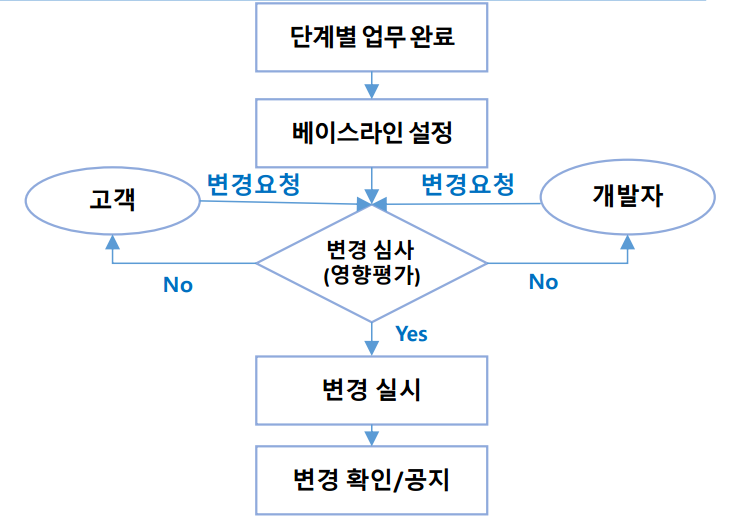
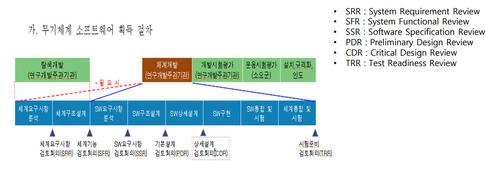
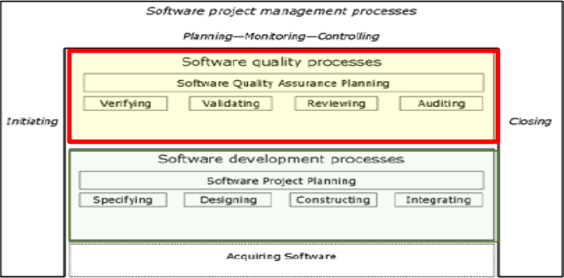

# CH 07. Agile Development

### Agile 방법론

1. eXtreme Programming (XP) 

   * 엔지니어링 업무에 집중
   * 짧은 개발 주기(타임박스)에 빈번한 소프트웨어 출시
   * Continuous integration

2. Scrum

   * 프로젝트 관리 집중
   * Cross-functional team
   * Self-organizing team

3. Lean Software Development

   * 낭비 제거 집중 (Focus on waste elimination)

4.  DevOps

   * Development + Operations
   * Continuous delivery

   

### Agile Manifesto

* **Individuals and interactions** over processes and tools : 개인과 상호작용
* **Working software** over comprehensive documentation : 작동하는 소프트웨어
* **Customer collaboration** over contract negotiation : 고객과 협력
* **Responding to change** over following a plan : 변화의 대응

### 12가지 원칙

1. 최우선의 순위는 가치있는 소프투에어를 조기에 지속적으로 제공하여 고객을 만족시키는 것이다.
2. 개발이 지연되더라도 요구사항의 변화를 환영한다. 애자일은 고객의 경쟁 우위를 위한 변화를 활용한다.
3. 더 짧은 기간을 선호하면서, 몇 주부터 몇 달까지 자주 소프트웨어를 배포한다.
4. 사업자와 개발자는 프로젝트 내내 매일 함께 작업한다.
5. 동기 부여된 개인들 중심으로 프로젝트를 만듭니다. 그들에게 필요한 환경과 지원을 제공하고 일을 완수할 수 있도록 신뢰한다.
6. 개발팀에 정보를 전달하는 가장 효율적이고 효과적인 방법은 대면 대화이다.
7. 작동하는 소프트웨어는 진행의 주요 척도이다.
8. 애자일 프로세스는 지속 가능한 개발을 촉진시킨다. 개발자, 사용자, 후원자가 무한정 일정한 속도를 유지할 수 있어야 한다.
9. 기술적 우수성과 설계에 대한 지속적인 관심이 민첩성을 향상시킨다.
10. 단순성 (the art of maximizing the amount of work not done)은 필수적이다. -> 당장 필요한 일부터 처리
11. 최고의 아키텍처, 요구사항, 디자인은 자체 조직으로부터 나온다.
12. 일정 간격으로 어떻게 하면 더 효과적 일지를 숙고하고 그에 따라서 행동을 조정한다.  

## eXtreme Programming

* 중소 규모의 가벼운 방법론이다
* 모호하고 급변하는 요구사항에 직면하여 소프트웨어를 개발하는 팀이다.

### 소프트웨어 개발에 기본적인 문제에 대하 XP가 해결하는 방법

* Schedule slips : 짧은 배포 주기(1~4주) , 우선 순위가 높은 기능 우선
  * 배포하는 주기를 짧게해서 일정 지연이 해결되도록

* Project Canceled : 고객이 기능 우선순위를 선택할 수 있음
* System goes sour (needs replace) : 지속적인 통합, 자동 테스트
* High Defect Rate of S/W in production : 개발자와 고객에게 테스트
* Business misunderstood : can’t solve the business problem : 고객은 팀의 필수적인 요소
* Business change : 출시 주기가 짧으면 변화가 줄어들 수 있다. 새/변경된 기능을 환영
* False feature rich : 최우선 과제에 집중 (feature은 많은데 쓸모 없는 것이 많을 수 있어서 우선순위가 높은 것 위주로 집중)
* Staff turnover : 개발자가 자신의 작업을 평가하고 완료하는 등의 책임을 진다. (자기가 할 수 있는 만큼 가져오기)

### XP Practices

* XP에 대한 새로운 관행은 없음
* 하지만  XP takes practices to extreme level
  * 만약 코드리뷰가 좋으면, 항상 코드를 검토한다. (pair programming)
  * 만약 디자인 좋다면, 그것을 일상 업무로 만든다. (refactoring)

* XP의 모든 practices는 하나의 우산 아래 두고 있다.
* 가능한 서로가 서로에게 지지해야한다.

* The Planning Game
  * 비지니스 우선순위와 기술 추정치를 결합하여 다음 릴리스 범위를 신속히 결정
* Small releases
  * 간단한 시스템을 신속하게 운영한 뒤 매우 짧은 주기로 새 버전 출시
* Metaphor
  * 전체 시스템의 작동방식을 간단히 공유하여 모든 개발을 guide한다.
* Simple design
  * 앞으로 생길지도 모르는 것은 넣지말기!
  * 시스템은 주어진 순간에 최대한 간단하게 설계. 추가적인 복잡성은 발견하자마자 제거한다.
* Testing
  * 프로그래머는 지속적으로 unit test를 작성하고, 고객은 기능 완료를 증명하는 테스트를 작성해야 한다.
* Refactoring
  * 우선 코딩하고 다음번의 수정을 위해 코드를 구조화 시킨다.
  * 프로그래머는 중복 제거, 커뮤니케이션 개선, 단순화 또는 유연성 추가를 위해 동작을 변경하지 않고 시스템을 재구성한다.

* Pair programming
  * 모든 제품 코드는 하나의 머신에서 두명의 프로그래머로 작성된다.
* Collective ownership (공동 소유권)
  * 누구나 어디에서든 언제든지 시스템 코드를 변경할 수 있다.
* Continuous integration
  * 작업이 완료될 때마다 여러번 시스템을 통합하고 구축한다.
* 40 hour week
  * 원칙적으로 일주일에 40시간 이하로 일하고 2주 연속 야근은 피해라
* On-site customer
  * 실제 사용자를 팀에 포함시키고 질문에 언제든지 답해야한다.
* Coding standards
  * 코드를 통한 소통이 가능하도록 규칙을 준수한다.

### 1. The Planning Game

* 요구사항은 스토리 카드에 기록되고, 출시에 포함될 스토리는  time available와 상대적인 우선순위에 따라 결정된다.
  * 비지니스 담당자가 결정할 사항 : 범위, 우선순위, 릴리스의 구성, 릴리스 날짜
  * 기술 담당자가 결정할 사항 : 추정치, 결과, 프로세스, 상세 스케쥴링

### 2. Release Planning

* 빌드 중인 제품을 개괄적으로 보여준다. 
  * 무엇을 배포할 것인지 정하고, high level의 view를 보여준다.

* 릴리스 계획 수립의 일부는 며칠까지 얼마나 많은 작업을 수행할 수 있는지 결정
* 스토리 포인터를 사용하여 크기 예측
* 사례 : 도서 구매자로써, ISBN을 사용하여 책을 검색하고 빠르게 찾길 원한다.

### 3. Iteration Planning

* 스토리는 release planning에서 정했으므로, 여기서는 task를 분할한다.
* 반복으로 선정된 스토리를 완전하게 구현하려면 무엇이 필요한지 상세화
* 반복 계획은 반복 계획 미팅에서 만들어진다.

### 4. Simple design

* 필요할 때 필요한 것을 넣어야 함.
* 기존의 방식이 '현재를 위한 구현, 미래를 위한 설계'
* simple design은 
  * 모든 테스트를 실행
  * 중복된 논리 없다
  * 프로그래머에게 중요한 모든 intention을 state
  * 가능한 적은 classes와 methods

### 5. Testing

* 테스트는 XP 중심이고, XP는 모든 변경이 이루어진 후 프로그램을 테스트하는 접근 방식으로 개발
* XP testing features
  * 테스트 우선 개발
  * 시나리오으로부터 점진적 테스트 수행
  * 테스트 개발 및 검증에 대해 사용자 참여
  * Automated test harnesses는 새 릴리즈가 구축될 때마다 모든 구성 요소 테스트를 실행한다. 

### 6. Pair Programming

* 프로그래머들이 짝지어 함께 코드를 개발
* 짝은 동적으로 생성되고 그 결과 개발과정에서 모든 팀원이 함께 작업한다.
* 이를 통해, 코드의 공동 소유권을 개발하고 팀 전체에 지식을 전파할 수 있다
* 전체 팀이 시스템 코드를 개선함으로써 이익을 얻을 수 있다.

### 7. Refactoring

* 통념상 소프트웨어 공학은 변화를 위해 설계한다. 그러면 생애주기 후반의 비용을 줄일 수 있기 때문에 변화를 예상하는 데 시간과 노력을 기울일 가치가 있다.
* 하지만 XP는 변경은 신뢰성있게 예상할 수 없기 때문에 가치없다고 주장
* 그래서 XP는 변화를 쉽게하기 위해 지속적인 코드 개선(refactoring)을 제안한다. 
* 모든 테스트를 실행하면서 프로그램을 단순화함
* 소프트웨어 개선 가능성을 찾아보고 당장 필요하지 않은 곳도 개선함으로써 소프트웨어 이해도 향상, 설명서의 필요도 감소
* 코드가 잘 구조화되고 명확하기 때문에 변경이 쉽다. 하지만 일부 변경의 경우에는 아키텍처 리팩토링이 필요하고 이것은 더 비싸다.

### 8. Collective Ownership

* 모든 사람이 시스템 전체 책임짐

* 어떤 사람이든 코드에 가치를 추가할 수 있는 것을 발견하면 추가한다.
* 모든 사람이 모든 부분에 어느 정도알지만, 똑같이 다 잘아는 것은 아니다.

### 9. Continuous Integration (CI)

* 개발되고 통합되고 테스트 된다.
* 통합 전용 기계를 가지면 검사를 빨리할 수 있다.

### 10. On-site Customer

* 실제 고객인 팀과 함께 앉아 질문에 답하고 문제를 해결하고, 작은 우선 순위를 결정해야한다.
* 고객은 기능 테스트를 작성하거나 소규모 우선순위 및 범위를 결정함으로써 프로젝트의 가치를 생성할 수 있다.

> 애자일은 분석/ 설계 없이 바로 개발하지 않는다. 분석/설계를 개발에 필요한 논리적 흐름을 정리하고 구조화하는 작업은 당연히 필요하다고 생각한다.

## Scrum

* 스크럼은 반복적인 개발 관리에 초점을 맞춘 애자일 방식이다.
* 럭비처럼 역할이 정해진 것이 아니라 그때 상황에 맞춰 한다.

### Relay race vs Rugby approach

* 기존의 전통적인 방식 : 순차적 or 릴레이 레이스 방식
  * 컨셉 개발, 타당성 테스트, 제품 설계, 개발, 시범 생산, 최종 생산 등 단계별로 순차적으로 진행
  * 마케팅, R&D 엔지니어, 개발 엔지니어 등의 기능이 전문화되고 세분화
* Rugby approach
  * 팀원들의 **상호작용**으로 이루어짐.
  * 엔지니어 그룹은 타당성 시험의 모든 결과(2단계)가 다음 단계에 도달하기 전에 제품 설계(3단계)를 시작할 수 있다.

### Scrum process

* 스크럼은 일반적으로 erative/incremental development cycle을 개선한 것이다.
* Pregame : 계획, 시스템 아키텍처 / 고급설계
* Game : 개발 스프린트(concurrent engineering))
* PostGame : 끝 (출시 준비)

### WorkFlow

* Sprint Planning Meeting
  * 각 스프린트 시작
  * product backlog 리뷰
  * sprint backlog 측정
* Daily Scrum meeting
  * 어제 뭐 했는지? 오늘 뭐할것인지?, 장애물은 무엇인지?
* Sprint review meeting
  * Review sprint
  * 이해관계자에게 데모 프레젠테이션
* Sprint retrospective
  * Review sprint process (무엇이 잘 되었는지?)

### The Sprint cycle

* 스프린트는 일반적으로 2-4주 길이
* 계획 시작은 product backlog이다. 
  * product backlog는 프로젝트에서 완료되어야할 작업목록
* 선택 단계에서는 **개발할 제품 백로그에서 특징과 기능을 선택**하기 위해 고객과 함께 작업하는 모든 프로젝트 팀이 참여해야 함
* 합의되면, 소프트웨어를 개발하기 위해 팀 조직
* 팀은 고객과 조직으로부터 격리되고, 스크럼 마스터를 통해서 모든 커뮤니케이션을 수행
* **스크럼 마스터의 역할은 외부 방해로부터 개발팀 보호**
* 스프린트가 끝나면 수행된 작업을 검토하고 이해관계자에게 제시, 그리고 다음 스프린트 사이클 실행

### Roles

* Product Owner
  * **제품 기능** 또는 요구사항 식별하고 개발에 필요한 **우선순위 정함**
  * 프로젝트가 중요한 비지니스 요구사항을 충족했는지 확인하기 위해 지속적으로 **product backlog 리뷰**한다.
  * 고객이거나 혹은 소프트웨어 회사의 제품관리자
* Scrum Master
  * 스크럼 프로세스 준수 확인
  * 스크럼을 효과적으로 사용할 수 있도록 팀 안내
  * 회사의 나머지 부서와 소통하는 책임
  * **스크럼 팀이 외부 간섭에 의해 우회되지 않도록 책임**
  * 하지만 프로젝트 매니저라고 생각하면 안된다.
* Development Team
  * 소프트웨어 개발자로 구성된 그룹
  * 소프트웨어 개발 및 기타 필수 프로젝트 문서 담당

### Scrum meeting

* 목표 : 프로젝트/스프린트 목표 공유, 진행상태 매일 갱신, 위험과 이슈 식별 및 해결
* 잘못된 스크럼 미팀의 징후
  * 누구에게 보고하는 느낌
  * 누군가 우리의 한일을 감독하는 느낌
  * 실수나 완료하지 못한 작업에 대해 숨기거나 변명하려는 분위기
  * 특정사람만 말을 많이 하거나 일방적인 전달형태로 진행
  * 출근시간 체크 목적으로 활용한다는 느낌 등

### 사례

* Product backlog : Scrum team이 처리해야 하는 '작업 관리' 순서 목록
* Sprint backlog: 스프린트 중 개발팀이 해결해야 하는 작업 목록

### Progress Tracking

1. Task Board
   * “to do”, “in progress”, “done”
2. Sprint Burn-down chart
   * 매일 진행률 추적
   * 남은 노력 집중
3. Release Burn-down chart
   * X 축 : 스프린트
   * Y 축 : 남아있는 작업
   * 각 스프린트 종료시 업데이트

# + Requirements Management

>  목적 : 프로젝트의 제품 및 제품 구성요소의 요구사항을 관리하고 해당 요구사항과 프로젝트의 계획 및 산출물 간의 조정 보장

* RM 프로세스는 조직이 프로젝트에 부과한 요구사항, **기술적, 비기술적 **요구사항 모두를 포함하여 프로젝트가 받거나 생성한 모든 요구사항을 관리합니다.
* 특히 요구사항 개발 프로세스 영역이 구현될 경우, 해당 프로세스는 요구사항 관리 프로세스에 의해 관리되기도 하는 제품 및 제품 구성요소 요구사항을 생성합니다.

### Goal 1 Manage Requirements 

* 요구사항이 관리되고 프로젝트 계획 및 산출물이 일치하는지 확인

1. 요구사항 이해

   

   * 요구사항 제공자와 요구사항의 의미를 이해
   * 요구사항 왜곡을 방지하기 위해 요구사항을 받는 적절한 채널이나 공식적인 출처를 지정하여 기준을 수립해야한다. 
   * 요구사항을 제공자와 함께 분석하고 양립가능한 이해를 보장
   * 평가, 합격 기준이 부족하게 되면 검증, 비용, 고객 거부 등의 문제 발생
   * 평가와 허용 기준
     * 명확하고 적절하게 명시
     * 완정성
     * 고유 식별
     * 일관성
     * 아키텍처 접근 방식과 품질 속성의 우선순위와 일관성
     * 검증 가능 (testable)
     * 추적 가능
     * 비즈니스 가치와 연계
     * 고객 우선순위로 식별

2. 요구사항에 대한 약속 획득

   * 프로젝트 이해관계자로부터 요구사항에 대한 확약
   * 요구사항 구현의 필요 활동에 대한 합의와 약속
   * 요구사항이 변경되거나 새로운 것이 추가될 때 이해관계자에게 미치는 영향 평가하고 협상해야 함

3. 요구사항 변경관리

   * 요구사항은 다양한 이유로 변경된다.
     * 요구사항 변화와 작업 진행에 따라서 혹은 기술이 성숙, 표준의 발전 또는 변경됨에 따라
   * 활동
     * **모든 요구사항 및 요구사항 변경사항 **문서화
     * 근거를 포함하여 변경내역 유지
     * **변경 영향에 관련해 이해관계자 관점으로 평가**
       * 제품 아키텍처에 영향 미치는 요구사항 변경은 많은 이해관계자에게 영향 미침
     * 요구사항 및 변경 데이터를 프로젝트에 사용할 수 있도록 함

4. 요구사항 양방향 추적성 유지

   * 양방향 추적
     * 어느 방향으로든 구별 가능
   * 양방향 추적 기능은 모든 요구사항이 해결되었는지 , 하위 요구사항을 유효한 소스로 추적할 수 있는지 여부 결정에 도움됨
   * 추적성은 요구사항 변경이 프로젝트 활동과 산출물에 미치는 **영향을 평가할 때 필요**하다.

   > Requirements Traceability Matrix
   >
   > 1. Bidirectional Traceability
   >
   >    * Forward traceability : 요구사항 -> 설계 -> 구현 -> 테스트 
   >
   >    * Backward traceability : 테스트-> 구현 -> 설계 -> 요구사항 ->
   >
   > 2. Vertical traceability : 고객 니즈 – 시스템 요구사항 –-설계 – 구현 – 테스트
   > 3. Horizontal traceability : 요구사항 간, 모듈 간 등

5. 산출물과 요구사항 사이의 조정

   * 요구사항과 프로젝트 계획 및 산출물 간의 불일치를 찾고 해결하기 위한 시정조치
   * 하위 업무
     * 프로젝트 계획, 활동 및 작업 산출물을 검토하여 요구사항 및 변경사항과 일관성이 있는지 확인
     * 있다면, 일치의 원인을 파악
     * 요구사항 기준선의 변경으로 인한 계획 및 작업 산출물의 변경 사항을 파악
     * 필요한 시정 조치 시작

# + Configuration Management

> 목적 : 형상 identification, control, status accounting, audits을 사용하여 산출물의 무결정성을 설정하고 유지

* 특점 시점 기준점이 되는 산출물의 형상을 식별
* 형상에 대한 변경 제어
* 산출물을 구축하기 위해 명세서 제공
* 기준의 무결성 유지
* 개발자, 최종 사용자에게 정확한 상태와 현재 형상 데이터 제공

### Goal 1  Establish Baselines 

> Baseline :  공식적으로 검토되고 합의된 사양 또는 작업 산출물 집합으로, 이후 추가 개발의 기초가 되며 변경 통제 절차를 통해서만 변경될 수 있다.

* SP 1.1 형상 항목 식별

  * 고객에게 출시되는 제품, 내부 작업물, 취득 제품, 도구, 제품을 만들고 설명하는데 필요한 기타 항목

  

* SP 1.2 형상 관리 시스템 구축

* SP 1.3 기준선의 생성 또는 출시 

### Goal 2  Track and Control Changes 

* 형상 항목에 대한 변경 요청 추적
  * 새 요구사항 및 변경된 요구사항, 산출물의 고장과 결함의 경우, **변경사항이 미치는 영향**을 분석하고 검토 후 이해관계자의 동의 얻음
  * 종료될 때까지 변경 요청 추적
* 형상 항목의 변경 제어
  * 각 항목에 대한 형상 추적
  * 새로운 형상이 승인되면 **의도하지 않는 변경 사항이 있는지 검토**
  * 기준선 업데이트

### Goal 3 Establish Integrity 

* 형상을 설명하는 기록 설정 및 유지 관리
  * Revision history, change log, change request records
  *  Status of configuration items (e.g., not ready, test, build, production, deprecated, decommissioned)
* 기준선의 무결성을 유지하기 위해 감사 수행
  * 기능 형상 감사 : 완정성, 모든 요구사항 충족했는지
  * 물리적 형상 감사 : 제품이 올바르게 조립되고 있는지 평가
  * 형상관리 감사 : 형상 관리 기록과 각 항목이 완전, 일관, 정확한지

### Version Control System

* 버전 제어는 소프트웨어 프로세스 중 생성된 **다양한 버전의 configuration objects**를 관리하기 위한 절차와 도구를 결합
* 4가지의 주요 기능
  * **a project database (repository) **that stores all relevant configuration objects
  * **a version management** capability that stores all versions of a configuration object (or enables any version to be constructed using differences from past versions)
  * 소프트웨어 엔지니어가 모든 관련 configuration objects를 수집하고 특정 버전의 소프트웨어를 구성할 수 있는 **기능을 만듦**
  * 모든 미해결 문제의 상태를 기록하고 추적 가능 - **issues tracking**

# 변경통제 절차 예시

* 변경 통제가 필요한 대상과 버전에 대해 기준선을 설정하고 이후 공식 절차에 따라 변경을 수행한다.
* 형상 항목 예시 : 소스 코드 / 실행 파일 / 데이터 구조 (DB 스키마 등) / 사용자 메뉴얼, 운영자 메뉴얼 / 분석서, 설계서, 테스트케이스 등 개발 산출물 / 프로젝트 계획서 등 관리 산출물 등

### 개발라이프사이클과 형상통제 예시

# CH 08. Software Quality Assurance

* 제품 품질은 프로세스 품질로부터 온다. 
  * 프로세스를 따르면, 좋은 품질이 나온다. 

* 

### Software Quality Assurance 정의

* 소프트웨어 프로세스의 **적합성을 정의하고 심사**하는 일련의 활동으로, 소프트웨어 프로세스가 의도된 목적에 적합한 품질있는 소프트웨어 제품을 개발한다는 신뢰를 위한 증거를 제공하기 위함 (IEEE 730:2014)
* 정의된 표준, 절차, 방법이 적용됨을 보증하기 위한 계획되고 체계적인 활동으로, 프로젝트 구성원과 경영층에게 프로세스와 산출물에 대한 **객관적인 통찰**을 제공하기 위함 (CMMI-DEV 1.3)

### Cost Of Quality (COQ)

* 평가 비용, 예방 비용을 높이면, 실패 비용이 줄어든다.
* 품질활동을 제대로해야 실패 비용을 낮출 수 있다.

* External Failure Costs
  * **제품 및 서비스가 고객에게 제공 후** 발견된 결함을 해결하기 위해 발생
    * 수리 및 서비스 : Of both returned products and those in the field
    * 보증요청 : 장애가 발생한 제품 혹은 보증에 따라 재실행되는 서비스
    * 불만 사항 : 고객 불만 처리 및 서비스와 관련된 모든 비용
    * 반환 : 운송비를 폼하여 불합격 또는 리콜된 제품의 취급 및 조사
    * 서비스 수준 계약 패널티

* Internal Failure Costs
  * 제품 및 서비스가 고객에게 **인도되기 전에** 발견된 결함을 해결하기 위해 발생
    * Scrap : 수리, 사용, 판매가 불가능한 불량 제품 또는 자재
    * 장애 분석 : 내부 제품 또는 서비스 장애, 디버깅의 원인을 규명하는데 필요한 활동
    * 재작업 : 불량 자재 또는 오류의 시정, 설계 변경, 재작업된 품목의 재검사, regression testing

* Appraisal Costs 
  * 품질 표준 및 성능 요구 사항을 준수하도록 보장하기 위해 제품 또는 서비스의 측정, 평가, 감사
    * 결함을 탐지에 집중한 peer review와 다른 기술적 검토
    * testing
    * 공급업체 제품 적격성
    * 프로세스, 제품, 및 서비스 감사
    * Other Verification and Validation activities
    * 제품 품질 측정 

* Prevention Costs 
  * 제품 또는 서비스의 품질 저하를 방지하기 위해 설계된 모든 활동의 비용
  * 품질 경영 시스템의 설계, 구현, 유지
    * 품질 계획 : 품질, 신뢰성, 운영, 생상 및 검사에 대한 계획 수립
    * 품질 보증 : 품질 시스템 조성 및 유지 관리
    * 품질 향상 프로젝트, Process capability evaluation
    * Root cause analysis
    * 교육 : 프로그램의 개발, 준비, 유지관리
    * 공급업체의 자격 및 품질계획

### Intangible/Hidden Cost of Poor Quality

### Process and Product Quality Assurance

> 목적 : 직원 및 경영진에게 프로세스 및 관련 제품에 대한 객관적 통찰력 제공

* 프로젝트 직원과 매니저에게 프로젝트 수명 전반에 걸쳐 프로세스 및 관련 작업물에 대한 **적절한 가시성과 피드백**을 제공함으로써 고품질의 제품을 제공하도록 지원한다.
* 활동
  * 수행된 프로세스와 산출물을 해당 프로세스 설명, 표준 및 절차에 따라 **객관적으로 평가**
  * 규정 비준수 문제 식별 및 문서화 (Identifying and documenting **noncompliance issues** )
  * 품질 보증 활동 결과에 대해 프로젝트 관리자와 직원에게 피드백 제공
  * **비준수 문제 해결** 보장

### Goal 1 : Objectively Evaluate Processes and Work Products

* 수행된 프로세스, 작업물에 적용가능한 프로세스 설명, 표준 및 절차에 대해 일관성을 객관적으로 평가
* SP 1.1 선택된 수행된 프로세스를 해당 프로세스 설명, 표준 및 절차에 따라 객관적으로 평가
* SP 1.2 선택한 작업 산출물을 해당 공정 설명, 표준 및 절차에 따라 객관적으로 평가

### Goal 2 :  Provide Objective Insight

* 규정 미준수 문제를 객관적으로 추적하고 전달하여 해결을 보장
* SP 2.1 품질 문제를 직원 및 관리자와 전달하고 비준수 문제의 해결을 보장
* SP 2.2 품질보증 활동 기록을 수립하고 유지

### IEEE Standard for Software Quality Assurance Processes, IEEE 730 - 2014

-----------

### 1. 제품 보증 활동

* 품질활동도 개발활동과 함께 병렬로 이루어진다.
* Integration Testing : 각 개별 모듈이 시스템이 되기 전까지 단계단계별 통합
* System Testing : 전체 시스템에 대한 테스트로 테스트의 개수는 적지만 결함이 많고, 복잡도가 높기 때문에 잘못 고쳤을 때 문제가 발생할 수 있다.

### 제품 보증 활동 주요 방법

* V&V
  * Vertification : 내가 잘하고 있는가?
  * Validation : 내가 잘 만들었는가?
* 검토 (peer review, walkthrough, inspection 등)
* 테스팅 (정적 테스트, 동적 테스트 등)
  * 정적 테스트 : 검토, statcic analysis tool
  * 동적 테스트 : dynamic analysis(cpu 얼마나 사용하는지 , 리소스 모니터링 , 바테리 사용 등 튜닝) and test(일반적인 테스트)
* 감사
* 제품 메트릭 수집/ 분석

### Test 활동의 효과성

### Pretest 활동의 효과성

> Pretest Defect Removal Methods

* Small Project
  * Personal desk checking
  * Scrum session
  * Client reviews of specification
  * Informal peer reviews
  * Static analysis of source code
* Large Project
  * Personal desk checking
  * Independent V&V
  * SQA reviews
  * Phase reviews
  * Formal inspection: requirement/architecture/design/code /test plan/test case/document
  * Static analysis of source code

### Inspections 

* 체계화되어있으며, 미리 확인하고 와서 합의를 하는 것을 의미한다.
* 결함제거 효율 : 평균 85% / 최소 65%이상, 최대 97% 이하
* 준비 시간 : 점검 참여자 당 3시간
  * 각자 결함이 있는 확인해오기
* 실행 시간 : 참가자 당 4시간
  * 각자 본 것에 대해 논의하고 합의하기
* 시너지 : 임베디드, 시스템, 군사 소프트웨어
* Counter indication: Agile projects, 500 FP 초과 작은 프로젝트
* 현재 사용
  * 75% 미만 - 시스템 및 임베디드 어플리케이션
  * 35% 미만 - 큰 상업적 어플리케이션
  * 5% 초과 - 웹 그리고 IT 어플리케이션
  * 5% 초과 - 1000FP 아래의 작은 어플리케이션

### Automated Static Analysis of Source Code

* 결합제거 효율 : 평균 85% / 최소 60% 이상, 최대 95% 이하
* 준비 시간 : 코드 세그먼트 또는 어플리케이션 당 15분
* 실행 시간 : 10K 소스 코드 당 15분
* 현재 사용
  * 75% 미만 - 시스템 및 임베디드 어플리케이션 , 오픈 소스 어플리케이션, 게임 및 엔터테인먼트 어플리케이션, 큰 상업적 어플리케이션, 웹 어플리케이션
  * 70% 미만 - 애자일 어플리케이션
  * 35% 초과 - IT 어플리케이션
  * 15% 초과 - legacy 어플리케이션

---------

### 2. 프로세스 보증 활동

* 소프트웨어 프로세스가 적절하고 효율적이고 효과적인지 평가

### 프로세스 보증 주요 방법

* 검토(Review) / 평가 / 분석
* 감사
* 프로세스 매트릭 수집 / 분석

### # 사례

> SI 이행 사례

> 임베디드 SW

### 결함예방활동의 효과성

----------

### 3. SQA 프로세스 구현 활동

>  SQA의 독립성과 객관성

* SQA 수행체계는 조직/개발 규모, 제품 특성, 고객 요구사항, 개발 라이프사이클(Waterfall, 애자일 등) 등을 고려하여 정의

* 예시 : 
  * SQA 조직을 개발팀과는 *별도의 물리적 조직단위* 로 구성
    * 전사 차원의 품질 감사 조직 구성
    * 개발 독립적인 테스트 조직 구성
    * 사외 조직 활용 등
  * 여러 프로젝트 및 관련 부서의 담당자로 구성된 가상조직 구성
  * 프로젝트내 *SQA 역할* 정의. 단, SQA 활동에 대해서는 프로젝트 관리자가 아닌 *상위 경영층과 직접 의사소통* 함.
  * QA 교육 등 적절한 교육이수 및 경험을 보유한 인력이 수행
  * 동료 검토, 체크리스트 활용 등 수행 절차의 체계화
  * 프로세스 자동화를 통한 객관성 확보 (예.배포 시스템을 통한 릴리즈 등

> SQA 원칙

* 처음부터 제대로해서 결합 유입이 최소화되도록
* 유입된 결함은 가능한 일찍 발견
* 전체 라이프사이클 관점
* 고객 관점
* 품질 보증 활동의 객관성 확보

### QA (Quality Assurance) vs. QC (Quality Control)

* QA : 예방의 관점에서 처음부터 제대로!!
* QC : 결과물이 나오고 관리하자!!

> Quality Control (품질통제)

* 서비스 성능 또는 제품 품질을 모니터링하고, 결과를 기록, 필요한 변화를 추천해줌
* 개발 또는 제조된 제품의 품질을 평가하기 위해 설계된 일련의 활동
* 주요 활동 : 시험, 검토, 통계적 품질 제어 (관리도 등) 등

> SQA vs. SQC

* Software Quality Assurance(SQA) 
  * 소프트웨어 제품을 개발 및 수정하는데 사용되는 프로세스 **적합성과 준수여부를 평가**하는 일련의 활동
* Software Quality Control (SQC)
  * 프로젝트 **수명 주기 동안** 소프트웨어 프로젝트 제품의 품질을 측정, 평가 및 보고하는 일련의 활동

# Ch 09. Measurement and Analysis

> 목적 : 관리 정보 필요성을 지원하기 위해 사용되는 측정 기능을 개발하고 유지

* **측정과 분석의 목표**를 세분화하여 **식별된 정보의 필요성, 프로젝트 조직, 비즈니스 목표에 맞춰 조정** 되도록 함
* 데이터 수집, 저장, 보고 및 피드백을 위한 측정, 분석 기법 및 매커니즘을 **세분화**
* 데이터 수집, 보고 및 피드백을 위한 분석 기법과 매커니즘 **구현**
* 정보에 입각한 의사결정 및 적절한 시정 조치에 사용할 수 있는 **객관적인 결과 제공**

### Goal 1 : Align Measurement and Analysis Activities

* 측정 목표와 활동은 식별된 정보 요구 및 목표와 일치
* SP 1.1 확인된 정보 니즈 및 (프로젝트, 조직, 비즈니스) 목표에서 파생된 측정 목표를 설정하고 유지
* SP 1.2 측정 목표를 해결하기 위한 수단 명시 
  * **일정과 진행, 노력과 비용, 크기와 안정성, 품질**
* SP 1.3 데이터 수집 및 저장 절차 지정
* SP 1.4 분석 절차 지정

### Goal 2 : Provide Measurement Results

* 관적 근거에 기초한 측정 결과는 진행상황과 성과를 모니터링하고, 정보에 입각한 관리 및 기술적 결정을 내리고, 시정 조치를 취할 수 있도록 하는 데 도움
* SP 2.1 측정 데이터 획득 – 완전성 및 무결성 확인
* SP 2.2 측정 데이터 분석 및 해석
* SP 2.3 측정 데이터 및 분석 결과 저장
  * 적시에 비용 효율적으로 사용하기 위해
  * 데이터의 **완전성, 무결성, 정확성 및 현재성**을 검토
  * 저장된 정보가 부적절하게 사용되는 것을 방지
* SP 2.4 측정 및 분석 활동의 결과를 모든 관련 이해관계자에게 전달
  * 제때에
  * 의사결정을 지원하고 시정 조치를 취할 수 있도록 지원

### 측정지표 (Metric)

* 시스템, 컴포넌트, 프로세스가 특정 속성을 보유한 정도를 나타내는 정량적인 측정변수

* 측정 목표 : 통제하고 개선하기 위해

  

### 측정의 역할

* 이해 : 정보를 수집해 필요한 시간, 비용, 자원 할당, 오류, 생산성 이해
* 평가 : 의사결정 절차에 사용될 수 있으며, 기준점을 세우고 후에 설정된 표준, 목표, 인수 기준에 만족하는지 판단
* 통제 : 자원, 프로세스, 제품, 서비스에 대한 관리할 때 사용
* 예측 : 미래 속성에 대한 가치를 예측하는데 사용 (예산, 일정계획, 인력배치, 자원, 위험, 품질, 신뢰성 등)

> 품질 측정

* 제품 품질은 프로세스 품질로부터 나옴

### 1. 제품 매트릭

* 개발 중 또는 최종 제품의 특징을 측정한 매트릭
* 내적/정적 속성 : 규모, 유지보수성(모듈성 등), 정적 분석, 리뷰를 통해 발견한 결함
  * 규모 : 소스 코드 라인수(LOC), 기능점수(Function Point), 클래스 수, 요구사항 수, 테스트케이스 수, story point 등
* 외적/행위 속성 : 유지보수성(분석성 등), 테스트 결함, 성능, 신뢰성, 가용성, 사용성 등

1. 소스 코드 라인수 : 

   * 통상 실행가능한 라인을 측정하여 규모로 산정

   * 목적에 따라 코멘트 라인을 포함하여 측정하기도 함

   * 1 KLOC == 1000 LOC

   * 일반적으로 사용되는 규모 추정 매트릭

   * 개발 대가 산정, 제품 특징 정의, 다른 메트릭의 정규화 (예. 결함 밀도 = 결함수/KLOC) 등에 활용됨

   * 언어에 따라 차이가 크기때문에 고려. 여러 프로그래밍 언어를 사용하는 시스템의 경우 규모 산정이 어려움

   * 개발 라이프사이클 초기에는 예측이 어려움

   

2. 기능 점수
   * **사용자 관점**에서 시스템이 제공하는 논리적 기능의 규모를 측정
   * 트랜잭션 기능, 데이터 기능으로 구분하여 측정
   * 프로젝트 초반에 요구사항을 기반으로 추정 가능
   * 측정을 위해 구체적인 요구사항 자료가 필요, 복잡도 계산이 주관적
   * 정보 시스템에는 적합하나, 임베디드 소프트웨어나 서버 프로그램 등은 적용이 어려움

3. 유지 보수성
   * 모듈성 : 코드복잡도, 응집도, 결합도
   * 재사용성 : 전체 중 재사용 가능 비중, 코딩 규칙 준수 정도
   * 분석성 : 시스템 로그가 충분한 정도, 진단 기능의 효과성/충분성
   * 변경성 : 변경에 대한 시간 효율성, 정의된 기한내 이루어졌는지, 변경으로 인해 시스템 기능의 저하 등 결함 발생 정도(품질 측면)
   * 시험 가능성 : 연동되는 시스템 없이 독립적으로 테스트 가능한 정도

4. 결함

   * 결함 분포 : 결함유형, 심각도, 비즈니스 중요도
   * 결함 밀도 : 결함수 / KLOC , 결함수 / FP , 요구사항 결함 수 / 요구사항 수

   > 시장 결함 (Post - release Defect)
   >
   > * 시스템 유형에 따른 시장 결함 발견 패턴 분석
   >   * 3개월 이내 발견되는 비율은 약 20~40% 수준

5. 기능 적합성 (Functional suitability)
   * 기능 완전성 (Functional completeness)
     * 기능 **구현**율 (명세된 기능 요구사항 중 미구현 기능 확인)
   * 기능 정확성 (Functional correctness)
     * 기능 **오류**율 (잘못된 기능의 비율)
   * 기능 적절성 (Functional appropriateness)
     * 사용 **목적 부합** 정도

6. 성능 (Performance)
   * 처리량 (Throughput) : 일정한 시간 간격에 처리할 수 있는 작업의 총량 (트랜잭션/시간, jobs/day)
   * 반응 시간 (Response time) : 어떠한 입력에 대해 얼마나 빠르게 반응하는지에 대한 측정
   * 자원 활용 (Resource utilization) : 기능을 수행하기 위해 사용된 평균 혹은 최대 자원의 양 (메모리, 디스크 공간, 대역폭)
   * 용량 (Capacity) : 동시에 처리될 수 있는 최대의 활동, 또는 이벤트의 양

7. 신뢰성 (Reliability)
   * 성숙도(Maturity)
     * 결함해결율 (corrected failures/ detected failures)
     * MTBF (Mean time between failure) (operation time/# of failure)
     * **장애발생정도 (# of failure / duration of observation)**
     * 테스트 커버리지
   * 가용성 (Availability)
     * 시스템 가용성 (actual operation time / scheduled operation time)
     * Mean down time (total down time / # of breakdowns)
   * 장애허용성 (Fault tolerance)
     * 장애 회피 (# of avoided / # of fault pattern in executed test cases)
     * 컴포넌트 중복배치 (e.g. control system duplication in safety critical system)
     * 평균 오류공지시간 (sum of [reported time - detected time] / # of fault)
   * 회복성 (Recoverability)
     * 평균 회복 시간 (total time to recover / # of failures)
     * 백업데이터의 완전성

8. 사용성 (Usability)
   * 적절성 식별가능성 (Appropriateness recognizability)
     * 제품명세서나 사용자 메뉴얼에 사용 시나리오에 대한 설명은 충분한가
     * 사용자를 위한 데모를 제공하는가
   * 학습성 (Learnability)
     * 사용자 문서는 완전한가 (온라인 헬프, 사용법 비디오 등)
     * 입력 필드 초기값 제공하는가
     * 에러 메세지는 이해하기 용이한가
     * 사전 교육이나 도움 없이 바로 사용할 수 있는가
   * 조작성 (Operability)
     * 사용자에게 전달되는 시스템의 메세지는 명확한가
     * 기능, 사용자 인터페이스 등에 대해 사용자별 커스트마이징을 할 수 있는가
     * ‘조작 취소(Undo)’ 가 가능한가
     * 일관된 사용자 인터페이스를 제공하는가
     * 다양한 입력용 디바이스를 지원하는가 (키보드, 마우스, 목소리 등)
   * 사용자 에러방지 (User error protection)
     * 사용자의 조작 에러를 방지하기 위한 조치를 하는가 (예. 파일 삭제에 대한 재확인 등)
     * 사용자의 입력 에러 방지하는 메카니즘이 있는가
   * 접근성 (Accessibility)
     * 인지기능, 청각, 시각, 신체 등에 장애를 가진 사용자가 사용할 수 있는가
     * 사용자의 연령대에 따른 차이를 고려하였는가
     * 다국어를 지원하는가

### 2. 프로세스 매트릭

* 프로젝트 관리 활동 측면
  * 견적 정확성 (규모, 비용, 일정, 자원 등의 추정 대비 실제의 차이)
  * 프로젝트 진척율
  * 납기 준수율
* 개발 활동 측면
  * Bad fix Rate
  * 개발자 대비 테스트팀 결함 발견 비중
* 결함 제거 활동 측면
  * 조기 결함 발견율
  * 결함 해결율
  * 결함 해결 사이클 타임
  * 테스트 자동화율

